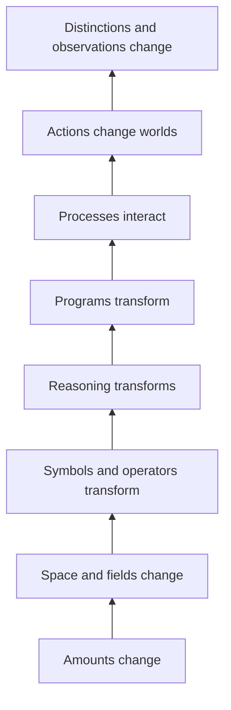

# The Pantheon of Calculi

This page is a broad map of major calculi.

It is not a ranking. It is not a claim that one calculus replaced another.

Each calculus is a rulebook built for a certain kind of object, change, or reasoning.

## 1. Quantity, motion, and change

These are the calculi closest to what most people mean by **calculus** in school.

| Calculus | Plain-language job |
|---|---|
| differential calculus | find how fast something is changing right now |
| integral calculus | add up many small changes into a total |
| multivariable calculus | track change when more than one quantity can vary |
| vector calculus | study changing quantities that have size and direction |
| finite-difference calculus | study change using steps instead of infinitely small changes |
| calculus of variations | find the best whole path, shape, or function |
| stochastic calculus | study change when randomness is part of the path |
| fractional calculus | generalize derivatives and integrals beyond whole-number orders |

## 2. Geometry and fields

These calculi help when the thing changing lives on a surface, in space, or in a geometric field.

| Calculus | Plain-language job |
|---|---|
| tensor calculus | track quantities that transform across coordinates and directions |
| exterior calculus | work with differential forms and generalized versions of gradient, curl, divergence, and Stokes' theorem |
| Ricci calculus | index-based tensor methods used heavily in differential geometry and relativity |
| differential geometry | use calculus on curves, surfaces, manifolds, and geometric fields |

Some of these are often taught as parts of larger subjects rather than as stand-alone calculi. They still belong in the family because they provide systematic rules for geometric change.

## 3. Functions, operators, and higher mathematics

Here the objects are no longer just ordinary numbers or curves.

| Calculus | Plain-language job |
|---|---|
| functional calculus | apply ordinary-looking functions to operators or matrices |
| Malliavin calculus | differentiate random processes; often called stochastic calculus of variations |
| operational calculus | turn difficult operations such as differentiation into easier algebraic ones using transforms or operators |
| umbral calculus | manipulate polynomial sequences through symbolic operator rules |
| calculus of fractions | systematically invert selected arrows in category theory |
| Goodwillie calculus | study functors using ideas that resemble polynomial approximation and derivatives |

## 4. Logic and formal reasoning

These calculi treat **reasoning itself** as something that can be transformed by rules.

| Calculus | Plain-language job |
|---|---|
| propositional calculus | reason with statements such as AND, OR, NOT, and IF–THEN |
| predicate calculus | reason about objects, properties, and words such as ALL and SOME |
| sequent calculus | build proofs by transforming statements of what follows from what |
| natural deduction | represent proof steps in a form close to ordinary mathematical reasoning |

These are calculi even though they do not measure speed or area. Their 'moves' are valid steps of reasoning.

## 5. Computation and programs

These calculi treat expressions or programs as things that can be transformed.

| Calculus | Plain-language job |
|---|---|
| combinatory logic | express computation through combinations of functions without named variables |
| λ-calculus | express computation through functions, application, and substitution |
| simply typed λ-calculus | add types so only certain expressions may combine |
| System F | allow powerful polymorphic types |
| differential λ-calculus | add a notion of linear or differential change to λ-terms |
| Calculus of Constructions | combine typed computation with formal proof |
| Calculus of Inductive Constructions | add inductive data and proofs; foundational to systems such as Coq |

## 6. Interaction and concurrency

These calculi are built for systems where many things happen and communicate at once.

| Calculus | Plain-language job |
|---|---|
| CCS | describe communicating concurrent systems |
| CSP | describe processes that interact through events |
| ACP | reason algebraically about communicating processes |
| π-calculus | let processes communicate names and change who can talk to whom |
| join calculus | describe synchronization through message patterns |
| ambient calculus | model computation that moves between locations or containers |
| stochastic π-calculus | add probabilistic timing or rates to communicating processes |
| spi calculus | model cryptographic protocols using process-calculus ideas |
| applied π-calculus | reason about protocols with richer data and cryptographic operations |
| ψ-calculi | provide a general framework for many process-calculus variants |
| ρ-calculus | make reflective process structure part of naming and computation |

## 7. Actions, events, and changing worlds

These calculi are useful when the main question is **what becomes true after something happens?**

| Calculus | Plain-language job |
|---|---|
| situation calculus | reason about actions and the situations that result from them |
| event calculus | reason about events, time, and what remains true between events |
| fluent calculus | represent changing facts while handling what stays unchanged |

## 8. Data and relations

| Calculus | Plain-language job |
|---|---|
| relational calculus | describe what data we want by stating logical conditions rather than step-by-step procedures |

Relational calculus became foundational in database theory.

## 9. Distinction and observation

These calculi and formalisms ask what happens when **difference itself** becomes part of the mathematics.

| Calculus / formalism | Plain-language job |
|---|---|
| calculus of indications | reason from the act of drawing a distinction |
| distinction graphs | represent what a particular observer can and cannot tell apart |
| Fuzzy Calculus | study differentiation, integration, and recovery through bounded observation |

## A simple way to remember the pantheon

The pyramid is not saying mathematics developed in exactly this order.

It is saying that more and more kinds of things can become objects of disciplined transformation.

## What belongs here?

A named calculus belongs in the atlas when it has a reasonably clear answer to three questions:

1. What kinds of objects does it work with?
2. What are its characteristic moves?
3. What problem is it trying to make manageable?

That standard keeps the pantheon broad without becoming a dictionary of every use of the word *calculus*.
