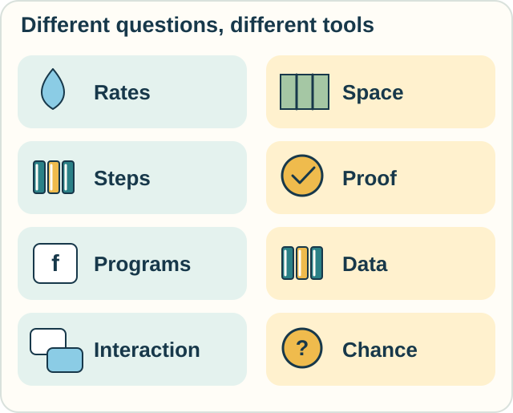

# Field Map: The World of Calculi

A field guide shows habitats and neighboring species. This map does something similar for mathematical tools.

**It is a teaching map, not an official classification or a family tree.** The groups overlap. Their size here does not measure their importance, popularity, or age.

Some names identify broad subjects. Others identify a specific language, a proof method, or an author's research framework. Not everything nearby is itself called a calculus.

**New here?** Read the [welcome](START.md), or choose a question below. Each core lesson supplies an everyday example. Optional tracks go deeper; source links may require much more mathematics.

<!-- visual:diagram-field-habitats -->

*These are places to begin exploring. The tiles are not ranks or prerequisites.*
<!-- /visual:diagram-field-habitats -->

## 1. Rates, totals, and best choices

**Everyday question:** How much water enters? How sensitive is an answer to an input? Which choice works best?

| Subject | Main job | Place in the landscape |
|---|---|---|
| Differential calculus | Find local rates and sensitivity | A central part of introductory calculus |
| Integral calculus | Accumulate quantities over intervals or regions | A central part of introductory calculus |
| Complex-variable calculus / complex analysis | Differentiate complex functions and integrate along contours | A major branch of analysis, including residue calculus |
| Differential equations | Find functions obeying rules that involve their rates | A broad neighboring subject built with calculus |
| Calculus of variations | Vary a whole function, path, or shape | An established advanced area |
| Fractional calculus | Extend derivatives and integrals to noninteger orders | A family of advanced definitions and methods |

**Learn:** [Rates and totals](lessons/01-classical-calculus.md), then the garden example in [space and shape](lessons/02-space-and-shape.md).\
**Explore:** [Variations](tracks/change/variational-calculus.md), [complex calculus](tracks/change/complex-calculus.md), or [fractional calculus](tracks/change/fractional-calculus.md).

“Best” requires a goal and constraints. A stationary point is a candidate, not automatically the winner.

## 2. Space, shape, and fields

**Everyday question:** Which way is uphill? How much flows through a window?

| Subject or method | Main job | Place in the landscape |
|---|---|---|
| Multivariable calculus | Work with several inputs | A broad continuation of introductory calculus |
| Vector calculus | Study fields, circulation, and flux through surfaces | Standard methods in mathematics and physics |
| Tensor calculus / Ricci calculus | Work with quantities and their coordinate transformations | Overlapping tensor methods; Ricci calculus uses index notation |
| Exterior calculus | Organize derivatives and integrals using differential forms | Advanced methods linking regions and their boundaries |
| Differential geometry | Study curves, surfaces, and more general spaces | A field that uses several of these tools |

**Learn:** [Slopes, Shapes, and Space](lessons/02-space-and-shape.md).\
**Explore:** [Tensor calculus](tracks/geometry/tensor-calculus.md) and [exterior calculus](tracks/geometry/exterior-calculus.md), with [geometry sources](REFERENCES.md#geometry-and-field-calculi).

These areas overlap with [complex analysis](tracks/change/complex-calculus.md) and are not all separate “species” at the same level. A fixed shape can be studied with calculus even when nothing moves.

## 3. Steps, sums, and approximation

**Everyday question:** What changed between daily counts? What can samples tell us?

| Subject or method | Main job | Place in the landscape |
|---|---|---|
| Finite-difference calculus | Work with differences of sequences | A discrete counterpart to differentiation |
| Sums and recurrence relations | Accumulate terms and describe repeated updates | Closely connected discrete tools |
| Numerical differentiation and integration | Estimate derivatives and integrals through finite calculations | Methods within numerical analysis |

**Learn:** [Working in Steps](lessons/03-discrete-and-numerical.md).\
**Explore:** [Discrete and numerical sources](REFERENCES.md#discrete-and-numerical-methods).

A discrete answer can be exact for a discrete question. Approximation is a different use of the same tools.

## 4. Claims, logic, and proof

**Everyday question:** What follows from these assumptions?

| Language or method | Main job | Place in the landscape |
|---|---|---|
| Propositional calculus | Connect whole statements with logical operations | A basic logic language |
| Predicate calculus | Express claims about objects, properties, all, and some | A richer logic language |
| Natural deduction / sequent calculus | State allowed steps and organize proofs | Proof methods used with several logics |
| Modal and intuitionistic logics | Change what can be expressed or which reasoning rules are used | Different logic families with their own proof calculi; [epistemic logic](tracks/observation/epistemic-logic.md) gives one modal entry point |
| Linear logic | Track the use of assumptions, including consumable resources | An established logic with several proof presentations |
| Calculus of indications | Manipulate distinctions using marks and rules | Spencer-Brown's particular symbolic system from *Laws of Form* |

**Learn:** [What Follows from What?](lessons/04-logic-and-proof.md).\
**Explore:** [Sequents](tracks/proof/sequent-calculus.md), [linear logic](tracks/proof/linear-logic.md), or [indications](tracks/logic/calculus-of-indications.md).

Choosing a language and choosing a proof presentation are different decisions. The calculus of indications is one particular symbolic system to explore.

## 5. Computation, types, and program guarantees

**Everyday question:** What does an instruction do? Do its pieces fit? Does it meet a promise?

| Calculus or method | Main job | Place in the landscape |
|---|---|---|
| Lambda calculus | Compute through functions, application, and substitution | A foundational model of computation |
| Combinatory logic | Express computation without named bound variables | A related foundational formalism |
| Typed lambda calculi, including System F | Constrain expressions and describe richer forms of functions | A family of typed computation systems |
| Calculus of Constructions and its inductive extensions | Connect typed constructions and formal proofs | Foundations for dependent type theory and proof assistants |
| Hoare logic / predicate transformers | Reason about program behavior from conditions | Program-verification methods |
| Separation logic | Reason locally about separately owned parts of memory | A specialist program logic |

**Learn:** [Instructions and Guarantees](lessons/05-computation-and-correctness.md).\
**Explore:** [Lambda calculus](tracks/computation/lambda-calculus.md) and [the Calculus of Constructions](tracks/types/calculus-of-constructions.md). See [program-logic sources](REFERENCES.md#program-logic-and-correctness) for verification branches.

A type check establishes what that type system's rules guarantee. It does not automatically prove every useful property of a program.

## 6. Data and questions

**Everyday question:** Which records satisfy these conditions?

| Language or method | Main job | Place in the landscape |
|---|---|---|
| Tuple relational calculus | State conditions on whole records | A formal database-query language |
| Domain relational calculus | State conditions on individual field values | Another form of relational calculus |
| Relational algebra | Build queries from operations on relations | A closely related formal language |

**Learn:** [Asking Questions of Data](lessons/06-data-and-relations.md).\
**Explore:** [Formal relational query languages](https://www.db-book.com/online-chapters-dir/27.pdf).

The connection to logic is direct: a query states conditions that answers must satisfy. A correct query still depends on its data.

## 7. Interaction, actions, and events

**Everyday question:** Who can communicate? Can they get stuck? What becomes true after an action?

| Family or system | Main job | Place in the landscape |
|---|---|---|
| CCS, CSP, and ACP | Describe and reason about concurrent behavior | Major process-calculus and process-algebra traditions |
| Pi calculus | Pass names and change communication connections | A particular process calculus |
| Ambient and spi calculi | Focus on locations or security | Specialist process formalisms |
| Rho calculus | Build names from quoted processes and use reflection | A particular reflective process calculus |
| Situation, event, and fluent calculi | Represent action effects and persistence | Related formalisms in knowledge representation |

**Learn:** [Messages and Events](lessons/07-interaction-and-action.md).\
**Explore:** [Pi](tracks/interaction/pi-calculus.md), [rho](tracks/interaction/rho-calculus.md), or [action calculi](tracks/action/situation-event-fluent.md). [Observational equivalence](tracks/observation/observational-equivalence.md) asks when systems behave alike under a chosen comparison.

Process languages and action formalisms can describe parts of the same system. Their questions and rules differ. This grouping does not claim they share one ancestry.

## 8. Chance, random paths, and causes

**Everyday question:** What might happen? How does uncertainty develop? What would an intervention change?

| Subject or calculus | Main job | Place in the landscape |
|---|---|---|
| Probability theory | Assign and combine probabilities; condition on information | A broad mathematical subject |
| Stochastic calculus | Integrate and reason about suitable random processes | An advanced area, with distinct conventions such as Itô and Stratonovich |
| Malliavin calculus | Study variation of random functionals | A specialist branch of stochastic analysis |
| [Do-calculus](tracks/observation/do-calculus.md) | Transform causal queries under stated graphical conditions | Pearl's rules for causal inference |

**Learn:** [Chance and Cause](lessons/08-chance-and-cause.md).\
**Explore:** [Stochastic calculus](tracks/change/stochastic-calculus.md), [do-calculus](tracks/observation/do-calculus.md), and [probability and causal sources](REFERENCES.md#probability-and-causal-inference).

Probability, stochastic calculus, and causal inference are different subjects. One is not a synonym for the next.

## 9. Operators and transforms

**Everyday question:** What happens when an entire action becomes the input to another mathematical rule?

| Name | A first orientation | Starting source |
|---|---|---|
| Functional calculus | Apply functions to matrices or operators | [Higham, *Functions of Matrices*](https://eprints.maths.manchester.ac.uk/2109/) |
| Operational calculus | Use operators and transforms to turn some differential problems into algebra | [Strang's differential-equations materials](https://math.mit.edu/~gs/dela/) |

A matrix is an array of numbers with rules for combining such arrays. An operator acts on objects such as functions. The full theories need more background, but a two-channel sound box gives us a small place to begin.

**Explore:** [Functional calculus](tracks/operators/functional-calculus.md): apply a function to an action.

**Functional calculus is not another name for functional programming.** Similar names need not mean similar objects or rules.

There are still other uses in algebra, category theory, and topology. This guide offers a representative set of entry points, not an exhaustive census.

## 10. Observation, knowledge, and measurement

**Everyday question:** What does a record let us distinguish? What can we learn, test, change, or reconstruct from it?

This route crosses logic, data analysis, programming, and physics. “Observation” is our organizing theme. Each subject specifies its own objects and operations.

| Subject or framework | What it explores | Place in the landscape |
|---|---|---|
| [Epistemic and dynamic epistemic logic](tracks/observation/epistemic-logic.md) | What different agents know, and how observations or messages change it | Established logic families with formal semantics and proof systems |
| [Rough-set theory](tracks/observation/rough-sets.md) | Definite and possible classification from limited distinctions | Pawlak's approach to approximation and data analysis, with many extensions |
| [Observational equivalence and bisimulation](tracks/observation/observational-equivalence.md) | Whether permitted interactions can distinguish systems | Behavioral comparisons used with process calculi and programming languages |
| [Measurement calculus](tracks/observation/measurement-calculus.md) | Programs driven by quantum measurements and recorded outcomes | Danos, Kashefi, and Panangaden's formal calculus for measurement-based computation |
| [Do-calculus](tracks/observation/do-calculus.md) | When observations and causal assumptions determine intervention effects | A causal calculus; also belongs in the chance-and-cause habitat |
| [Relational quantum mechanics](REFERENCES.md#relational-quantum-mechanics) | Physical descriptions relative to interacting systems | Rovelli's interpretation of quantum mechanics; a neighboring physical account |
| [Distinction graphs](tracks/observation/distinction-graphs.md) | Pairwise indistinguishability and graph-based information measures | Goertzel's specified graph formalism and its extensions |
| [Tiffany's Fuzzy Calculus](tracks/observation/tiffany-fuzzy-calculus.md) | Change and reconstruction through bounded observation | The framework developed in *Principia Symbolica* and related materials |

**Begin with a small question:** compare two views of a card in [epistemic logic](tracks/observation/epistemic-logic.md), or sort crates by incomplete labels in [rough sets](tracks/observation/rough-sets.md).

Then choose a different operation: [test a machine's behavior](tracks/observation/observational-equivalence.md), [use a measurement result in a program](tracks/observation/measurement-calculus.md), [set a garden's watering rule](tracks/observation/do-calculus.md), [record pairwise distinctions](tracks/observation/distinction-graphs.md), or [study reconstruction through observation](tracks/observation/tiffany-fuzzy-calculus.md).

## Read the map critically

Ask what a system works with, what its rules do, and which sources establish its claims. There is no single test that makes this teaching map a universal taxonomy.

Use [Choose and Combine](lessons/09-choose-and-combine.md) to connect tools in one task, [Connections](RELATIONS.md) to distinguish kinds of relationship, and [References](REFERENCES.md) to leave this guide for the wider literature.

[Home](README.md) · [Practice](PRACTICE.md)
