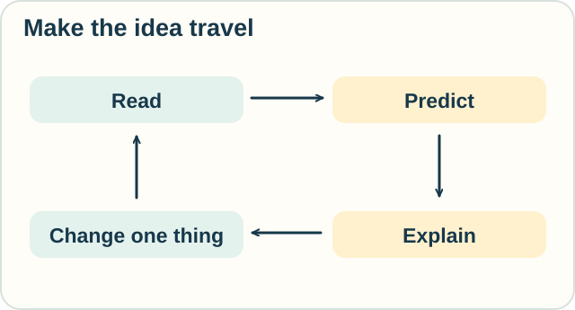
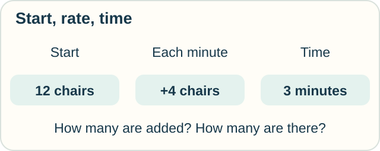
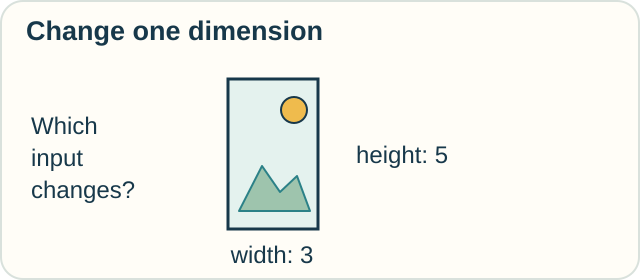
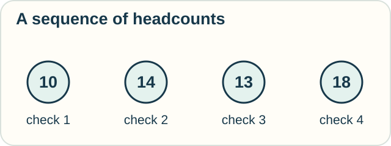
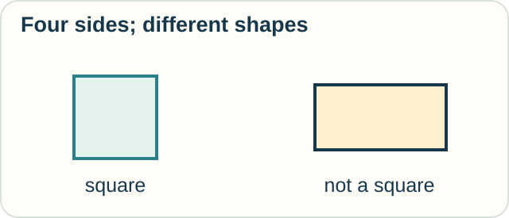
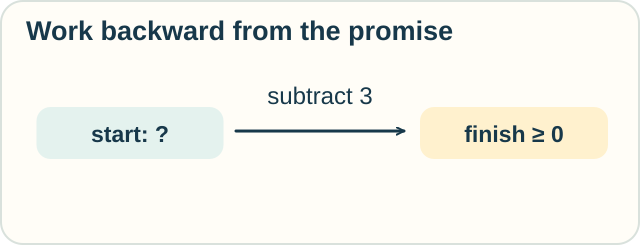
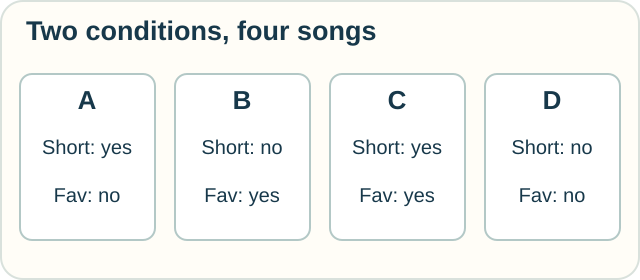
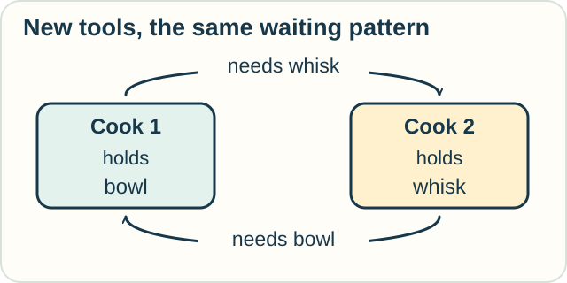
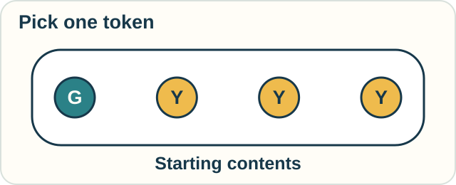

# Try It Somewhere New

These challenges use the same ideas in different settings. You can answer aloud, on paper, or with a partner.

For each one, give an answer **and a reason**. Then name an assumption. Open the explanation after your first attempt.

<!-- visual:diagram-learning-loop -->

*Try a prediction before opening an answer. Then change one thing.*
<!-- /visual:diagram-learning-loop -->

## 1. Rate and total: seats

<!-- visual:diagram-practice-chairs -->

*Use the given start, rate, and time. Leave the final count for your own calculation.*
<!-- /visual:diagram-practice-chairs -->

A hall starts with 12 chairs set out. Helpers add 4 chairs per minute for 3 minutes. Nobody removes a chair.

How many chairs are added? How many are now set out? If two chairs are removed during the work, which answer changes?

Check

Twelve chairs are added, and 24 are set out at the end.

Removing two does not change how many were added. It changes the final total to 22. The net change is then ten.

This uses the distinction between input, net change, and starting amount from [lesson 1](lessons/01-classical-calculus.md).

## 2. Several inputs: a photograph

<!-- visual:diagram-practice-photo -->

*Change the width or the height while keeping the other fixed.*
<!-- /visual:diagram-practice-photo -->

A rectangular print is 3 units wide and 5 units tall. Its area is 15 square units.

How much area is added by increasing only its width by one? What if you increase only its height by one? Why do the answers differ?

Check

Increasing width gives $4\times5=20$, adding 5 square units.

Increasing height gives $3\times6=18$, adding 3 square units.

The change depends on which input varies and which stays fixed. See [lesson 2](lessons/02-space-and-shape.md).

## 3. Discrete steps: visitors

<!-- visual:diagram-practice-visitors -->

*These are snapshots. What might happen between them?*
<!-- /visual:diagram-practice-visitors -->

A room's headcount at four check-ins is 10, 14, 13, and 18.

Find the three differences and their sum. Do these counts tell you the total number of people who entered?

Check

The differences are +4, −1, and +5. Their sum is +8, which is also $18-10$.

They do not tell us the total number entering. During one interval, five could enter and one leave, giving a net gain of four. Other combinations give the same net gain. See [lesson 3](lessons/03-discrete-and-numerical.md).

## 4. Logic: shapes

Every square has four sides. This shape has four sides.

Does it follow that the shape is a square? Give an example that settles the question.

Check

No. A rectangle with unequal adjacent sides has four sides but is not a square.

One counterexample is enough to show that the reversed rule is false. See [lesson 4](lessons/04-logic-and-proof.md).

## 5. Program guarantees: game points

<!-- visual:diagram-practice-score -->

*Read the promise backward: what must have been true at the start?*
<!-- /visual:diagram-practice-score -->

An instruction subtracts three points from a score. You want the resulting score to be at least zero.

What is the least starting score that works? Would “the score is an integer” be enough? Suppose the code actually subtracts four: which part of the argument changes?

Check

Start with at least three points.

An integer type alone is not enough: one is an integer and would become −2.

If the code subtracts four, the required starting score becomes at least four. A proof must match the actual modeled instruction. See [lesson 5](lessons/05-computation-and-correctness.md).

## 6. Data: a playlist

| Song | Shorter than 3 minutes? | Marked favorite? |
|---|---|---|
| A | Yes | No |
| B | No | Yes |
| C | Yes | Yes |
| D | No | No |

<!-- visual:diagram-practice-playlist -->

*The picture gives the records, not the selected answer.*
<!-- /visual:diagram-practice-playlist -->

Which songs meet both conditions? Which meet at least one? Does this table let you find songs shorter than 2 minutes?

Check

Both conditions: C. At least one: A, B, and C.

The table does not give enough detail for the 2-minute question. A song marked shorter than 3 minutes could last 1 minute or 2½ minutes. See [lesson 6](lessons/06-data-and-relations.md).

## 7. Coordination and effects: a shared kitchen

<!-- visual:diagram-practice-kitchen -->

*Compare the earlier printer-and-scissors pattern. The tools have changed.*
<!-- /visual:diagram-practice-kitchen -->

One cook holds the mixing bowl and waits for the whisk. Another holds the whisk and waits for the bowl. Both refuse to release their tool first.

What blocks progress? Suggest a changed rule.

Now a timer rings. Does that event alone establish that someone removed the cake from the oven?

Check

The cooks are stuck in a circular wait. They could agree to acquire tools in the same order, or one could release a tool so the other can finish.

The timer event does not itself remove the cake. A model needs an action connecting someone hearing the timer to removing the cake. See [lesson 7](lessons/07-interaction-and-action.md).

## 8. Chance and cause: two questions

<!-- visual:diagram-token-question -->

*This is the starting bag. Decide what remains after the stated draw.*
<!-- /visual:diagram-token-question -->

A bag has one green token and three yellow tokens, each equally likely to be drawn. You draw a yellow token and keep it out. What is the chance of green next?

Separately, suppose a model says rain causes both umbrellas to open and pavements to get wet. There is no other causal link in the model. Would opening an umbrella make the pavement wet?

Check

One green and two yellow tokens remain, so the chance is 1/3.

Under the stated causal model, opening an umbrella does not cause a wet pavement. Observing open umbrellas can be evidence of rain; forcing one open does not make it rain. See [lesson 8](lessons/08-chance-and-cause.md).

## Six more trails to try

These follow the optional tracks. You can choose one without completing them all.

### 9. Describe the same movement

A movement is (4, 3) in east–north coordinates. Describe it using north–west coordinates, with the same starting point and unit. Did the movement itself change?

Check

It is **(3, −4)**: three north and four opposite west. The movement stays the same. Only its description changes. See [tensor calculus](tracks/geometry/tensor-calculus.md).

### 10. Combine boundaries

Three unit-square plots form one straight row. Trace each plot counterclockwise and cancel shared edges traversed in opposite directions. How many outside unit edges remain?

Check

**Eight.** The combined rectangle is three units long and one unit wide. Its outside has $3+1+3+1=8$ unit edges. The two shared edges each appeared twice in the original twelve traversals. See [exterior calculus](tracks/geometry/exterior-calculus.md).

### 11. Turn the movement

Start with an arrow pointing two units right. Keep the axes fixed. Multiply its complex number by i three times, making a counterclockwise quarter-turn each time. Where does it end?

Check

It points **two units down**, or $-2i$. The successive directions are up, left, then down. This changes the arrow itself. See [complex calculus](tracks/change/complex-calculus.md).

### 12. Compare histories

Use the fractional track's **toy score**, with oldest-to-newest weights 1/4, 1/2, and 1. One record has changes (2, 2, 0); another has (0, 0, 4). Starting from zero, do they end at the same value? Do they receive the same score?

Check

Both finish at **4**. Their scores differ: $2/4+2/2+0=1.5$ and $0+0+4=4$.

That is a calculation in the stated weighted model. Calling it a fractional derivative would require a different, precise definition. See [fractional calculus](tracks/change/fractional-calculus.md).

### 13. Repeat a new operator

An operator C changes the sign of both numbers in a pair. What do C² and C³ do to (2, −5)? Here powers mean repeated application.

Check

The first application gives (−2, 5). **C² returns (2, −5)**. **C³ gives (−2, 5)** again.

Two sign changes act as the identity, just as two swaps did, although one sign change and one swap are different operations. See [functional calculus](tracks/operators/functional-calculus.md).

### 14. Count uses of a resource

You have two ride vouchers. Each ride consumes one voucher. The instruction sheet can be read any number of times. Can reading it three times give you three rides under these rules?

Check

No. You can use the instructions again, but you still have only **two vouchers**. A third ride requires another voucher or a changed rule. See [linear logic](tracks/proof/linear-logic.md).

## Observation and intervention trails

### 15. Knowing that someone knows

A book is in one of two closed boxes. Jo has privately seen which box holds it. Sam has no clue about the location, but knows Jo looked. Jo publicly says, “I know which box.” Does Sam now know the location?

Check

No. Jo could truthfully say that with the book in either box. Both locations remain possible for Sam. Knowing that someone has an answer need not give you the answer's content. See [epistemic logic](tracks/observation/epistemic-logic.md).

### 16. Find the unresolved group

A scanner groups parcels 1 and 2 under label A, parcels 3 and 4 under B, and parcel 5 under C. The inspected fragile parcels are **1, 3, and 4**. Using only the group labels, which parcels lie in the lower approximation, upper approximation, and boundary of the fragile set?

Check

The lower approximation is **3, 4**: their whole B group is fragile. The upper approximation is **1, 2, 3, 4**: both A and B meet the fragile set. The boundary is **1, 2**, where the shared label leaves the answer unresolved. See [rough sets](tracks/observation/rough-sets.md).

### 17. What does the test record?

One machine lets you pay and then choose tea or coffee. Another commits to one drink while accepting payment. A test records only the set of possible completed sequences, with no timing, failed requests, or further interaction. Would it distinguish the machines? What stronger comparison caught their difference in the lesson?

Check

That trace-only test sees the same two sequences: **pay–tea** and **pay–coffee**. The step-by-step comparison also checks the choices that remain after each payment. The committed machine can lose an option that the other retains. See [observational equivalence](tracks/observation/observational-equivalence.md).

### 18. Combine two correction instructions

Suppose an output needs an X operation for each recorded 1 in two bits. Two X operations cancel. What is the combined correction for bits **1, 1**? What about **1, 0**?

Check

For **1, 1**, applying X twice is the identity, so the combined correction can be omitted. For **1, 0**, apply X once. The bit records must be available before choosing between those instructions. See [measurement calculus](tracks/observation/measurement-calculus.md).

### 19. Change the causal graph

In a new garden model, watering changes soil moisture, and soil moisture changes growth. Suppose that is the entire causal route from watering to growth. A gardener proposes holding soil moisture fixed when comparing watering choices. Would that preserve the total effect we wanted to measure?

Check

No. Holding moisture fixed blocks the very route through which watering affects growth in this model. Moisture comes after watering on that route. Weather in the original example was a shared cause that came before watering.

The position of a variable matters; “adjust for everything” is not a general rule. See [do-calculus](tracks/observation/do-calculus.md).

## Program rules and guarantees

### 20. Combine rule cards in a new setting

A parcel record is represented by `parcel`. Use the combinator rules from the track: `I x` returns x, `K x y` returns x, and `S f g x` becomes `(f x) (g x)`.

What does `S K I parcel` become? Does the appearance of `parcel` twice after the S step establish that two physical parcels exist?

Check

It becomes `(K parcel) (I parcel)`, then **`parcel`**. K keeps its first input and discards the whole second expression, `I parcel`. Reducing `I parcel` first would give the same result.

The rule repeats a symbolic expression. It makes no claim about creating physical parcels. See [combinatory logic](tracks/computation/combinatory-logic.md).

### 21. Reuse the recipe with pictures

One operation adds a border to an image and returns an image. Another turns an image into a written caption. Which operation fits the System F track's twice recipe? Does having an image-to-image type prove that an operation adds **two** borders?

Check

The border operation fits because its output can enter the same operation again. The caption operation returns text, which does not fit its image input.

An image-to-image type alone does not count borders. Adding one border, adding two, or returning the original image could all have that type. See [System F](tracks/types/system-f.md).

### 22. Work backward, respecting the order

A game uses whole-number credits. A program first deducts 4, then triples the remaining balance. We want at least 12 credits at the end. What is the weakest starting condition?

What if the program instead triples first and deducts 4 afterward?

Check

For **deduct, then triple**, we need at least 4 just before tripling, so we must start with **at least 8**. The result is $3(n-4)$.

For **triple, then deduct**, we need at least 16 just before the deduction. The starting whole-number balance must be **at least 6**. Starting with 5 gives 11 at the end; 6 gives 14. The result is $3n-4$.

Moving the same steps changes the required condition. See [Hoare logic and predicate transformers](tracks/proof/hoare-logic.md).

### 23. Copies, shortcuts, and separation

Two desktop shortcuts have different names but open the same saved drawing. One person edits through the first shortcut. Can a proof treat the drawing reached by the second shortcut as a separate, untouched object?

Suppose instead that the shortcuts open independent file copies. Later, the second shortcut is redirected to the first file. Does the original claim about what the second shortcut opens still hold?

Check

In the first case, no: two names reach one object, so the edit changes what both open.

With independent copies, an edit to one can preserve the other, assuming no syncing. But redirecting a shortcut changes which object its name reaches. The second file may remain untouched while the second shortcut now opens the edited first file.

Both separation of objects and stability of the names used in the promise matter. See [separation logic](tracks/proof/separation-logic.md).

## Steps, samples, and continuous change

### 24. Grow a staircase

A tile staircase has rows of lengths 1, 2, 3, and so on. Each stage adds one new row, one tile longer than the last. The first four stage totals are **1, 3, 6, 10**.

Find the first and second differences. What is the fifth total? What lets you justify that answer beyond spotting a pattern in four numbers?

Check

The first differences are **2, 3, 4**. The second differences are **1, 1**. The fifth row adds 5 tiles, giving **15** altogether.

The construction tells us what comes next: stage five adds a row of length five. Four totals alone could fit other rules with a different fifth value. See [finite-difference calculus](tracks/change/finite-difference-calculus.md).

### 25. Mind the time gaps

A toy train moves forward. Its speed readings are **0 meters/second at 0 seconds**, **4 meters/second at 1 second**, and **4 meters/second at 3 seconds**.

Join neighboring readings with straight lines. Estimate the distance traveled. Why would averaging all three readings and multiplying by three seconds give a different answer? What assumption makes your first answer exact?

Check

From 0 to 1 second, the average of the endpoint speeds is 2 meters/second. Over one second, that contributes **2 meters**. From 1 to 3 seconds, the average is 4 meters/second. Over two seconds, that contributes **8 meters**. The estimate is **10 meters**.

Giving the three samples equal weight produces $(0+4+4)/3\times3=8$ meters. That ignores the lengths of the intervals and the straight-line rule we chose. Samples are points in time; they do not each represent an equal share of this trip.

Ten meters is exact if speed really changes linearly on each stated interval. Otherwise it is an estimate based on those joins. See [numerical calculus](tracks/change/numerical-calculus.md).

### 26. Let a goal control the pace

A game character's energy moves toward 8 points. Its current change per second is **half the gap from its current energy to 8**: subtract the current energy from 8, then halve the result. Temporary bonuses can put energy above 8.

Starting at 12 points, find the current rate and the equilibrium. Take one Euler step lasting half a second. Is its answer necessarily the exact continuous-model value after that time?

Check

The gap is $8-12=-4$, so the current rate is **−2 points/second**. The equilibrium is **8 points**, where the rate is zero.

One half-second Euler step gives $12+(-2)\times0.5=11$ points. It holds the initial rate fixed for the step. In the continuous rule, the rate changes as the energy changes, so 11 is an approximation. See [differential equations](tracks/change/differential-equations.md).

### 27. Check the starting gap

A sound control moves a level toward 10. A solved model says: **level = 10 + starting difference from 10 × a shrinking factor**. The factor equals 1 at the start and ¼ at the time we want to inspect.

Find the level then if it starts at 2. What if it starts at 14? A second proposed formula gives zero at the start in both cases. Could it solve either of these starting-value problems, even if it passes a rate-equation check?

Check

Starting at 2 gives difference $2-10=-8$, so the later level is $10-8/4=\mathbf{8}$. Starting at 14 gives difference $14-10=4$, so the later level is $10+4/4=\mathbf{11}$.

The differences shrink toward zero from opposite sides. The equilibrium stays 10, while the starting value chooses the path.

A formula that starts at zero fails both initial conditions. Solving a rate equation and meeting its starting value are both required. The [operational-calculus track](tracks/operators/operational-calculus.md) shows where that starting value enters a transform calculation.

## A reusable activity for learners and teachers

Choose one problem above. Have one person change a number, object, condition, or rule. Ask the other person:

1. What stays useful from the original reasoning?
2. What must be recalculated or reconsidered?
3. What missing information could stop us answering?
4. Where else could this pattern appear?

Then swap roles. If an answer is mistaken, try a small counterexample before introducing a new technical word.

For a larger task, choose two tools and explain the assumption that connects them. [Lesson 9](lessons/09-choose-and-combine.md) shows how.

The aim is to explain why an idea applies. Speed and symbol recall are not the only signs of understanding.

*All challenges are original teaching examples. Mathematical sources are linked from the corresponding lessons.*

[Home](README.md) · [Field map](PANTHEON.md)
