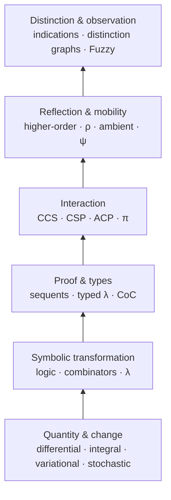

# Calculi

*Uncovering the pyramid.*

A pedagogy-first atlas of calculi: what each calculus takes as primitive, what it lets us do, and what becomes expressible as the formal world grows richer.

**Open educational resource:** original pedagogical material in this repository is licensed [CC BY 4.0](LICENSE.md). Source works retain their own rights and are attributed through lesson-local sources, the [Attribution Ledger](ATTRIBUTION.md), and the [References](REFERENCES.md).

## The pyramid

A calculus is a disciplined way of transforming or reasoning about something.

The pedagogical pyramid asks a simple question:

> **What must become expressible before the next kind of calculus makes sense?**

This is a **teaching order**, not a single historical family tree. Historical relationships are sourced where they matter.

## Start here — no calculus required

The first three pages assume no prior calculus and target roughly an **8th-grade reading level**.

1. [Things Change](start/01-things-change.md)
2. [What Calculus Does](start/02-what-calculus-does.md)
3. [Why Are There Many Calculi?](start/03-why-many-calculi.md)

If those make sense, enter the pyramid:

4. [Classical calculus — local change and accumulation](lessons/01-classical-calculus.md)
5. [λ-calculus — abstraction, application, substitution](lessons/02-lambda.md)
6. [π-calculus — communication that changes connectivity](lessons/03-pi.md)
7. [ρ-calculus — reflection in a process world](lessons/04-rho.md)
8. [Calculus of indications — distinction as operation](lessons/05-indications.md)
9. [Distinction graphs — distinguishability relative to an observer](lessons/06-distinction-graphs.md)
10. [Fuzzy Calculus — bounded observation and residual recovery](lessons/07-fuzzy.md)
11. [Comparing calculi](lessons/08-comparison.md)

Optional bridge: [What makes a calculus formal?](lessons/00-what-is-a-calculus.md)

The core path is intentionally short. Expansion tracks fill out the pyramid without bloating it.

## Learn in more than one mode

Core lessons use a lean rhythm:

**Read → See → Do → Check → Watch (optional)**

The text remains complete on its own. Diagrams, exercises, and external media change cognitive mode rather than carry essential claims. See [MEDIA.md](MEDIA.md).

## Expansion tracks

### Quantity and change

- [Calculus of variations — change the whole path](tracks/change/variational-calculus.md)
- [Stochastic calculus — change along noisy paths](tracks/change/stochastic-calculus.md)
- fractional calculus — planned
- tensor calculus — planned
- Malliavin calculus — planned
- functional calculus — planned

### Proof and type theory

- [Sequent calculus — proof as a calculus](tracks/proof/sequent-calculus.md)
- [Calculus of Constructions — types, terms, and proofs](tracks/types/calculus-of-constructions.md)
- natural deduction — planned
- simply typed λ-calculus — planned
- System F — planned
- Calculus of Inductive Constructions — planned
- differential λ-calculus — planned

### Process calculi

- CCS — planned
- CSP — planned
- ACP — planned
- π-calculus — [core lesson](lessons/03-pi.md)
- higher-order π-calculus — planned
- join calculus — planned
- ambient calculus — planned
- stochastic π-calculus — planned
- spi calculus — planned
- applied π-calculus — planned
- ρ-calculus — [core lesson](lessons/04-rho.md)
- ψ-calculi — planned

### Action and evolving worlds

- [Situation, event, and fluent calculi](tracks/action/situation-event-fluent.md)
- relational calculus — planned

### Distinction and observation

- calculus of indications — [core lesson](lessons/05-indications.md)
- distinction graphs — [core lesson](lessons/06-distinction-graphs.md)
- Fuzzy Calculus — [core lesson](lessons/07-fuzzy.md)
- new distinction-centered calculi — add when enough formal material exists to teach them

### Structural and categorical uses of “calculus”

- calculus of fractions — planned
- Goodwillie calculus — planned
- umbral calculus — planned

## Reading level

The main path is written so an interested 8th-grade reader can follow the **idea** before meeting the formal notation. Technical terms are introduced only when they earn their keep. Equations may deepen a lesson, but the plain-language explanation must stand on its own.

## One teaching frame

Every lesson should answer seven questions:

1. **Need** — what problem made this calculus useful?
2. **World** — what sort of things exist inside it?
3. **Primitive** — what does it assume before anything else?
4. **Move** — what is the characteristic operation or rewrite?
5. **Toy example** — what happens in the smallest useful case?
6. **Boundary** — what does the calculus not give us for free?
7. **Relations** — what does it inherit, encode, extend, or resemble?

## The recurring layers

| Layer | Question |
|---|---|
| **Objects** | What exists? |
| **Distinctions** | What differences matter? |
| **Operations** | What can happen? |
| **Composition** | How do moves combine? |
| **Observation** | What counts as the same outcome? |
| **Boundary** | What is not native here? |

Different calculi answer these differently. That is the point.

## Source discipline

The atlas is synthetic, but not anonymous.

- originators and primary sources are named;
- modern corrections stay visible;
- encodings are not treated as identities;
- pedagogical analogies are labeled as analogies;
- original examples are distinguished from source claims.

See [ATTRIBUTION.md](ATTRIBUTION.md), [RELATIONS.md](RELATIONS.md), and [REFERENCES.md](REFERENCES.md).

## Repository guides

- [Media and learning modes](MEDIA.md)
- [Relation Ledger](RELATIONS.md)
- [Attribution Ledger](ATTRIBUTION.md)
- [Glossary](GLOSSARY.md)
- [References](REFERENCES.md)
- [Contributing](CONTRIBUTING.md)
- [Citation metadata](CITATION.cff)

## License

Except where otherwise noted, original pedagogical material in this repository is licensed under **Creative Commons Attribution 4.0 International (CC BY 4.0)**.

Third-party works cited or discussed here are not relicensed by this repository.

Preferred credit:

> Paul Carver Tiffany III, *Calculi: A Pedagogy-First Atlas of Calculi*, 2026, https://github.com/PaulTiffany/calculi, CC BY 4.0.
