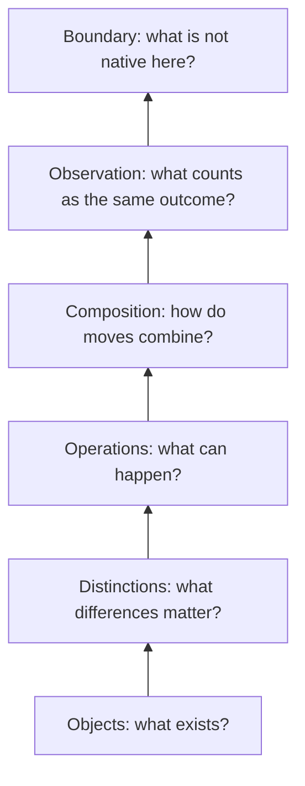

# Calculi

*Uncovering the pyramid.*

A pedagogy-first atlas of calculi: what each calculus takes as primitive, what it lets us do, what problem it was built to solve, and what is lost or gained when we move between them.

**Open educational resource:** original pedagogical material in this repository is licensed [CC BY 4.0](LICENSE.md). Source works retain their own rights and are attributed through lesson-local sources, the [Attribution Ledger](ATTRIBUTION.md), and the [References](REFERENCES.md).

This repository is **not** a claim that all calculi form one historical lineage. Some are directly related by extension or encoding; some share only a structural analogy. We keep those relations separate.

## The guiding idea

A calculus becomes easier to understand when we ask:

> **What kind of world does this calculus make expressible?**

Some calculi make **change** primary. Some make **substitution**, **proof**, **communication**, **action**, **distinction**, or **observation** primary.

The word *calculus* is used here in its broad mathematical sense: a disciplined system of objects, operations, and rules for transforming or reasoning about them.

## Start here

The first reading path is deliberately comparative:

1. [What is a calculus?](lessons/00-what-is-a-calculus.md)
2. [Classical calculus — local change and accumulation](lessons/01-classical-calculus.md)
3. [λ-calculus — abstraction, application, substitution](lessons/02-lambda.md)
4. [π-calculus — communication that changes connectivity](lessons/03-pi.md)
5. [ρ-calculus — reflection in a process world](lessons/04-rho.md)
6. [Calculus of indications — distinction as operation](lessons/05-indications.md)
7. [Distinction graphs — distinguishability relative to an observer](lessons/06-distinction-graphs.md)
8. [Fuzzy Calculus — bounded observation and residual recovery](lessons/07-fuzzy.md)
9. [Comparing calculi without flattening them](lessons/08-comparison.md)
10. [Frontier: Goertzel's d-calculus](lessons/09-frontier-d-calculus.md)

The path is **pedagogical**, not a claim of historical descent.

Each lesson ends by identifying what its calculus does *not* give us for free. That boundary motivates comparison with the next formal world.

### Learn in more than one mode

Core lessons are being shaped around a lean rhythm: **Read → See → Do → Check → Watch (optional)**. The lesson must remain complete as text; diagrams and external media deepen intuition rather than carry essential claims. See [MEDIA.md](MEDIA.md).



This is the pedagogical **pyramid** we keep uncovering. It is a comparison scaffold, not a claim that every calculus was historically built in this order.

## Constellations

This is a cosmology, not a single ladder.

| Constellation | Central question | Representative calculi |
|---|---|---|
| **Change and quantity** | How does something vary, accumulate, fluctuate, or optimize? | differential & integral calculus; calculus of variations; stochastic calculus; fractional calculus; tensor calculus |
| **Functions and computation** | How can computation be reduced to application, abstraction, and substitution? | combinatory logic; λ-calculus; typed λ-calculi; System F; differential λ-calculus |
| **Proof and types** | How can derivation itself be made formal? | natural deduction; sequent calculus; calculus of constructions; calculus of inductive constructions |
| **Interaction and concurrency** | How do independent processes synchronize, communicate, move, or rewrite one another? | CCS; CSP; ACP; π-calculus; join calculus; ambient calculus; stochastic π-calculus |
| **Security and distributed interaction** | How do names, channels, identities, and adversaries affect interaction? | spi calculus; applied π-calculus |
| **Reflection and higher-order process** | What changes when processes can represent, quote, or manipulate processes? | higher-order process calculi; ρ-calculus; ψ-calculi |
| **Action and evolving worlds** | How do actions change a world through time? | situation calculus; event calculus; fluent calculus |
| **Relations and data** | How can queries and relations be expressed declaratively? | relational calculus |
| **Distinction and observation** | What follows from drawing a distinction, and from limits on distinguishability? | calculus of indications; distinction graphs; Fuzzy Calculus |
| **Advanced mathematical calculi** | What happens when “calculus” is generalized to new mathematical objects? | Malliavin calculus; functional calculus; umbral calculus; calculus of fractions; Goodwillie calculus |
| **Frontier / incomplete public specification** | What new calculi are being proposed now? | Goertzel's d-calculus |

## Expansion tracks

The main lessons establish comparison vocabulary. These tracks deepen individual constellations.

### Change beyond elementary calculus

- [Calculus of variations — change the whole path](tracks/change/variational-calculus.md)
- [Stochastic calculus — change along noisy paths](tracks/change/stochastic-calculus.md)
- fractional calculus — planned
- tensor calculus — planned
- Malliavin calculus — planned
- functional calculus — planned

### Proof and type theory

- [Sequent calculus — proof as a calculus](tracks/proof/sequent-calculus.md)
- [Calculus of Constructions — types, terms, and proofs](tracks/types/calculus-of-constructions.md)
- natural deduction — planned
- simply typed λ-calculus — planned
- System F — planned
- Calculus of Inductive Constructions — planned
- differential λ-calculus — planned

### Process calculi

- CCS — planned
- CSP — planned
- ACP — planned
- π-calculus — [core lesson](lessons/03-pi.md)
- higher-order π-calculus — planned
- join calculus — planned
- ambient calculus — planned
- stochastic π-calculus — planned
- spi calculus — planned
- applied π-calculus — planned
- ρ-calculus — [core lesson](lessons/04-rho.md)
- ψ-calculi — planned

### Logic of action and time

- [Situation, event, and fluent calculi — reasoning about change in worlds](tracks/action/situation-event-fluent.md)

### Structural and categorical uses of “calculus”

- calculus of fractions — planned
- Goodwillie calculus — planned
- umbral calculus — planned

## One teaching frame for every lesson

Every lesson should answer the same seven questions:

1. **Need** — what problem made this calculus useful?
2. **World** — what sort of things exist inside it?
3. **Primitive** — what does it assume before anything else?
4. **Move** — what is the characteristic operation or rewrite?
5. **Toy example** — what happens in the smallest useful case?
6. **Boundary** — what does the calculus *not* give us for free?
7. **Relations** — what is historically inherited, formally encoded, or merely analogous to another calculus?

This lets a reader compare Newtonian differentiation, β-reduction, sequent rules, π-calculus communication, and observer-relative distinction without pretending they are the same operation.

## A map, not a ladder

```text
CHANGE / ACCUMULATION
classical calculus
   ├── calculus of variations
   ├── stochastic calculus
   ├── fractional calculus
   └── tensor / functional / Malliavin ...

FORMAL TRANSFORMATION
combinatory logic
   └── λ-calculus
        ├── typed λ / System F
        ├── differential λ
        └── proofs-as-programs
             ├── natural deduction / sequents
             └── Calculus of Constructions / CIC

INTERACTION
CCS / CSP / ACP
   └── π-calculus
        ├── join / ambient
        ├── spi / applied π
        ├── stochastic π
        ├── higher-order process calculi
        ├── ρ-calculus
        └── ψ-calculi

ACTION / WORLD CHANGE
situation calculus
   ├── event calculus
   └── fluent calculus

DISTINCTION / OBSERVATION
calculus of indications
   └── observer-relative distinction
        ├── distinction graphs
        └── bounded differentiation / observation
             └── Fuzzy Calculus

FRONTIER
Goertzel d-calculus
   └── comparison deferred until public primitives and laws are available
```

The lines above do **not** all mean the same thing.

Every edge must be labeled in the [Relation Ledger](RELATIONS.md) as one of:

- **historical influence**
- **formal encoding**
- **extension/refinement**
- **structural analogy**
- **conjectured bridge**

If we cannot support an edge, we do not draw it as fact.

## Why “cosmology”?

A genealogy asks:

> What descended from what?

A cosmology asks:

> **What kind of world must exist for this calculus to make sense?**

In classical calculus, quantities vary enough for local change and accumulation to be related. In λ-calculus, the world is organized around abstraction, application, and substitution. In π-calculus, around interacting processes and names. In ρ-calculus, process structure can participate in naming and reflection. In distinction-based systems, what can and cannot be told apart becomes central. In Fuzzy Calculus, observation is bounded and failure of exact recovery is itself mathematical data.

The teaching goal is to learn each calculus by learning the world it assumes.

## Epistemic rules

1. Historical claims require sources.
2. An encoding is not an identity.
3. Similar notation is not evidence of ancestry.
4. A structural analogy is not a historical influence.
5. A later calculus can generalize an earlier object without retroactively originating it.
6. Unpublished or incompletely specified systems stay in the **frontier** section until their primitives and laws are public.
7. Fuzzy Calculus is presented alongside its antecedents, not as if observer-relative distinction began with it.
8. Where scholars disagree about lineage or interpretation, the disagreement stays visible.
9. A slogan never outranks the theorem it summarizes.

## Repository guides

- [Relation Ledger](RELATIONS.md) — every cross-calculus edge and its evidentiary status
- [Attribution Ledger](ATTRIBUTION.md) — source lineage for every core lesson and expansion track
- [Glossary](GLOSSARY.md) — shared vocabulary without pretending definitions transfer unchanged between traditions
- [References](REFERENCES.md) — working primary-source bibliography
- [Contributing](CONTRIBUTING.md) — source, relation-label, and licensing requirements for additions
- [Citation metadata](CITATION.cff) — preferred repository citation
- [Media and learning modes](MEDIA.md) — visual, interactive, and external-media policy

## License and attribution

Except where otherwise noted, original pedagogical text, diagrams, tables, and other original educational material in this repository are licensed under **Creative Commons Attribution 4.0 International (CC BY 4.0)**.

This license permits sharing and adaptation, including commercial use, with attribution. Third-party works cited or discussed here are **not** relicensed by this repository.

- [License](LICENSE.md)
- [Attribution and source provenance](ATTRIBUTION.md)
- [Full references](REFERENCES.md)

Preferred credit:

> Paul Carver Tiffany III, *Calculi: A Pedagogy-First Atlas of Calculi*, 2026, https://github.com/PaulTiffany/calculi, CC BY 4.0.
