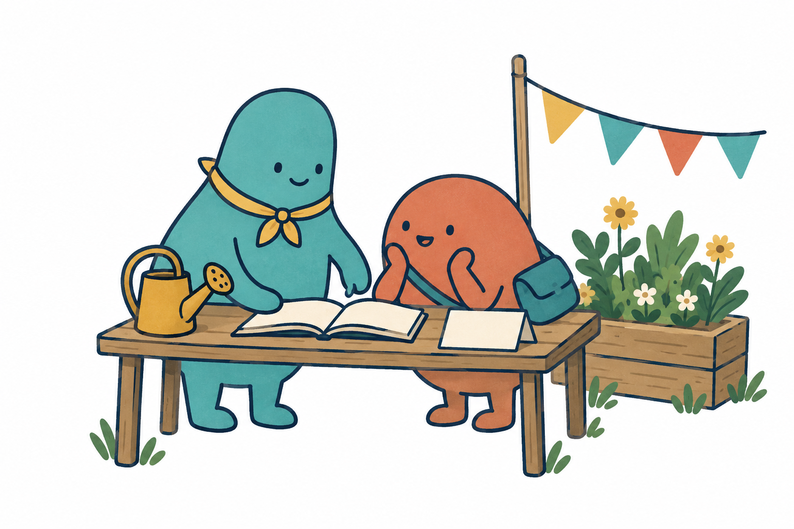
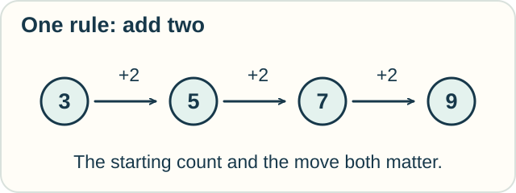

# Welcome to the World of Calculi

Imagine a community fair. Jo and Sam are helping out. Different people ask different questions.

- One asks how much water will fill a pool.
- One asks which visitors booked a table.
- One asks whether two volunteers will end up waiting for each other.

They all want to reason carefully. But water amounts, booking records, and messages need different kinds of rules.

That is the world we are going to explore.

<!-- visual:art-welcome -->

*Jo wears the yellow scarf; Sam carries the satchel. They return in different settings as we ask new questions.*
<!-- /visual:art-welcome -->

## One word, several uses

**Calculi** means more than one **calculus**. Say it roughly as “KAL-kyuh-lye.”

In school, *calculus* usually means the mathematics of rates and accumulation: slopes, motion, areas, and totals.

In logic and computing, a calculus often means a precise language with rules for reasoning or carrying out steps. Its objects might be statements, instructions, or messages.

Other named calculi extend these ideas to new settings. The word does not mark one neat scientific category. A useful neighboring tool might be called a *logic* or an *algebra* instead.

We will use “mathematical rulebook” as a starting picture. It helps us ask what the objects and rules are. It is not a full definition of every subject called calculus.

## Try a tiny rulebook

Our whole rulebook has two instructions:

1. Start with any whole number of counters.
2. In one move, add two counters.

If you start with 3, you can reach 5, then 7, then 9.

**Starting from 3, can you reach 8? Why?**

Open after making a prediction

No. Starting with an odd number and adding two always leaves an odd number. Eight is even.

You have done more than list a few results. You have found a reason that applies however many moves you make.

This is an invented miniature system for practice. It is not a new named calculus.

<!-- visual:diagram-add-two -->

*Same move, new count. What stays the same?*
<!-- /visual:diagram-add-two -->

Notice four parts of the example:

| Part | In our rulebook |
|---|---|
| Objects | Whole-number counts |
| Allowed move | Add two |
| Question | Can we reach eight from three? |
| Reasoning | Every reachable count stays odd |

Changing the rule to “add one” changes the answer. Precise rules matter.

## A model leaves things out

A **model** is a chosen description of a situation. A pool model may track liters while leaving out water color. A booking model may track names while leaving out swimming ability.

A **formal** model states its allowed expressions and steps precisely. Precision helps us check reasoning. It does not guarantee that the model matches the world.

Two models can describe the same fair and answer different questions.

## What you will be able to do

You do not need to master advanced calculations to understand why these tools exist. The small examples let you try the starting ideas; the deeper tracks show more of the formal tools. In each lesson, aim to:

- explain the question in your own words;
- carry out one small step;
- name an assumption the answer depends on;
- recognize a different setting where the idea helps.

There is no final calculus that wins the tour. The interesting part is learning what each tool lets us see.

**[Begin: How Fast? How Much? →](lessons/01-classical-calculus.md)**

[Home](README.md) · [Browse the field map](PANTHEON.md) · [Sources for the guide](REFERENCES.md)

*The fair, counters, and rulebook comparison are original teaching examples.*
