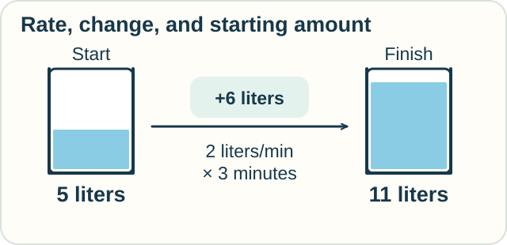

# 1 — How Fast? How Much?

**You need:** multiplication and the [welcome](../START.md).\
**Your goal:** tell a rate from a total and explain why the starting amount matters.

<!-- visual:art-garden -->

*At the garden, Jo asks how fast the water enters. Sam asks how much there is.*
<!-- /visual:art-garden -->

## Fill a tank

A tank starts with **5 liters**. Water enters at **2 liters per minute** for 3 minutes. None leaves.

| Question | Calculation | Answer |
|---|---|---|
| How fast is the amount growing? | 2 liters each minute | 2 liters per minute |
| How much enters? | 2 × 3 | 6 liters |
| How much is there now? | 5 + 6 | **11 liters** |

<!-- visual:diagram-water-total -->

*The water level records an amount. The incoming flow has a rate.*
<!-- /visual:diagram-water-total -->

The rate and the amount have different units. “Liters per minute” tells us how fast. “Liters” tells us how much.

**Predict:** if the tank started empty, would its rate change? What would its final amount be?

Check

The rate would still be 2 liters per minute. The final amount would be 6 liters.

A rate does not tell us the starting amount.

## What if the rate varies?

Suppose 2 liters enter during the first minute and 4 during the second. Add the contributions: **6 liters enter**.

For a smoothly changing flow, we can split time into short pieces. On each piece, use a rate to estimate the amount entering. Add the pieces. With suitable assumptions, smaller pieces approach a definite total.

That approaching value is a **limit**. Limits make the idea of “smaller and smaller pieces” precise.

**Integral calculus** develops ways to find such accumulations. A familiar picture is adding thin strips to find an area.

Now turn the question around. Suppose we know the tank's amount at each time. Comparing nearby times gives an average rate. Taking a suitable limit gives the rate at a particular moment: a **derivative**. **Differential calculus** studies these local rates.

## Why the two belong together

Under suitable conditions, adding up a quantity's rate of change gives its final amount minus its starting amount. This link is part of the **Fundamental Theorem of Calculus**.

It also explains why knowing the total change lets us recover the final amount only when we know where we started.

A **function** gives an output for each allowed input—for example, the water amount at each time.

Sometimes we know a rule for the rate before we know the whole function. For example, a tank's outflow might depend on how much water it holds. An equation linking a quantity to its rate is a **differential equation**. Solving it finds a function that obeys that rule.

## Try it with ribbon

A box holds 7 meters of ribbon. A machine adds 3 meters per minute for 2 minutes.

How much is added? How much is in the box? What assumption would fail if ribbon also left the box?

Check your reasoning

Six meters are added; the box holds 13 meters.

We assumed no ribbon leaves. If some leaves, we need the **net rate**: rate in minus rate out.

Optional notation — a local rate and an accumulated change

Let $f(x)=x^2$, meaning $x$ multiplied by itself. Its derivative is

$$
f'(x)=\lim_{h\to0}\frac{f(x+h)-f(x)}{h}.
$$

The fraction compares output change with a nonzero input change. Here it simplifies to $2x+h$, whose limit is $2x$.

At $x=3$, the local rate is 6. Adding this derivative from 0 to 3 gives

$$
\int_0^3 2x\,dx=9.
$$

The integral sign asks us to accumulate over the stated interval. The answer equals $f(3)-f(0)$.

For $F(x)=5+x^2$, the derivative is still $2x$. The same integral gives $F(3)-F(0)=14-5=9$.

A standard theorem says that if $f$ is continuous on $[a,b]$ and $F'=f$, then

$$
\int_a^b f(x)\,dx=F(b)-F(a).
$$

These are precise claims with assumptions, not rules for every possible function.

## More questions this opens

Rates need not involve time. A hillside has a slope even while it stays still. Derivatives also help search for the best size or setting. Both ideas appear in the next lesson.

## Sources

The tank and ribbon problems are original. For the mathematics, see OpenStax, *Calculus Volume 1*: [derivatives](https://openstax.org/books/calculus-volume-1/pages/3-1-defining-the-derivative) and [the Fundamental Theorem](https://openstax.org/books/calculus-volume-1/pages/5-3-the-fundamental-theorem-of-calculus). See also *Volume 2*, [differential equations](https://openstax.org/books/calculus-volume-2/pages/4-1-basics-of-differential-equations).

[← Welcome](../START.md) · [Home](../README.md) · [Next: Space and shape →](02-space-and-shape.md)
