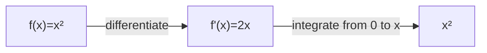

# 01 — Classical Calculus: Local Change and Accumulation

## Need

How can we reason rigorously about quantities that vary?

Classical differential and integral calculus gives two complementary operations:

- **differentiation** — local change;
- **integration** — accumulation.

Their deep connection is expressed by the Fundamental Theorem of Calculus.

## World

The beginner's world is a line or region on which quantities vary continuously enough for limits, derivatives, and integrals to make sense.

A simple inhabitant is a function:
\[
f:\mathbb{R}\to\mathbb{R}.
\]

## Primitive

At an elementary level we need variables, functions, arithmetic structure, and a notion of nearness or limit.

More advanced formulations make the assumptions precise using topology, measure theory, manifolds, differential forms, or functional analysis.

## Move I — Differentiate

For a function \(f\), the derivative at \(x\) is
\[
f'(x)=\lim_{h\to 0}\frac{f(x+h)-f(x)}{h},
\]
when the limit exists.

The derivative records how \(f\) responds to infinitesimal displacement.

### Toy example

For
\[
f(x)=x^2,
\]
we get
\[
f'(x)=2x.
\]

At \(x=3\), the local rate of change is \(6\).

## Move II — Integrate

For a suitable function,
\[
\int_a^b f(x)\,dx
\]
accumulates \(f\) across an interval.

For \(f(x)=2x\),
\[
\int_0^3 2x\,dx=9.
\]

## The remarkable bridge

If
\[
F(x)=\int_a^x f(t)\,dt,
\]
then under standard regularity conditions,
\[
F'(x)=f(x).
\]

Conversely,
\[
\int_a^b f'(x)\,dx=f(b)-f(a).
\]

Local change and global accumulation are linked.

This local/global duality will become one of our comparison motifs, but we will never assume that another calculus has an analogue automatically.

## Beyond one dimension

On manifolds, differential forms and Stokes' theorem give a far-reaching generalization:
\[
\int_M d\omega=\int_{\partial M}\omega.
\]

The slogan is:

> the accumulation of local change over a region is expressed on its boundary.

Again, this is a theorem inside a particular mathematical setting, not a universal law for everything called a calculus.

## Boundary

Classical calculus does not by itself tell us how concurrent processes communicate, how proofs transform, how names acquire scope, what an observer can resolve, or how measurement limitations alter differentiation.

Those require additional formal worlds.

## Relations

Classical calculus is historically and mathematically connected to differential geometry, tensor calculus, calculus of variations, stochastic calculus, functional analysis, and fractional calculus.

Its relation to λ-calculus or π-calculus is mostly **structural analogy** unless an explicit encoding or semantic construction is supplied.

## Checkpoint

Explain in your own words:

1. derivative;
2. integral;
3. Fundamental Theorem of Calculus;
4. why \(d/dx\) and β-reduction are not the same operation;
5. why Stokes' theorem makes boundaries mathematically important.

---

## See it

The diagram is intentionally simple: local change and accumulation can recover one another under the usual hypotheses.

## Do it

Start with

\[
f(x)=x^3.
\]

Differentiate it, then integrate the derivative from \(0\) to \(x\).

Check your answer

\[
f'(x)=3x^2
\]

and

\[
\int_0^x 3t^2\,dt=x^3.
\]

In this example the chosen lower bound makes the recovery exact without an extra constant.

> **Do not confuse:** the Fundamental Theorem connects derivative and integral under specific regularity assumptions. It is not a generic law saying that every formal transformation has an inverse.

## Watch — optional

3Blue1Brown, **“The essence of calculus”** — a geometric visual introduction to derivatives, integrals, and why the Fundamental Theorem links them:

https://www.youtube.com/watch?v=WUvTyaaNkzM

> **What the next layer notices:** what if the thing being transformed is not a number-valued function, but an expression that can itself represent computation?
