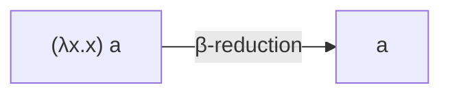

# 02 — λ-Calculus: Computation as Abstraction and Application

## Need

How little machinery is required to express computation with functions?

The untyped λ-calculus answers with an extraordinarily small language.

## World

The world contains **terms**.

A term is:

1. a variable \(x\);
2. an application \(MN\);
3. an abstraction \(\lambda x.M\).

Functions are not a separate species from values. A function is itself a term and can be passed as an argument.

## Primitive

The two characteristic constructions are:

- **abstraction** — \(\lambda x.M\);
- **application** — \(MN\).

The central operational idea is substitution.

## Move — β-reduction

\[
(\lambda x.M)N \to_\beta M[x:=N].
\]

Read this as:

> apply the abstraction \(\lambda x.M\) to \(N\), replacing free occurrences of \(x\) in \(M\) by \(N\).

### Toy example

\[
(\lambda x.x)\,a \to_\beta a.
\]

A slightly richer example:
\[
(\lambda x.\lambda y.x)\,a\,b
\]
reduces to
\[
a.
\]

## Why variable binding matters

Substitution must avoid accidentally turning a free variable into a bound one.

That leads to:

- free and bound variables;
- α-conversion;
- capture-avoiding substitution.

These are part of the calculus's formal control over meaning.

## Computation as rewriting

In this world, computation is a sequence:
\[
M_0\to_\beta M_1\to_\beta M_2\to_\beta\cdots.
\]

A term in **normal form** has no β-redex left to reduce.

Some terms have no normal form.

## A famous self-application

Define
\[
\Omega=(\lambda x.xx)(\lambda x.xx).
\]

Then
\[
\Omega\to_\beta\Omega.
\]

The calculus can express nontermination without adding a special loop operator.

## Why λ matters

The λ-calculus became foundational for computability, functional programming, programming-language semantics, and type theory.

Typed descendants constrain which applications are allowed and make new properties provable.

## Boundary

Plain λ-calculus does not make concurrency primitive.

An expression can encode many things, but the native picture is application/reduction, not multiple independently evolving processes that exchange communication links.

That motivates process calculi.

## Relation to π-calculus

Milner and others showed that λ-style computation can be represented using communicating processes.

But
\[
\lambda \not= \pi.
\]

An encoding tells us that selected computational behavior can be represented across calculi. It does not erase the difference in primitives.

## Checkpoint

Reduce:
\[
(\lambda f.\lambda x.f(fx))(\lambda y.y)
\]
far enough to see what it does.

Then answer:

1. What is abstraction?
2. What is application?
3. What is β-reduction?
4. Why is substitution not trivial string replacement?
5. Why does the existence of a λ→π encoding not make the calculi identical?

## Sources

- Stanford Encyclopedia of Philosophy, “The Lambda Calculus.”
- Robin Milner, *The Polyadic π-Calculus: A Tutorial*.

See [../REFERENCES.md](../REFERENCES.md).

---

## See it

The visual point is not “movement through space.” A redex is replaced by the result of capture-avoiding substitution.

## Do it

Reduce:

\[
(\lambda x.\lambda y.x)\;p\;q.
\]

Check your answer

First:

\[
(\lambda x.\lambda y.x)\;p
\to_\beta
\lambda y.p.
\]

Then:

\[
(\lambda y.p)\;q
\to_\beta
p.
\]

The term keeps the first argument and ignores the second.

> **Do not confuse:** β-reduction is a rewrite by substitution. It is not differentiation, even though both can be written as transformations.

## Watch — optional

Computerphile / Graham Hutton, **“Lambda Calculus”** — a compact visual introduction to abstraction, application, and reduction:

https://www.youtube.com/watch?v=eis11j_iGMs

> **What the next layer notices:** what if computation is not one expression reducing, but several processes interacting at once?
