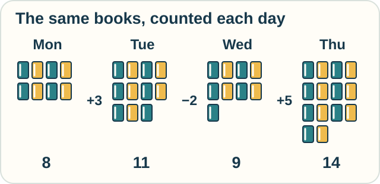

# 3 — Working in Steps

**You need:** addition and subtraction; [rates and totals](01-classical-calculus.md) help with the last example.\
**Your goal:** recover change from a sequence and tell an exact discrete answer from an estimate.

<!-- visual:art-library -->

*At the library, we begin by counting the books.*
<!-- /visual:art-library -->

## Count the books

A little library records its number of books at the end of each day.

| Day | Books | Change since the previous day |
|---|---|---|
| Monday | 8 | — |
| Tuesday | 11 | +3 |
| Wednesday | 9 | −2 |
| Thursday | 14 | +5 |

<!-- visual:diagram-book-counts -->

*Each small book stands for one book in the daily count.*
<!-- /visual:diagram-book-counts -->

Subtract neighboring counts to find each **difference**. Add the differences to recover the total change:

**3 − 2 + 5 = 6 more books.**

Start with 8 and add 6 to recover Thursday's 14.

**Predict:** someone starts a second library with 20 books. It has the same daily changes. How many books does it have on Thursday?

Check

Twenty plus six gives 26. The changes alone do not specify the starting count.

This is the same starting-value issue we met with the tank.

## Steps can be the right objects

The counts form a **sequence**: values in a chosen order. The days are separate steps. This is a **discrete** description.

The **calculus of finite differences** studies rules for differences and sums. It can help with counts, sequences, and repeated updates.

The count naturally changes in whole-book steps. Discrete mathematics is useful on its own.

The daily table also leaves things out. Eleven books at day's end does not tell us how many came and went during the day.

## Samples can also estimate a smooth process

A walker covers 50 meters in 10 seconds. The average speed is 5 meters per second.

That is exact for the stated distance and time. It need not be the speed at the fifth second. The walker might pause, then hurry.

To estimate a changing speed, we could measure positions at shorter time intervals. **Numerical methods** use calculations like these to estimate answers when an exact formula is unavailable or inconvenient.

More samples can help. They do not automatically fix an inaccurate measuring device. Very small intervals can even make measurement error matter more.

Finite differences can therefore play two roles: work exactly with discrete values, or help approximate continuous ones.

## Try it with a battery

A device reports these battery levels:

| Time | Charge |
|---|---|
| 12:00 | 80% |
| 12:10 | 74% |
| 12:20 | 70% |

1. Find the change in each interval and the total change.
2. Do these readings prove that the battery lost charge at a steady rate within each interval?
3. What is the average loss per minute over the whole 20 minutes?

Check your reasoning

1. The changes are −6 and −4 percentage points, for −10 in total.
2. No. We have three readings, not every value between them.
3. Ten percentage points divided by 20 minutes is **0.5 percentage points per minute**.

We say “percentage points” because the reading dropped from 80% to 70%. That is not the same as losing 10% of the starting charge.

Optional notation — the discrete cousin of a derivative

For a sequence $a_n$, the forward difference is

$$
\Delta a_n=a_{n+1}-a_n.
$$

Adding consecutive differences cancels the intermediate values:

$$
\sum_{n=0}^{N-1}\Delta a_n=a_N-a_0.
$$

The $\sum$ sign means “add the listed terms.”

If $a_n=n^2$, then $\Delta a_n=2n+1$. The derivative of the continuous function $f(x)=x^2$ is $2x$. A whole-step difference and a local derivative are related operations, but give different expressions.

## Keep exploring

[Finite-difference calculus](../tracks/change/finite-difference-calculus.md) follows growing tile squares through first and second differences. [Numerical calculus](../tracks/change/numerical-calculus.md) estimates rates and totals from samples, then finds a pulse that sparse readings miss.

In [differential equations](../tracks/change/differential-equations.md), repeated small steps help predict what a changing tank will do.

## Sources

The library, walker, and battery examples are original. Daniel Kleitman's MIT [*Calculus for Beginners*, Chapter 9](https://math.mit.edu/~djk/calculus_beginners/chapter09/contents.html) develops numerical differentiation. MIT's [numerical methods notes](https://math.mit.edu/icg/resources/teaching/18.330/18.330-Apr-2014.pdf) cover derivatives as differences and integrals as sums. The cancellation identity above follows directly by expanding the sum.

[← Space and shape](02-space-and-shape.md) · [Home](../README.md) · [Next: Logic and proof →](04-logic-and-proof.md)
