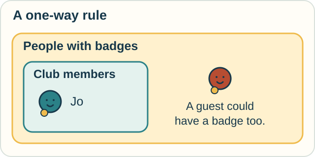

# 4 — What Follows from What?

**You need:** reading “if,” “and,” “all,” and “some.”\
**Your goal:** make a valid inference and spot a tempting reversal.

## Who gets a badge?

For this puzzle, accept two starting claims:

1. Every club member receives a badge.
2. Jo is a club member.

We can conclude that **Jo receives a badge**.

A proof shows why a conclusion follows from stated assumptions, using allowed steps. It does not have to measure anything or describe change over time.

**Predict:** Sam has a badge. Do our two claims prove that Sam is a member?

Check

No. Guests might receive badges too.

The rule says what follows from membership. It does not say that membership is the only way to get a badge.

<!-- visual:diagram-badge-logic -->

*The outer group includes everyone with a badge. The members fit inside it, but they need not fill it.*
<!-- /visual:diagram-badge-logic -->

## Two kinds of language

**Propositional calculus** reasons with whole statements and words such as AND, OR, NOT, and IF–THEN.

For example, “The gate is open AND the path is clear” is true only when both parts are true. In ordinary classical logic, OR allows either part or both; it does not automatically mean “exactly one.”

**Predicate calculus** adds a way to discuss objects and their properties, including ALL and SOME.

| Kind of claim | Example | What would establish it? |
|---|---|---|
| About one object | Jo is a member | Information about Jo |
| About every object in a group | Every member has a badge | A reason covering all members |
| About at least one object | Some member has a badge | One member who has a badge |

In logic, “some” means **at least one**. It does not mean “some but not all.”

## A language and a way to prove things

Once we choose a language, we still need proof rules.

**Natural deduction** and **sequent calculus** are ways to arrange formal proofs. Both can be used with propositional or predicate logic. They are not the next two subjects after those logics.

One rule we used is simple:

> If A implies B, and A is true, then B follows.

Here A and B stand for statements. We cannot silently reverse that rule.

We must also separate **valid reasoning** from **true starting claims**. A proof based on “every bird can fly” would need that assumption checked before we applied it to actual birds.

## Try it with library books

Assume:

- Every book on the repair shelf has a torn page.
- This dictionary is on the repair shelf.

What follows? If another book has a torn page, must it be on that shelf?

Then invent a different setting where reversing an IF–THEN rule would lead to a mistake.

Check your reasoning

The dictionary has a torn page.

The other book need not be on the repair shelf. It might still be in someone's bag. Our rule never said all damaged books had already reached the shelf.

A fresh example: all squares have four sides, but having four sides does not make every shape a square.

Optional notation — statements, objects, and proof steps

Write $M(x)$ for “$x$ is a member” and $B(x)$ for “$x$ receives a badge.”

$$
\forall x\,(M(x)\to B(x)),\qquad M(\mathrm{Jo})
$$

The symbol $\forall$ means “for all.” The arrow means “implies.” These premises allow us to infer $B(\mathrm{Jo})$.

The symbol $\exists$ means “there exists at least one.” Thus $\exists x\,M(x)$ says that at least one member exists.

A sequent such as $\Gamma\vdash A$ says that conclusion $A$ is derivable from assumptions collected in $\Gamma$, under the chosen proof rules.

Classical, intuitionistic, modal, and linear logics make different choices about reasoning. They are further branches, not interchangeable spellings.

## Explore further

Try a [sequent proof](../tracks/proof/sequent-calculus.md). For another particular symbolic system, see [the calculus of indications](../tracks/logic/calculus-of-indications.md).

## Sources

The badge and book puzzles are original. See the Open Logic Project's [proof-systems overview](https://builds.openlogicproject.org/content/first-order-logic/proof-systems/proof-systems.pdf) and [*forall x*, natural deduction](https://forallx.openlogicproject.org/bookml/Ch16.html). [References](../REFERENCES.md#logic-and-formal-reasoning) gives further reading.

[← Working in steps](03-discrete-and-numerical.md) · [Home](../README.md) · [Next: Instructions and guarantees →](05-computation-and-correctness.md)
