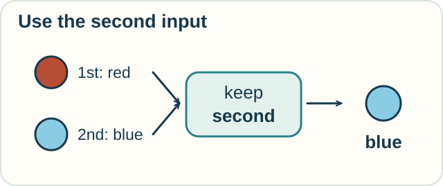
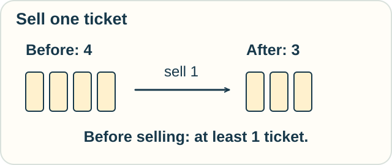

# 5 — Instructions and Guarantees

**You need:** simple subtraction and [if–then reasoning](04-logic-and-proof.md).\
**Your goal:** distinguish running an instruction, checking its type, and proving a promise about it.

<!-- visual:art-workshop -->

*At the workshop, a plan can be followed, checked, and connected to another plan.*
<!-- /visual:art-workshop -->

## What does the instruction do?

Imagine a rule called **keep the second**. Give it two inputs, and it returns the second one.

| Inputs, in order | Result |
|---|---|
| red, blue | blue |
| cat, dog | dog |
| 4, 9 | 9 |

<!-- visual:diagram-keep-second -->

*The rule follows a position, not a favorite color.*
<!-- /visual:diagram-keep-second -->

The objects change, but the rule stays the same.

**Lambda calculus**, written λ-calculus, gives a small formal language for building functions, applying them to inputs, and replacing input names with their supplied values. Such simple ingredients can express a very wide range of computations.

**Predict:** what happens if we give “keep the second” the inputs blue, red?

Check

It returns red. Input order is part of the instruction.

The rule does not choose its favorite color. It uses the second position.

## Do the pieces fit?

A ticket counter expects a number of tickets. A printer expects a line of text.

A **type** describes what kind of input or result an expression may have. Type rules can reject an attempt to subtract one from a photograph.

An **integer** is a number such as −3, 0, or 4, with no fractional part. A type that says only “integer” allows −3. Passing that type check would not prove that a ticket count is sensible.

Types check the distinctions their rules express. Some type systems can express much richer conditions than these simple labels.

## Can we prove a promise?

Now consider this ticket-selling instruction:

> Replace the number of tickets left with that number minus one.

We want to promise: **the result is never negative**.

What must be true beforehand? There must be **at least one ticket left**.

| Before | After subtracting one | Promise met? |
|---|---|---|
| 4 | 3 | Yes |
| 1 | 0 | Yes |
| 0 | −1 | No |

<!-- visual:diagram-ticket-contract -->

*This little contract connects a starting condition to a promised result.*
<!-- /visual:diagram-ticket-contract -->

A condition required beforehand is a **precondition**. A condition promised afterward is a **postcondition**.

**Hoare logic** provides rules for proofs about programs using such conditions. **Predicate-transformer methods** can work backward from a desired result to a condition needed at the start.

For our one-step instruction, “at least one” is the least restrictive starting condition that guarantees a nonnegative result. Requiring at least ten would work, but would exclude safe cases.

We are assuming a simple counter, exact arithmetic, and one completed update. A real ticket system also needs rules for simultaneous buyers and failed transactions.

## Try it with supplies

An instruction removes two pens from the recorded stock.

1. What starting condition guarantees a nonnegative result?
2. Would checking only that the stock is an integer guarantee this?
3. If the record says five pens, does the proof establish that five real pens are on the shelf?

Check your reasoning

1. Start with at least two.
2. No. Integers include zero, one, and negative numbers.
3. No. The proof concerns the stated record and update. Matching that record to the shelf needs another check.

Optional notation — a function and a program contract

In lambda calculus,

$$
(\lambda x.\lambda y.y)\;\mathrm{red}\;\mathrm{blue}
\;\longrightarrow\;(\lambda y.y)\;\mathrm{blue}
\;\longrightarrow\;\mathrm{blue}.
$$

The expression names two inputs and returns the second. The color words stand for terms; no arithmetic is needed.

A Hoare triple for our ticket update is

$$
\{n\geq1\}\quad n:=n-1\quad\{n\geq0\}.
$$

The left braces contain the precondition; the right braces contain the postcondition. The symbol $:=$ means “update the stored value.”

A **partial-correctness** claim says that if the program finishes, its result meets the stated condition. **Total correctness** also requires that it finishes. Our simple subtraction terminates in the model; a program with a loop needs further reasoning.

## Explore further

Try [lambda substitution](../tracks/computation/lambda-calculus.md), then [the Calculus of Constructions](../tracks/types/calculus-of-constructions.md) for a deeper link between types and proofs.

## A nearby use of the word “function”

[Functional calculus](../tracks/operators/functional-calculus.md) applies functions to matrices or suitable operators. A sound box that swaps two values gives us a tiny example: what does it mean to square the swapping action? This subject has a different meaning from functional programming.

## Sources

The examples are original. See Frank Pfenning's [lambda-calculus lecture](https://www.cs.cmu.edu/~fp/courses/15814-f25/lectures/01-lambda.pdf), Carnegie Mellon's [Hoare-logic notes](https://www.cs.cmu.edu/~aldrich/courses/17-355-19sp/notes/notes11-hoare-logic.pdf), and Edsger Dijkstra's [EWD472](https://www.cs.utexas.edu/~EWD/transcriptions/EWD04xx/EWD472.html) for predicate transformers and program derivation.

[← Logic and proof](04-logic-and-proof.md) · [Home](../README.md) · [Next: Questions of data →](06-data-and-relations.md)
