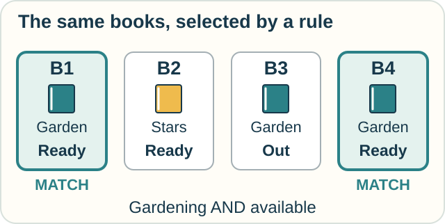

# 6 — Asking Questions of Data

**You need:** [AND, OR, and “at least one”](04-logic-and-proof.md).\
**Your goal:** describe which records belong in an answer without specifying how a computer must find them.

<!-- visual:art-library -->

*The same library, a different question: which books meet our conditions?*
<!-- /visual:art-library -->

## Find a book

A library stores this small table. Each row has its own ID.

| ID | Title | Topic | Available? |
|---|---|---|---|
| B1 | Small Gardens | Gardening | Yes |
| B2 | Night Skies | Astronomy | Yes |
| B3 | Seeds at Home | Gardening | No |
| B4 | Balcony Plants | Gardening | Yes |

Ask: **Which books are about gardening AND available?**

Check both conditions for each row. The answer contains B1 and B4.

<!-- visual:diagram-book-query -->

*“Garden” means gardening; “Ready” means available. Both conditions must hold.*
<!-- /visual:diagram-book-query -->

**Predict:** change AND to OR. Which rows now qualify?

Check

All four.

B2 is available even though it is not about gardening. B3 is about gardening even though it is unavailable. B1 and B4 meet both conditions, which is allowed by this OR.

## Describe the answer

**Relational calculus** expresses a database question through conditions that its answers must satisfy.

A **relation** can be pictured as a table of records. In **tuple relational calculus**, variables stand for whole records, or tuples. In **domain relational calculus**, variables stand for individual values in their fields.

Our gardening condition describes what belongs in the answer. It does not demand that the computer inspect rows in a particular order.

A system could scan every row or use an index, much as you might use a book's index to find a topic. Those are choices about how to carry out the search.

This is **declarative** reasoning: state the desired condition.

## Connect two tables

Suppose the library also has reader requests:

| Reader | Wanted topic |
|---|---|
| Jo | Gardening |
| Sam | Astronomy |

To find books for each reader, require:

1. a request record for that reader;
2. a book with the same topic;
3. availability marked Yes.

Jo matches B1 and B4. Sam matches B2.

The connection is a shared value, the topic. We do not need a new kind of calculus for every pair of tables.

## Try it with a cupboard

A cupboard record lists objects and where they are:

| Object | Color | Shelf |
|---|---|---|
| Cup | Blue | Top |
| Bowl | Red | Top |
| Plate | Blue | Bottom |

Write conditions to select:

- blue objects on the top shelf;
- objects that are blue or on the top shelf.

Now suppose the plate was moved yesterday but the record was never updated. What would a correct query tell us?

Check your reasoning

“Color is blue AND shelf is top” selects the cup.

“Color is blue OR shelf is top” selects all three objects.

The query can correctly report the stored location of the plate while being wrong about its present physical location. Query rules do not verify the source data.

Optional notation — a condition with a bounded search

A tuple-calculus version of the first book query is

$$
\{b\mid \mathrm{Books}(b)\land
b.\mathrm{topic}=\text{Gardening}\land
b.\mathrm{available}=\text{Yes}\}.
$$

Read this as “all records $b$ that are in Books and satisfy both conditions.”

The vertical bar means “such that.” The symbol $\land$ means AND.

Useful query languages restrict expressions so that results are well behaved. Asking for “every number not in this small table,” for example, could describe infinitely many answers. Safe relational-calculus queries avoid this kind of unbounded result.

SQL draws on relational ideas, but practical SQL has features such as duplicates and missing values that require additional rules. It is not simply this notation written in English.

## Why it matters

A question about data is also a small piece of logic. The subject changes from proving a claim to selecting records, while some of the reasoning tools carry over.

## When the records leave things unresolved

For a longer visit, [tuple relational calculus](../tracks/data/tuple-relational-calculus.md) connects book and request records and checks that the same record meets all the right conditions. [Domain relational calculus](../tracks/data/domain-relational-calculus.md) names individual field values, then asks whether every request is covered—including the case of no requests.

A query can use only the information represented in its records. [Rough sets](../tracks/observation/rough-sets.md) asks what a coarse label lets us classify definitely or only possibly. Its crate example connects this data question to observation.

## Sources

The tables and queries are original. See Silberschatz, Korth, and Sudarshan, *Database System Concepts*, [Chapter 27: Formal Relational Query Languages](https://www.db-book.com/online-chapters-dir/27.pdf), especially tuple calculus, domain calculus, and safe expressions.

[← Instructions and guarantees](05-computation-and-correctness.md) · [Home](../README.md) · [Next: Messages and events →](07-interaction-and-action.md)
