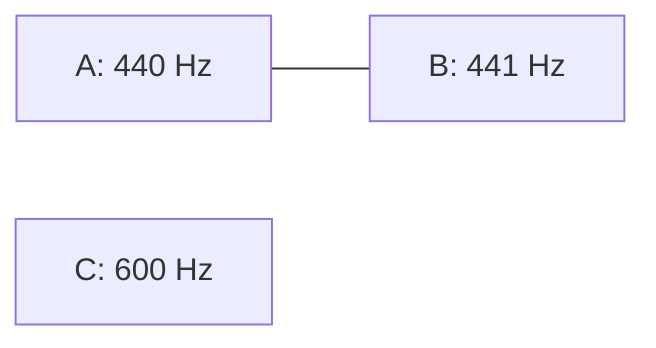
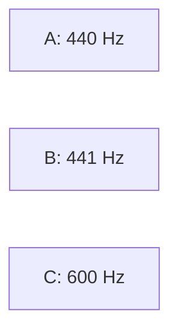

# 06 — Distinction Graphs: Distinguishability Relative to an Observer

## Need

A bare distinction tells us that something has been separated.

But real observers may fail to tell different things apart.

Ben Goertzel's **distinction graphs** formalize this explicitly.

## World

Take a collection of items and a particular observer \(O\).

Construct a graph whose nodes are the items.

Two nodes are connected when the observer **cannot distinguish them**.

Schematically:
\[
x\sim_O y
\quad\Longleftrightarrow\quad
O\text{ does not distinguish }x\text{ from }y.
\]

The graph represents an observer-relative pattern of indistinguishability.

## Primitive

The published 2019 construction begins with:

1. items;
2. a particular observer;
3. the observer's capacity to distinguish them.

That ordering matters.

The observer is not derived by the basic definition. Distinguishability is indexed to an observer.

## Move

The central construction is graph formation from observational indistinguishability.

Goertzel defines **graphtropy** from the connection structure and relates special cases to logical entropy.

He also develops probabilistic and quantum variants.

## Toy example

Suppose three tones have frequencies:

- \(A=440\) Hz;
- \(B=441\) Hz;
- \(C=600\) Hz.

Imagine observer \(O\) cannot distinguish \(A\) from \(B\), but can distinguish both from \(C\).

Then the distinction graph contains an edge between \(A\) and \(B\), but not between those nodes and \(C\).

A sharper observer \(O'\) might distinguish all three.

So:
\[
G_O\neq G_{O'}.
\]

The informational structure depends on the observer.

## Dynamic Distinction Graphs

The 2019 paper goes further and introduces **Dynamic Distinction Graphs (DDGs)** by adding causal-implication structure.

This permits distinction-centered models with dynamics and provides machinery for modeling observers within the formalism.

That is an important expansion beyond a static graph.

## Relation to the calculus of indications

The relation is conceptually strong:

- both make distinction foundational;
- distinction graphs explicitly index indistinguishability to an observer.

But they are not the same formalism.

The graph construction adds combinatorial and observer-relative structure not present merely in the act of marking a form.

## Boundary

The basic distinction-graph definition does not itself supply:

- a derivation of the observer from pre-observational dynamics;
- a differential operator;
- an integral operator;
- an FTC-like recovery defect;
- geometric connection or holonomy.

Those are separate constructions.

This is where comparison with Fuzzy Calculus becomes precise rather than rhetorical.

## Checkpoint

Given four colors and an observer who confuses red/orange and blue/purple, draw the corresponding indistinguishability graph.

Then imagine an observer with finer resolution.

What changed?

- the colors?
- the observer?
- the graph?
- the relation we call information?

The distinction-graph framework forces that question into the formal object.

## Sources

- Ben Goertzel, “Distinction Graphs and Graphtropy: A Formalized Phenomenological Layer Underlying Classical and Quantum Entropy, Observational Semantics and Cognitive Computation,” 2019, arXiv:1902.00741.

See [../REFERENCES.md](../REFERENCES.md).

---

## See it

For the tone example above, observer \(O\) cannot distinguish \(A\) from \(B\):

For a sharper observer \(O'\), the edge can disappear:

The physical tones did not have to change. The observer-relative indistinguishability relation did.

## Do it

Suppose an observer sees four colors: red, orange, blue, and purple. It cannot distinguish red from orange or blue from purple.

How many indistinguishability edges are required in the simplest graph?

Check your answer

Two:

- red — orange;
- blue — purple.

A more elaborate model could assign probabilities or changing relations, but the simplest static graph needs only those two edges.

> **Do not confuse:** an observer-relative distinction graph does not by itself imply that the underlying items are identical. It represents what a specified observer can or cannot distinguish.

## Media note

No external video is required here. The original 2019 paper is more important than adding a generic explainer, and the two small graphs above expose the central construction directly.

> **What the next layer notices:** what determines the observer's resolution in the first place, and what happens when bounded observation participates in differentiation and reconstruction?
