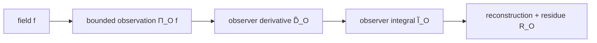

# 07 — Fuzzy Calculus: Bounded Observation and Residual Recovery

## In one sentence

Fuzzy Calculus asks what happens to differentiation and integration when they are performed through a **bounded observational interface** rather than from an ideal view from nowhere.

## Need

Classical calculus usually treats the quantity being differentiated or integrated as directly available.

But an observer may have finite resolution, a bounded domain, a perceptual kernel, and observer-relative derivations.

If access is filtered, the derivative available to the observer need not be identical to an ideal derivative. The mismatch can itself become mathematical data.

## World

A *Principia Symbolica* formulation equips a bounded observer \(O\) with structures such as

\[
(K_O,\delta_O,\mathcal B_O),
\]

where \(K_O\) is an observer kernel, \(\delta_O\) an observer-relative derivation, and \(\mathcal B_O\) a bounded perceptual domain.

A related kernel action is

\[
\mathcal K_O[X](x)=\int_M K_O(x-y)X(y)\,d\mu(y).
\]

The observer therefore acts on a filtered or projected field.

## Primitive

The primitive concern is not uncertainty in the abstract, but **bounded access to change**.

The calculus asks:

> What derivative is realizable for this observer?

## Move I — Differentiate

\[
f\mapsto\widetilde D_O f.
\]

## Move II — Integrate

\[
g\mapsto\widetilde I_O g.
\]

Now ask whether integration exactly reconstructs what differentiation removed.

A residual formulation has the shape

\[
\widetilde I_O\widetilde D_O f=f+R_O[f],
\]

where \(R_O\) records the recovery defect.

## See it

The point is not that every observation produces a large error. The point is that **failure of exact recovery is represented instead of discarded**.

## Fuzzy FTC and Stokes

The AGI-26 companion materials include a reduced curve-local **Fuzzy Fundamental Theorem of Calculus** and an **Observer-Relative Stokes** result with bulk and boundary residues.

The associated geometric language includes data such as

\[
(E,h_O,\nabla_O),
\]

together with kernel scale, connection, and observer-relative curvature.

This extends the familiar local/global question:

> How are local change and accumulated change related when the observation process itself is bounded?

## Do it

Imagine a sharp step signal viewed through a smoothing kernel.

1. The underlying signal changes abruptly.
2. The observed signal changes gradually across the kernel width.
3. Differentiate the observed signal.
4. Integrate that derivative back.

What information might fail to return exactly?

Check your reasoning

The observer may recover the smoothed transition rather than the original infinitely sharp step.

The difference between the original and the recoverable reconstruction is the kind of structure a residue term is meant to track.

This is a pedagogical example, not the full theorem.

> **Do not confuse:** observer-relative residue with generic random noise. A residue can be systematic and structured even in a deterministic observation model.

## Boundary

Fuzzy Calculus does not by itself supply a complete theory of cognition, identity, or agency.

Its native question is narrower: **how bounded observation changes the calculus of local change, accumulation, transport, and recovery**.

## Relations

Useful neighboring formalisms include classical differential and integral calculus, convolution and signal-processing mathematics, differential geometry and holonomy, stochastic and fuzzy mathematics, and observer-relative distinction formalisms.

These relations are worth comparing, but none should be assumed to be an identity.

## What the next layer notices

If observation alters what can be reconstructed, then repeated observation and transport can accumulate history.

That makes path dependence, curvature, and holonomy natural next questions.

## Sources

- Paul Carver Tiffany III, *Principia Symbolica*, especially the bounded-observer and observer-kernel constructions.
- Paul Carver Tiffany III, *The Hypothesis Surface: An Operational Epistemology for Autonomous Research*, AGI-26 supplementary materials, especially the FFTC / Observer-Relative Stokes companion.

See [../REFERENCES.md](../REFERENCES.md).
