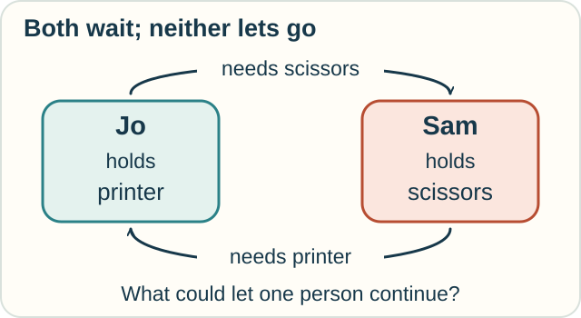
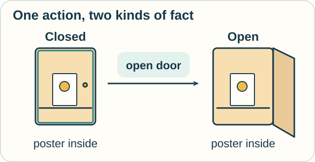

# 7 — Messages and Events

**You need:** following a sequence of actions; [logic](04-logic-and-proof.md) helps.\
**Your goal:** spot a coordination problem and state what an action changes or leaves alone.

<!-- visual:art-workshop -->

*The same workshop, a different question: can the helpers coordinate their steps?*
<!-- /visual:art-workshop -->

## Two people, one stuck project

Jo and Sam are making posters. Each needs the printer and the scissors.

| Person | Holds | Waiting for |
|---|---|---|
| Jo | Printer | Scissors |
| Sam | Scissors | Printer |

<!-- visual:diagram-circular-wait -->

*Each person is holding the tool the other needs.*
<!-- /visual:diagram-circular-wait -->

Suppose each refuses to release a tool until they have both.

Neither can continue. This is a **deadlock**: progress is blocked by their pattern of waiting.

**Predict:** would buying faster scissors solve this particular problem?

Check

No. The problem is who is holding and waiting for each tool. Faster cutting does not change those rules.

One possible repair is to require everyone to acquire the printer first, then the scissors. Someone waiting for the printer would not already be holding the scissors.

That removes this circular-wait pattern in our model. It does not prove every poster project will always finish.

## Describe the interaction

A **process** is an actor or activity in a model. **Concurrency** means activities can be in progress over overlapping periods. They do not have to run at exactly the same instant.

Process calculi give rules for communication and coordinated behavior. They help us ask which actions can happen, which must wait, and whether systems can get stuck.

Different process calculi focus on different features:

| Family or example | A central concern |
|---|---|
| CCS and CSP | Communication, events, and concurrent behavior |
| Pi calculus | Passing communication names, so connections can change |
| Stochastic process calculi | Adding random timing or rates |

Imagine Jo sends Sam a contact address for a new print shop. Sam can now reach someone new. Passing a connection is the kind of idea explored in [pi calculus](../tracks/interaction/pi-calculus.md).

The formal rules specify details such as whether sending must wait for a receiver. Ordinary words like “message” do not settle those choices.

## A different question: what becomes true?

Suppose a finished poster is in a closed cupboard. Jo opens the door.

| Fact | Before | After |
|---|---|---|
| Door is open | False | True |
| Poster is inside | True | True |

<!-- visual:diagram-cupboard-poster -->

*We show the inside in both pictures so you can track the poster.*
<!-- /visual:diagram-cupboard-poster -->

Our model says opening changes the door, while the poster stays put.

**Action calculi** describe effects and what persists. Situation calculus uses actions and the situations they produce. Event calculus reasons about events in time. Fluent calculus provides another way to describe states and their updates.

A **fluent** is a fact or value that can vary with time or situation. The word is used across this area.

These tools ask related but different questions from a communication model. “A message was received” and “the cupboard opened” are separate events unless our rules connect them.

## Try it with a delivery

A courier sends “I am outside.” The recipient's phone receives the message.

1. Does receiving that message prove the door is now open?
2. What extra action would a model need?
3. If both people wait for the other to speak first, what kind of problem might result?

Check your reasoning

1. No. Receipt changes what the phone has received.
2. Include a door-opening action and its effects. A model may also require someone to notice and act on the message.
3. A coordination deadlock, if neither has another allowed action that can break the wait.

## Explore further

The [action-calculi track](../tracks/action/situation-event-fluent.md) explains persistence more closely. The [pi](../tracks/interaction/pi-calculus.md) and [rho](../tracks/interaction/rho-calculus.md) tracks explore two particular process languages. They are optional branches, not stages every calculus must pass through.

## Compare two systems

Two machines may allow the same finished sequences while offering different choices along the way. [Observational equivalence](../tracks/observation/observational-equivalence.md) explores that difference with two drink machines.

## Sources

The poster and courier examples are original. See C. A. R. Hoare's [*Communicating Sequential Processes*](https://www.cs.ox.ac.uk/ucs/hoarebook.pdf), Milner's [pi-calculus tutorial](https://www.lfcs.inf.ed.ac.uk/reports/91/ECS-LFCS-91-180/), and the [action-calculus sources](../REFERENCES.md#situation-event-and-fluent-calculi).

[← Questions of data](06-data-and-relations.md) · [Home](../README.md) · [Next: Chance and cause →](08-chance-and-cause.md)
