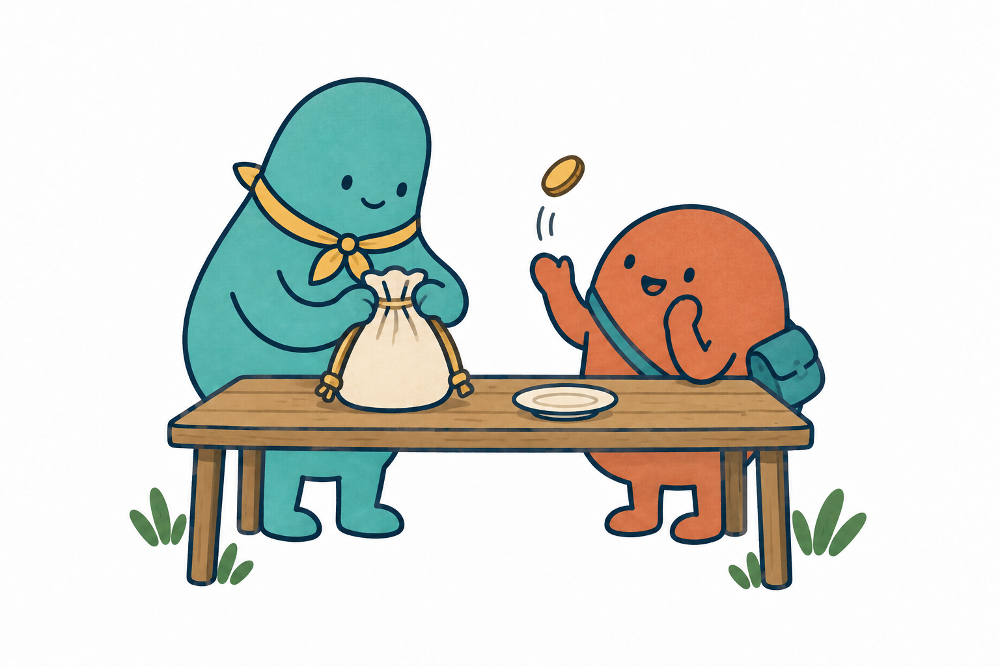
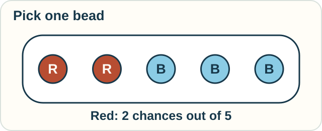
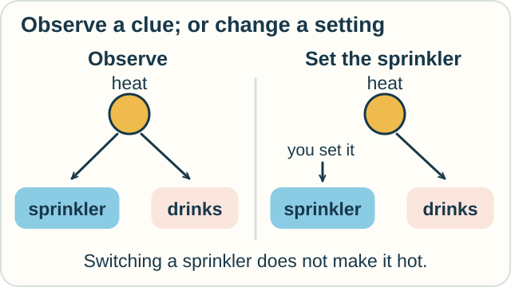

# 8 — Chance and Cause

**You need:** simple fractions and [the difference between rules and assumptions](04-logic-and-proof.md).\
**Your goal:** distinguish uncertain outcomes, random paths, and the effects of interventions.

<!-- visual:art-chance -->

*Jo and Sam can know the possible outcomes without knowing which will happen.*
<!-- /visual:art-chance -->

## What might we pick?

A bag holds two red beads and three blue beads. Suppose each bead is equally likely to be picked.

The chance of red is **2 out of 5**. We write this as 2/5, or 40%.

<!-- visual:diagram-bead-chance -->

*Letters as well as colors identify the red and blue beads.*
<!-- /visual:diagram-bead-chance -->

This is a **probability model**. It states the possible outcomes and assigns chances to them. The answer depends on our equal-chance assumption.

**Predict:** we pick a red bead and keep it outside the bag. What is the chance of red on the next pick?

Check

One red and three blue beads remain. The chance is now 1/4, or 25%.

The first draw changed the contents. If we had put the bead back, the answer would stay 2/5, assuming another equally likely draw.

Probability has rules for combining chances and updating them when information changes. People sometimes call this a probability calculus. It is the starting ground for several different subjects.

## What if chance shapes a whole path?

Put a counter at zero. Toss a fair coin twice. Each head moves it one step right; each tail moves it one step left. Assume the tosses are independent.

| Tosses | Final position |
|---|---|
| Heads, heads | +2 |
| Heads, tails | 0 |
| Tails, heads | 0 |
| Tails, tails | −2 |

All four sequences are equally likely. Half return to zero.

This is a discrete **random walk**. It models a whole path, not just one uncertain outcome.

**Stochastic calculus** develops ways to integrate suitable random processes and describe how functions of those processes change, especially in continuous time. Some of these paths are so rough that the usual derivative does not exist. We need carefully defined new operations.

The coin walk is an entry example. It is not itself the full machinery of stochastic calculus.

## Would changing something cause an effect?

Now consider a made-up town where hot weather makes people both run sprinklers and buy cold drinks.

Assume our model has no other connection between sprinklers and drink buying.

Seeing a sprinkler running may be a clue that it is hot. That can make high drink sales more likely.

But switching on a sprinkler does not make the weather hot.

| Question | What changes in our reasoning? |
|---|---|
| We observe the sprinkler running | We learn something that may be evidence of hot weather |
| We force the sprinkler on | We change the sprinkler setting; this does not itself change the weather |

<!-- visual:diagram-observe-or-set -->

*The arrows state the assumed causes. Setting the sprinkler changes one part of that model.*
<!-- /visual:diagram-observe-or-set -->

A **causal model** states which things affect which others. An **intervention** means setting something, rather than just observing its value.

Pearl's **do-calculus** gives rules for reasoning about interventions under a causal model. It can help determine when observational data suffice to answer a causal question. Some questions cannot be answered from the available data and assumptions.

Writing “cause” beside a correlation does not supply the missing model.

## Try it with the same model

We force the sprinklers off on a hot day. Must drink sales fall?

What new relationship would we need to add if sprinklers attracted thirsty visitors to the town?

Check your reasoning

Under our stated model, switching off sprinklers does not change drink buying. Heat still affects both.

If sprinklers attracted visitors who bought drinks, there would be another causal route from sprinklers to sales. We would need to change the model and reason again.

The answer follows from the assumed causal structure. The story alone does not establish how a real town works.

Optional notation — observation and intervention

Let $S$ mean the sprinkler setting and $D$ mean drink buying.

$$
P(D\mid S=\mathrm{on})
$$

describes a probability conditional on observing the sprinkler on. The vertical bar means “given.”

$$
P(D\mid do(S=\mathrm{on}))
$$

describes drink buying under an intervention that sets the sprinkler on. The two expressions need not have the same value.

For random paths, even the integration convention matters. Itô and Stratonovich integrals use different definitions and corresponding rules. The [stochastic track](../tracks/change/stochastic-calculus.md) introduces this distinction.

## Sources

The bead, walk, and town examples are original. See MIT's [*Introduction to Probability*](https://ocw.mit.edu/courses/res-6-012-introduction-to-probability-spring-2018/pages/part-i-the-fundamentals/), Varadhan's [notes on stochastic integration](https://math.nyu.edu/~varadhan/fall06/fall06.3.pdf), and Judea Pearl's [*The Do-Calculus Revisited*](https://ftp.cs.ucla.edu/pub/stat_ser/r402.pdf).

[← Messages and events](07-interaction-and-action.md) · [Home](../README.md) · [Next: Choose and combine →](09-choose-and-combine.md)
