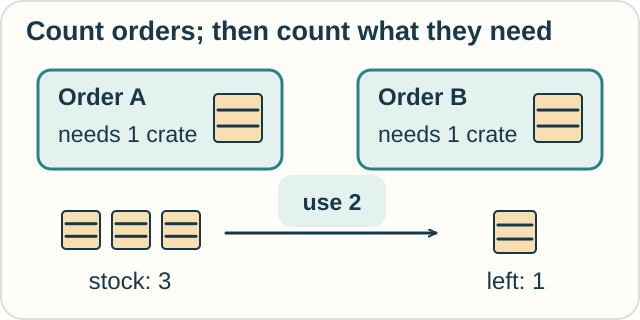

# 9 — Choose and Combine

**You need:** a few of the earlier lessons; keep the [field map](../PANTHEON.md) open if useful.\
**Your goal:** choose a tool by its question and explain an assumption that connects two models.

<!-- visual:art-delivery -->

*Garden produce, a book, a record, and a shared task: familiar objects return in a new problem.*
<!-- /visual:art-delivery -->

## One delivery service, many questions

A neighborhood group delivers groceries. It has addresses, drivers, vans, orders, and uncertain travel times.

There is no need to force all of these into one calculus.

| Question | A useful starting point | What the model works with |
|---|---|---|
| How much fuel will a trip use? | Rates and accumulation | Consumption rates, distances, totals |
| Which route has the lowest chosen cost? | Optimization | Allowed routes and a cost measure |
| How did stock change each day? | Differences and sums | A sequence of counts |
| Does every delivered order meet our rule? | Logic | Claims and assumptions |
| Can an update make stock negative? | Program logic | Program steps and conditions |
| Which orders still need delivery? | Relational calculus | Records and selection conditions |
| Can two drivers wait forever for each other? | Process models | Messages, actions, and waiting |
| What remains true after unloading? | Action models | Effects and persistent facts |
| How uncertain is arrival time? | Probability and random-process models | Possible times and their chances |
| Would a new dispatch policy reduce delays? | Causal reasoning | Interventions and causal assumptions |

The same real object may appear differently in each model. A van can be a fuel-consuming quantity system, an actor sending messages, or a row in a table.

## Connect two tools carefully

Suppose a query selects two undelivered orders. Each needs one crate. The stock record says three crates remain.

The query gives us **two selected orders**. An arithmetic update subtracts two from stock: **3 − 2 = 1**.

<!-- visual:diagram-orders-and-crates -->

*Turning an order count into a crate count needs a rule connecting the two.*
<!-- /visual:diagram-orders-and-crates -->

The bridge is an assumption: **each selected order needs exactly one crate**.

Other assumptions matter too:

- the two records refer to distinct orders;
- the stock record is accurate;
- another worker has not taken a crate during the update.

The mathematics inside each model can be correct while the connection between models is wrong.

**Predict:** one order needs two crates and the other needs one. What changes?

Check

There are still two orders, but three crates are needed. The remaining stock is zero.

Counting orders is no longer the same as counting crates. The query should supply the required quantities, and the update should add those quantities before subtracting.

## A similar pattern is not the same system

Adding changes to recover a final value appeared with tanks and daily book counts. That is a useful connection between derivatives/integrals and differences/sums.

But the rules are not identical. A derivative uses a local limit; a daily difference uses a specified step.

Likewise, a proof and a computer program may be related through a precise correspondence. That does not mean every proof is every kind of program.

When you hear “these calculi are connected,” ask **how**. Is it a shared pattern, an extension, a translation, or a theorem? [Connections](../RELATIONS.md) gives examples.

## Your turn: build a two-tool explanation

Choose a familiar task: cooking for guests, organizing a game, maintaining a garden, or something of your own.

1. Ask two different questions about it.
2. Pick a tool or family for each question.
3. Say what objects and rules each model uses.
4. Name one assumption needed to combine the answers.
5. Change that assumption. Explain which answer must be reconsidered.

One possible answer

For a meal, a data query finds guests recorded as vegetarian. Arithmetic scales servings.

To turn a count of guests into a quantity of food, assume a serving size per guest. A child needing half a serving changes that connection.

The records may also be incomplete. A correct query does not guarantee that everyone entered their preferences.

Another valid choice could use a schedule and a process model to keep two cooks from blocking each other at the oven.

## What you have learned to look for

A new calculus can now be approached with four questions:

**What does it work with? What moves are allowed? What can those moves establish? Which assumptions make the result useful?**

You do not need to recognize every name on the map. Being able to ask these questions is a skill you can carry into a new subject.

## Next explorations

Try [fresh practice problems](../PRACTICE.md), choose an optional track from the [field map](../PANTHEON.md), or teach one example to someone else and ask them to change a rule.

*This comparison and its examples are original teaching synthesis. Sources for each tool appear in its lesson; specific formal connections are documented in [Connections](../RELATIONS.md).*

[← Chance and cause](08-chance-and-cause.md) · [Home](../README.md) · [Practice →](../PRACTICE.md)
