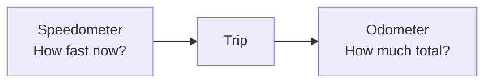

# 01 — Things Change

Before calculus has symbols, it has a question:

> **What is changing?**

Look around.

- A car moves down a road.
- Water fills a glass.
- Soup cools on the counter.
- A hill gets steeper as you walk.
- Money grows in a savings account.

All of these involve change.

## Two simple questions

When something changes, we can ask two basic questions.

### How fast is it changing right now?

A speedometer answers this kind of question.

If a car says **50 miles per hour**, that means its position is changing at that rate right now.

### How much change has built up?

An odometer answers this kind of question.

It keeps track of how much distance has added up over the whole trip.

Those two ideas—**change right now** and **change added up**—sit at the heart of ordinary calculus.

## See it

## Do it

Imagine you drive for two hours at about 40 miles per hour.

You do not need a formula. Just estimate: about how far did you travel?

Check your answer

About 80 miles.

You used a simple version of the same idea calculus makes precise: a rate of change can build up into a total amount.

> **Do not worry about formulas yet.** The point is to understand the questions first.

## One sentence to remember

> **Calculus began as a way to understand change and how change adds up.**

[Next: What calculus does →](02-what-calculus-does.md)
