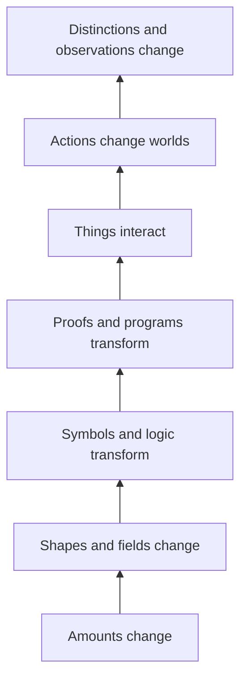

# 03 — Why Are There Many Calculi?

Now we can ask the bigger question.

If calculus is about change, why are there so many things called a **calculus**?

Because numbers are not the only things that can change by rules.

## Different things can change in different ways

A number can rise or fall.

A computer instruction can be replaced by another instruction.

A proof can move from one valid step to the next.

Two computer programs can send messages to each other.

A system can refer to a description of itself.

An observer can tell some things apart and fail to tell other things apart.

Each kind of change needs its own rules.

That is why mathematics has more than one calculus.

## The pyramid

Later, we give these layers names.

| What changes? | Some calculi you will meet |
|---|---|
| amounts and motion | differential, integral, vector, stochastic calculus |
| shapes and fields | tensor and exterior calculus |
| logical statements | propositional and predicate calculus |
| symbolic expressions and programs | λ-calculus and typed λ-calculi |
| proofs | natural deduction and sequent calculus |
| communicating processes | CCS, CSP, π-calculus |
| actions and events | situation and event calculus |
| data relationships | relational calculus |
| distinctions and observation | calculus of indications, distinction graphs, Fuzzy Calculus |

You do **not** need to understand those names yet.

The important idea is simpler:

> **A calculus is a rulebook for working with a certain kind of change or transformation.**

## Why one calculus is not enough

A speedometer cannot explain how two computer programs exchange messages.

A rule for proving a theorem does not tell you how water flows into a tank.

A tool is useful because it fits the job.

Calculi are like that.

## Do it

Match the situation to the kind of change:

1. A car speeds up.
2. Two computers exchange a new address.
3. A proof gains a new valid step.
4. Two colors look the same to one person but different to another.

Check your answer

1. changing quantity;
2. interacting processes;
3. proof transformation;
4. observer-relative distinction.

## One sentence to remember

> **There are many calculi because there are many kinds of things that can change according to rules.**

[See the wider pantheon →](../PANTHEON.md)

[Next: enter the calculus lessons →](../lessons/01-classical-calculus.md)
