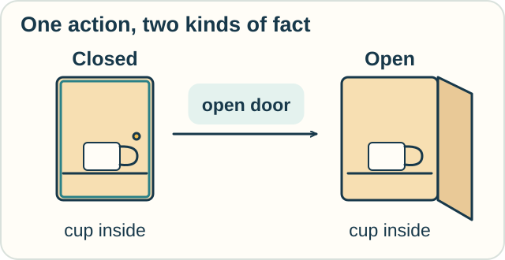

# Track — Situation, Event, and Fluent Calculi: What Changes After an Action?

**Place in the field:** Related action formalisms in knowledge representation. Each uses its own rules for effects and persistence.

**Start with:** statements that can be true or false.\
**By the end:** describe an action's effects and name an assumption about what stays unchanged.

## A worked example

A cupboard starts closed. A cup is inside it. Someone opens the cupboard.

In our small model, opening changes the door's state and does not move the cup.

| Fact | Before | After |
|---|---|---|
| Door is closed | True | False |
| Cup is inside | True | True |

<!-- visual:diagram-cupboard-cup -->

*We show the inside in both pictures so you can track the cup.*
<!-- /visual:diagram-cupboard-cup -->

Reasoning needs both kinds of information: **what changes** and **what persists**.

A **fluent** is a property whose truth or value can vary with the situation or time.

## Three related approaches

| Calculus | What it brings into focus | Typical question |
|---|---|---|
| Situation calculus | Actions and the histories or situations they produce | What holds after this sequence of actions? |
| Event calculus | Events, times, and facts they initiate or terminate | What holds between these events? |
| Fluent calculus | States described through fluents and their updates | Which parts of the state change, and which remain? |

They address related problems with different formal machinery. “Fluent” is used across this area, not only in the calculus with that name.

## Try it somewhere else

A parcel starts on a shelf. Someone scans its label.

Must the parcel now be somewhere else? Give one model where its location stays the same and one where an extra action changes it.

Check your reasoning

A scan-only model updates the parcel's record but leaves its location unchanged.

A model that includes “scan, then move to the conveyor” changes the location through the additional move. We must state that action; the word “scan” alone does not imply it.

This repeats the cupboard question: which effects have our rules actually specified?

Optional notation — successors and persistence

In a common situation-calculus presentation,

$$
do(a,s)
$$

denotes the successor situation after action $a$ in situation $s$. Fluent statements can depend on that situation.

Event-calculus presentations use rules about events initiating or terminating fluents and about persistence between relevant events.

The **frame problem** asks how to represent what actions leave unchanged without listing every unaffected fact separately for every action. Fluent-calculus state updates offer one formal treatment.

Persistence follows from the model's rules and assumptions; it is not simply “anything unmentioned must be true.”

## Sources

The cupboard and parcel examples are original. See McCarthy and Hayes (1969) for situation-calculus foundations; Kowalski and Sergot, *A Logic-based Calculus of Events* (1986); and Thielscher, [*From Situation Calculus to Fluent Calculus*](https://www.cse.unsw.edu.au/~mit/Papers/AIJ99.pdf) (1999). Full records are in [References](../../REFERENCES.md#situation-event-and-fluent-calculi).

[← Messages and events](../../lessons/07-interaction-and-action.md) · [Home](../../README.md) · [Field map](../../PANTHEON.md#7-interaction-actions-and-events)
