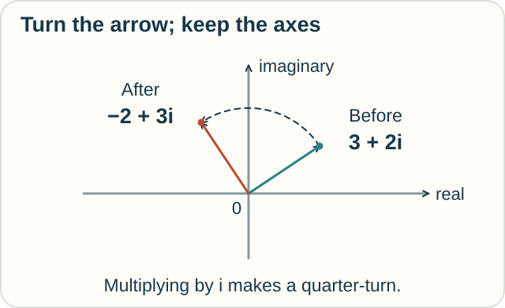
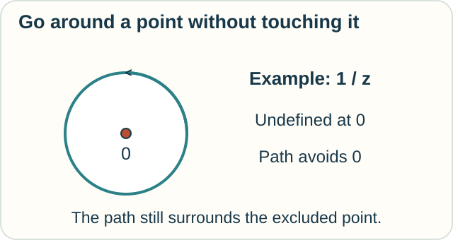

# Complex Calculus — Numbers That Turn

**Place in the field:** Complex analysis is a major branch of mathematics. Complex differentiation, contour integration, and residue calculus are parts of it.

**Start with:** [rates and totals](../../lessons/01-classical-calculus.md); this page introduces the new numbers.\
**By the end:** use a simple complex multiplication and recognize the extra demand in a complex derivative.

*Here we keep the axes fixed and turn an arrow.*

## Give numbers a second direction

On an ordinary number line, positive and negative numbers point in opposite directions.

The **complex plane** adds an up–down direction. A complex number has two parts. We write **3 + 2i** for three units right and two units up.

The symbol **i** is a number satisfying **i × i = −1**.

Multiplying an arrow's complex number by i turns it a quarter-turn counterclockwise, without changing its length.

*Three right and two up becomes two left and three up.*

The multiplication works out as:

$$
i(3+2i)=3i+2i^2=-2+3i.
$$

This is a new number system with precise rules. “Imaginary” is a historical name; it does not mean the rules are make-believe.

## Predict the next turn

Turn the new arrow by i once more. Where does it point compared with the original arrow?

Check

It points in exactly the opposite direction: **−3 − 2i**.

Two quarter-turns make a half-turn. That is the geometric meaning of multiplying by $i^2=-1$. Four quarter-turns bring the arrow back.

## What makes the calculus special?

Complex calculus studies functions of these numbers.

A complex derivative measures a local ratio of output change to input change. The same limiting answer must work **however we approach the point** in the plane.

That is a strong requirement. A smooth-looking map of the plane need not have a complex derivative.

For example, reflecting the plane across its horizontal axis leaves horizontal changes alone but reverses vertical changes. The two change ratios disagree, so this reflection has no complex derivative.

## Integrating along a path

A **contour** is a path used for integration. Complex integration can follow a curve through the plane.

Some functions have isolated points where they fail to be well behaved. **Residue calculus** uses a particular coefficient near each such point to calculate certain closed-path integrals.

*The path avoids the trouble point, but still goes around it.*

The coefficient called a residue here has its own precise definition. A shared word does not connect it automatically to every other mathematical use of “residue.”

## Try it somewhere new

A robot's planned movement is 1 unit right and 4 units up. Turn that movement a quarter-turn counterclockwise. What is the new movement?

Check your reasoning

It becomes **4 units left and 1 unit up**, or $-4+i$.

This is an actual change in the movement, with fixed axes. In the [tensor track](../geometry/tensor-calculus.md), we also describe the same movement using different axes. Be clear about which operation you performed.

Optional mathematics — derivatives and residues

The complex derivative is

$$
f'(z)=\lim_{h\to0}\frac{f(z+h)-f(z)}{h},
$$

where $h$ may approach zero through complex values. For $f(z)=z^2$, the quotient is $2z+h$, so the derivative is $2z$.

For $f(z)=\overline z$, real increments give a quotient of 1 and purely imaginary increments give −1. No single limit exists.

A residue at $a$ is the coefficient of $(z-a)^{-1}$ in the local Laurent expansion. For $f(z)=1/z$, the residue at zero is 1, and the counterclockwise unit circle satisfies

$$
\oint_{|z|=1}\frac{1}{z}\,dz=2\pi i.
$$

The singularity inside matters. We cannot assume that every closed-path integral vanishes.

## Sources

The garden-map and robot examples are original. See MIT's [18.04 *Complex Analysis with Applications* notes](https://math.mit.edu/~dunkel/Teach/18.04_2019S/notes/1804_Main.pdf), especially complex multiplication, §4.5 on derivatives, and the residue theorem. See also [MIT's lecture on complex integration](https://math.mit.edu/classes/18.305/WWW_2004_HungCheng/second1.pdf).

[Rates and totals](../../lessons/01-classical-calculus.md) · [Space and shape](../../lessons/02-space-and-shape.md) · [Field map](../../PANTHEON.md)
