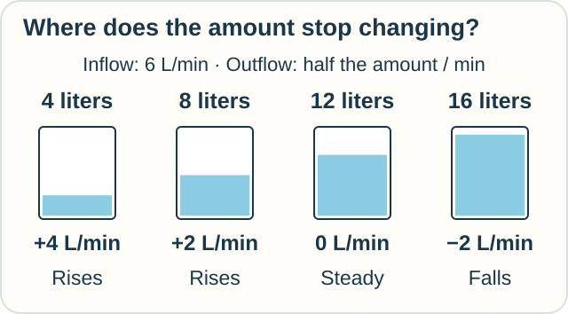
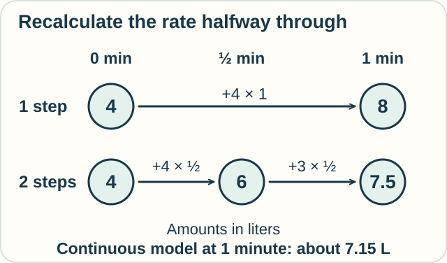

# Track — Differential Equations: A Rule for Ongoing Change

**Place in the field:** A broad subject that uses calculus to find functions obeying rules about their rates of change.

**Start with:** [the difference between a rate and an amount](../../lessons/01-classical-calculus.md).\
**By the end:** read a rate rule, find a balance point, and take a small numerical step from a stated starting value.

<!-- visual:art-garden -->

*The amount of water changes the drain rate. The drain rate changes the amount of water.*
<!-- /visual:art-garden -->

## Let the current amount affect the next change

A tap supplies **6 liters per minute** to a tank. A controlled pump drains it according to this rule:

> For each liter currently in the tank, remove water at a rate of 0.5 liter per minute.

So at 4 liters, the outflow rate is 2 liters per minute. At 8 liters, it is 4 liters per minute. The controller keeps adjusting as the amount changes.

This is an idealized pump rule. We assume enough tank capacity, a constant inflow, and a drain that follows the stated rule throughout.

| Current amount | Inflow rate | Outflow rate | Net rate of change |
|---|---|---|---|
| 4 liters | 6 liters/min | 2 liters/min | **+4 liters/min** |
| 8 liters | 6 liters/min | 4 liters/min | **+2 liters/min** |
| 12 liters | 6 liters/min | 6 liters/min | **0** |
| 16 liters | 6 liters/min | 8 liters/min | **−2 liters/min** |

<!-- visual:diagram-ode-balance -->

*Below 12 liters, more enters than leaves. Above 12, more leaves than enters.*
<!-- /visual:diagram-ode-balance -->

A **differential equation** connects an unknown function with one or more of its derivatives. Here the unknown function gives the water amount at every time. The equation says its rate is **6 minus half its current amount**, in the chosen units.

Solving it means finding an entire amount-over-time function that obeys this rate rule.

## A balance point is one possible solution

At **12 liters**, incoming and outgoing rates match. If we start there, the amount stays there. This is an **equilibrium solution**.

The number 12 is not the answer to every question about the tank. A tank starting at 4 liters does not instantly jump to 12. We need a **starting value**, also called an **initial condition**, to select its path through time.

For this model, starting below 12 leads to a rising amount that approaches 12. Starting above 12 leads to a falling amount that approaches 12.

**Predict:** start at 16 liters. Is the initial rate +2 or −2 liters per minute? What happens if we instead start at exactly 12?

Check

At 16 liters, the pump removes 8 liters/minute while the tap adds 6. The net rate is **−2 liters/minute**.

At 12 liters, the net rate is zero, so the constant 12-liter amount satisfies the rule. Water still flows in and out; a constant amount does not mean both flows have stopped.

## Walk forward in small steps

Suppose we start at **4 liters** and want an estimate after one minute.

The initial net rate is +4 liters/minute. Pretend that rate lasts for the whole minute:

**4 liters + 4 liters/minute × 1 minute = 8 liters.**

This is one step of **Euler's method**: use the rate at the beginning of a short interval to estimate the change across it.

Now try two half-minute steps, recalculating the rate between them:

| Step | Starting amount | Starting net rate | Estimated change | New estimate |
|---|---|---|---|---|
| First half-minute | 4 liters | +4 liters/min | +2 liters | 6 liters |
| Second half-minute | 6 liters | +3 liters/min | +1.5 liters | **7.5 liters** |

<!-- visual:diagram-ode-euler -->

*Recalculating halfway notices that the fuller tank drains faster.*
<!-- /visual:diagram-ode-euler -->

The continuous model's exact formula gives about **7.15 liters** after one minute. Both estimates are high, and the half-minute version is closer.

Our rule updates the drain continuously. It does not say to remove half the tank once each minute. That would be a different process.

Short steps can improve an approximation under suitable conditions. A numerical method also needs checks on error and stability; a large step can even predict behavior the model does not have.

## Try it somewhere else

A cooling model says a cup loses temperature at one quarter of its difference from a **20°C room**, per minute.

At 60°C, what is its current rate? At 30°C? What temperature is the equilibrium?

Check and connect

At 60°C, the gap is 40 degrees, so the rate is **−10°C per minute**. At 30°C, the gap is 10 degrees, so the rate is **−2.5°C per minute**.

The equilibrium is **20°C**, where the gap and rate are zero. The same pattern appears: the remaining gap determines the current rate. The numerical coefficient and units belong to this cooling model.

These are current rates, not guaranteed whole-minute drops. The rate changes as the cup approaches room temperature.

## Why this is a large subject

The tank has one amount changing with time. An **ordinary differential equation**, or ODE, uses derivatives with respect to one independent variable.

Heat spreading through a wall varies with both place and time. Equations using partial derivatives in several independent variables are **partial differential equations**, or PDEs. Weather, waves, motion, and chemical reactions supply many other questions.

Finding an equilibrium, estimating a path, proving a solution exists, and finding an exact formula are different tasks within the subject. Not every equation has a convenient formula.

Optional mathematics — the exact rule and its solution

Let t be the numerical time in minutes and V(t) the numerical amount in liters. Our equation and initial condition are

$$
V'(t)=6-\frac12V(t),\qquad V(0)=4.
$$

The physical outflow coefficient is $0.5\,\mathrm{min}^{-1}$. Using the chosen units gives the numerical coefficient 1/2 above.

Subtract the equilibrium and put $z(t)=V(t)-12$. Then $z'=-z/2$, whose solution with $z(0)=-8$ gives

$$
V(t)=12-8e^{-t/2}.
$$

Here e is the exponential base, about 2.718. The factor $e^{-t/2}$ starts at 1 and decreases toward zero. Differentiating the formula and substituting into the equation verifies the rate rule; setting t = 0 verifies the starting value.

For a different starting amount $V_0$, the solution is

$$
V(t)=12+(V_0-12)e^{-t/2}.
$$

Euler's update with step h is

$$
V_{n+1}=V_n+h(6-V_n/2).
$$

Writing $z_n=V_n-12$ gives $z_{n+1}=(1-h/2)z_n$. For this example, $0<h<4$ makes deviations decrease in magnitude; $0<h\leq2$ also avoids alternating sides of the equilibrium. At h = 5, the factor is −1.5, producing growing oscillations even though the continuous model settles toward 12.

## Sources

The controlled-drain tank and numerical values are original examples; the cooling activity uses the standard Newton cooling model. See OpenStax, *Calculus Volume 2*: [§4.1, differential equations and initial values](https://openstax.org/books/calculus-volume-2/pages/4-1-basics-of-differential-equations), [§4.2, direction fields and Euler's method](https://openstax.org/books/calculus-volume-2/pages/4-2-direction-fields-and-numerical-methods), [§4.3, separable equations and cooling](https://openstax.org/books/calculus-volume-2/pages/4-3-separable-equations), and [§4.5, first-order linear equations](https://openstax.org/books/calculus-volume-2/pages/4-5-first-order-linear-equations). The step-size observation follows from the displayed recurrence. See [References](../../REFERENCES.md#differential-equations-and-initial-values).

[← Numerical estimates](numerical-calculus.md) · [Next: Operational calculus →](../operators/operational-calculus.md) · [Home](../../README.md) · [Field map](../../PANTHEON.md#1-rates-totals-and-best-choices)
