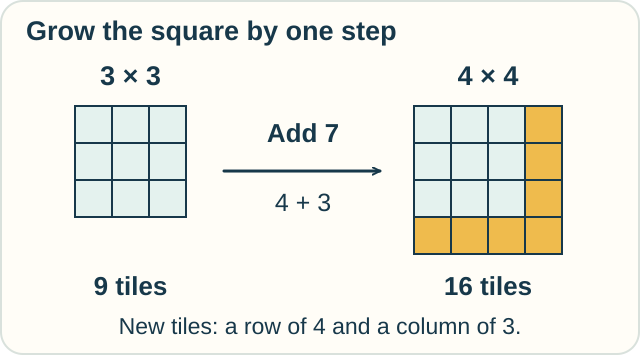
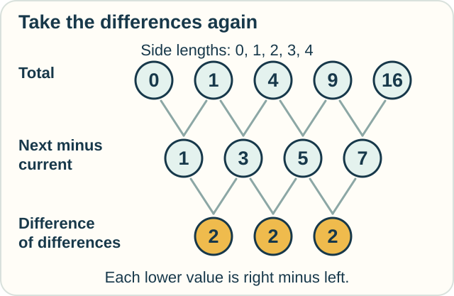

# Track — Finite-Difference Calculus: What Changes at the Next Step?

**Place in the field:** A calculus of differences and sums for sequences and functions sampled at fixed steps.

**Start with:** [counts, changes, and totals](../../lessons/03-discrete-and-numerical.md).\
**By the end:** build a difference table, explain a growing pattern, and recover a total from its changes.

<!-- visual:art-garden -->

*Make a square patio one tile wider. How many new tiles does that take?*
<!-- /visual:art-garden -->

## Grow the square

Jo builds a square from identical tiles. A square 3 tiles across needs 3 × 3 = **9 tiles**. A square 4 across needs **16**.

The next step adds **7 tiles**, not 1. We increased the side length by one, but the number of tiles changes by more.

<!-- visual:diagram-difference-tiles -->

*The new row and column share a corner. Count it once.*
<!-- /visual:diagram-difference-tiles -->

This is a **finite difference**: subtract the old value from the next value after a specified step. Here the step is one extra tile along each side.

## Take differences of the differences

Begin with an empty square, then grow its side length one tile at a time.

| Side length, in tiles | Total tiles | Increase to the next size |
|---|---|---|
| 0 | 0 | +1 |
| 1 | 1 | +3 |
| 2 | 4 | +5 |
| 3 | 9 | +7 |
| 4 | 16 | Work out the next increase below |

The increases themselves change: 3 − 1 = 2, 5 − 3 = 2, and 7 − 5 = 2. These are **second differences**: differences between consecutive first differences.

<!-- visual:diagram-difference-table -->

*Each lower entry compares two neighboring entries above it.*
<!-- /visual:diagram-difference-table -->

**Predict:** extend the 4-by-4 square to a 5-by-5 square. How many tiles do you add? Explain using the new row and column.

Check

Add **9**: one new row of 5 and the remaining 4 cells of the new column. The total becomes **25**.

The first differences continue 1, 3, 5, 7, **9**. The next second difference is again 2.

## Why the pattern keeps working

For a square n tiles across, the next size adds a row of **n + 1** and a column of **n** remaining tiles. That is **2n + 1** new tiles.

This reasoning works for every nonnegative whole-number size. It explains the pattern instead of just continuing a list.

A short list alone would not force the next value. Someone could change the building rule tomorrow. Here we have a stated construction that justifies our prediction.

Finite-difference calculus gives rules for these changes, including repeated differences, sums, and products. The discrete steps can be the exact objects we care about; no smaller step is needed to count a tile.

## Add changes to recover the total

Start with the empty square and add its first four increases:

**1 + 3 + 5 + 7 = 16.**

We can see why from the differences:

**(1 − 0) + (4 − 1) + (9 − 4) + (16 − 9) = 16 − 0.**

Every middle value appears once with a plus sign and once with a minus sign. They cancel. This is called a **telescoping sum**.

To recover a final value, we still need the start. The same changes added to 10 produce 26. They would describe a different sequence.

## Try it somewhere else

Sam makes rectangular display racks. A size-n rack has n rows and n + 1 spaces in each row.

The first four totals are **2, 6, 12, 20**. Find the first differences and second differences. What does a size-5 rack hold?

Check and connect

The first differences are **4, 6, 8**. Their second differences are **2, 2**. A size-5 rack holds **5 × 6 = 30** spaces, an increase of 10.

The square and rectangle totals differ, but both have constant second differences. Their building rules explain why. A difference table can reveal a useful shared structure without making the original objects identical.

## A whole step and a local rate

For the square rule, going from side length 3 to 4 changes the area by **7** unit squares. The continuous area function has derivative **6 square units per unit of side length** at side length 3.

Those answers address different questions. Seven covers a whole step; six is the rate at the starting point. A finite difference can also help estimate a derivative when divided by the step size. The [numerical track](numerical-calculus.md) explores that use.

Optional notation — difference operators and their rules

For a sequence $a_n$, define

$$
\Delta a_n=a_{n+1}-a_n,\qquad
\Delta^2a_n=a_{n+2}-2a_{n+1}+a_n.
$$

For $a_n=n^2$, these give $\Delta a_n=2n+1$ and $\Delta^2a_n=2$.

The shift operator E advances the index: $(Ea)_n=a_{n+1}$. Thus $\Delta=E-I$, with I the identity operator. For constants c and d, differences obey linearity: $\Delta(ca+db)=c\Delta a+d\Delta b$.

The product rule includes a whole-step correction:

$$
\Delta(a_nb_n)=a_n\Delta b_n+b_n\Delta a_n+(\Delta a_n)(\Delta b_n).
$$

To verify it, expand $(a_n+\Delta a_n)(b_n+\Delta b_n)-a_nb_n$. The last term is the new corner in a rectangle whose two sides both grow.

Telescoping gives

$$
\sum_{n=0}^{N-1}\Delta a_n=a_N-a_0.
$$

For a function with step h, our unscaled convention is $\Delta_hf(x)=f(x+h)-f(x)$. For $f(x)=x^2$,

$$
\Delta_hf(x)=2xh+h^2,\qquad
\frac{\Delta_hf(x)}h=2x+h\quad(h\ne0).
$$

The quotient approaches $2x$ as h approaches zero. Some sources include division by h in their difference-operator notation; check the convention.

## Sources

The tile and rack stories are original presentations of standard identities. Richard P. Stanley's [*Enumerative Combinatorics, Volume 1*, author-hosted second-edition text](https://math.mit.edu/~rstan/ec/ec1.pdf), §1.9, develops the difference and shift operators and difference tables. Laurent Demanet's [MIT 18.336 notes](https://math.mit.edu/icg/resources/teaching/18.336-spring2011/notes-18.336.pdf), Chapter 1, connect finite-difference operators to differential ones. The product and telescoping identities are also derived above. See [References](../../REFERENCES.md#discrete-and-numerical-methods).

[← Working in steps](../../lessons/03-discrete-and-numerical.md) · [Next: Numerical estimates →](numerical-calculus.md) · [Home](../../README.md) · [Field map](../../PANTHEON.md#3-steps-sums-and-approximation)
