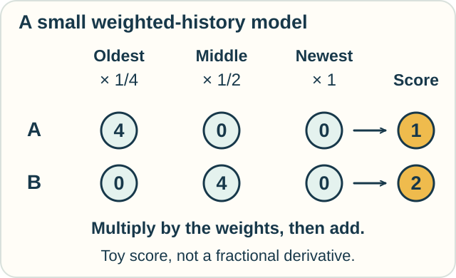

# Fractional Calculus — When Earlier Changes Still Count

**Place in the field:** A family of extensions of integration and differentiation to noninteger orders. Different definitions have different rules.

**Start with:** [rates and totals](../../lessons/01-classical-calculus.md) and simple fractions.\
**By the end:** explain how two histories can matter differently even when they end at the same value.

*Some materials respond to how they have been pressed over time. A particular mathematical model still needs checking.*

## Can a derivative have an in-between order?

Taking a derivative once gives a first derivative. Taking it again gives a second derivative.

**Fractional calculus** asks how to define orders such as one-half. The name also covers orders that are not simple fractions.

An order of one-half does **not** mean “calculate the ordinary derivative and divide its answer by two.” It specifies a different operation.

For many standard time-fractional definitions, that operation combines information from a span of earlier times.

## A tiny model of remembered change

Jo and Sam compare two records. Both begin at 0 and finish at 4. Neither changes during the most recent interval.

| Record | Start | After interval 1 | After interval 2 | Now |
|---|---|---|---|---|
| A | 0 | 4 | 4 | 4 |
| B | 0 | 0 | 4 | 4 |

Make a simple score from the changes:

- count the oldest change at one-quarter weight;
- count the middle change at one-half weight;
- count the newest change at full weight.

*Same final value; same newest change; different weighted histories.*

A scores **4 × 1/4 = 1**. B scores **4 × 1/2 = 2**.

This made-up score shows what a weighted history can do. **It is not itself a fractional derivative.** The quarter-and-half weights are teaching choices.

## What the actual calculus adds

A standard **Caputo derivative** of order between zero and one integrates earlier rates of change with a specified power-law weight. The order controls that weight.

“Power-law” means the weight depends on a power of the elapsed time. It supplies a precise rule for how earlier changes contribute.

Other definitions, including Riemann–Liouville derivatives, organize the operations differently. Initial values and the chosen definition matter.

Fractional models are used for some materials with memory and some unusual diffusion processes. A memory effect alone does not establish that a fractional model is the right one.

## Make a prediction

Our toy score originally gives extra weight to recent changes. What happens if every interval instead receives weight 1?

Check

Both records score **4**: add all their changes without favoring any interval.

The difference came from the weighting rule, not from different final values.

This does not prove a general identity about all fractional derivatives; it checks our small score.

## Try a new setting

Two tubs of material have the same dent depth now. One was pressed earlier and left to rest; the other was pressed recently.

Would a model using only the current dent depth necessarily distinguish them? What extra information could a history-dependent model use?

Check your reasoning

A model using only that depth assigns the same recorded state to both. A history-dependent model can also use when and how the material was pressed.

Actual behavior must be measured. Some models record extra internal state instead of using a fractional derivative.

Optional mathematics — one precise half derivative

For a suitable absolutely continuous function $f$ on $[0,t]$, the Caputo derivative with lower limit zero and order $0<\alpha<1$ is

$$
{}^C D_{0+}^{\alpha}f(t)
=\frac{1}{\Gamma(1-\alpha)}
\int_0^t (t-s)^{-\alpha}f'(s)\,ds,
$$

where the integral must exist. The gamma function supplies the normalization.

For $\alpha=1/2$ and $f(t)=t$,

$$
{}^C D_{0+}^{1/2}t=\frac{2\sqrt t}{\sqrt\pi}.
$$

The ordinary derivative is 1. Dividing it by two gives 1/2, a different function.

Fractional orders also change the units of the resulting quantity. One must carry those units and the initial-history convention through a physical model.

## Sources

The records and weighted score are original teaching examples. See Mainardi and Gorenflo, [“Time-fractional derivatives in relaxation processes: a tutorial survey”](https://arxiv.org/abs/0801.4914), particularly §1 and its Caputo definition, and Gorenflo and Mainardi, [“Fractional Calculus: Integral and Differential Equations of Fractional Order”](https://arxiv.org/abs/0805.3823). Further course materials appear in [References](../../REFERENCES.md#operators-and-fractional-extensions).

[Rates and totals](../../lessons/01-classical-calculus.md) · [Stochastic calculus](stochastic-calculus.md) · [Field map](../../PANTHEON.md)
