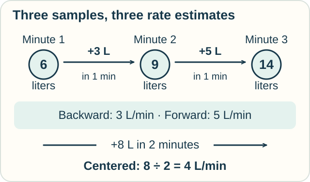
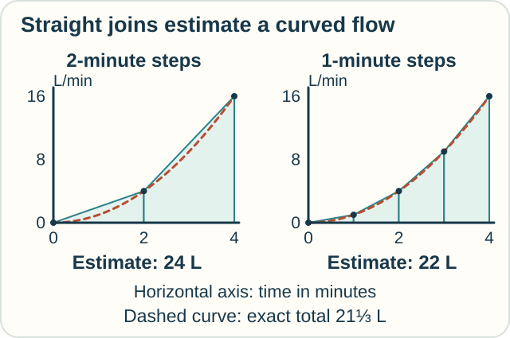
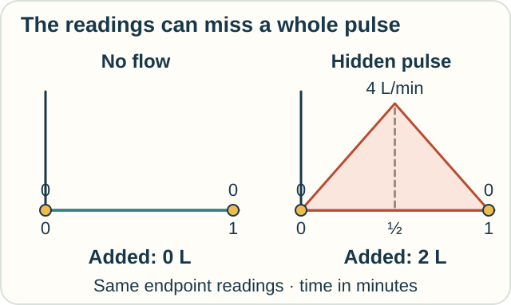

# Track — Numerical Calculus: What Can Samples Tell Us?

**Place in the field:** Numerical differentiation and integration: finite calculations used to estimate local rates and accumulations.

**Start with:** [rates and totals](../../lessons/01-classical-calculus.md), then [finite differences](finite-difference-calculus.md).\
**By the end:** estimate a rate and a total from samples, keeping track of units and what happens between readings.

<!-- visual:art-garden -->

*A few readings can help. What do they leave unmeasured?*
<!-- /visual:art-garden -->

## Estimate a rate from amounts

Jo measures the water in a tank:

| Time, in minutes | Water, in liters |
|---|---|
| 1 | 6 |
| 2 | 9 |
| 3 | 14 |

She wants the rate of change **at minute 2**. There are several nearby comparisons:

| Comparison | Calculation | Rate |
|---|---|---|
| Look backward, from minute 1 to 2 | (9 − 6) ÷ 1 | 3 liters/minute |
| Look forward, from minute 2 to 3 | (14 − 9) ÷ 1 | 5 liters/minute |
| Use both sides, from minute 1 to 3 | (14 − 6) ÷ 2 | 4 liters/minute |

<!-- visual:diagram-numerical-slopes -->

*Each answer uses a different time interval.*
<!-- /visual:diagram-numerical-slopes -->

These are exact average rates for the stated readings. They are estimates of the rate at minute 2. The readings alone do not tell us that moment's exact rate.

For a checkable example, suppose the whole amount curve is **5 plus time squared**, with time measured in minutes. Its derivative at minute 2 is exactly **4 liters/minute**. The centered estimate is exact for this quadratic example; that does not make it exact for every curve.

## Estimate an amount from rates

Now Sam measures a **different pump's flow**, in liters per minute. Its toy rule is time multiplied by time. The rates at minutes 0, 1, 2, 3, 4 are **0, 1, 4, 9, 16**.

Here we are sampling **rates**, not amounts already in a tank. To estimate how much enters, use an interval's average endpoint rate and multiply by its duration.

Between minute 1 and minute 2, for example:

**Average endpoint rate = (1 + 4) ÷ 2 = 2.5 liters/minute.**\
**Estimated amount = 2.5 × 1 minute = 2.5 liters.**

This is the **trapezoidal rule**. On a rate-versus-time graph, join neighboring readings with straight lines and take the area underneath.

| Readings used | Interval estimates, in liters | Estimated total |
|---|---|---|
| Minutes 0, 2, 4 | 4 + 20 | **24 liters** |
| Minutes 0, 1, 2, 3, 4 | 0.5 + 2.5 + 6.5 + 12.5 | **22 liters** |

<!-- visual:diagram-numerical-trapezoids -->

*Shorter straight joins follow this curved flow more closely.*
<!-- /visual:diagram-numerical-trapezoids -->

The exact total for this known toy curve is **21⅓ liters**. The estimates are too high, because the straight joins lie above the curve. Shortening the step improves this example.

**Predict:** a different hose is measured at 2 liters/minute, then at 6 liters/minute three minutes later. What does one trapezoidal estimate give? When would that estimate be exact?

Check

Average the endpoint rates: (2 + 6) ÷ 2 = **4 liters/minute**. Multiply by 3 minutes to get **12 liters**.

This is exact if the flow changes along a straight line between the readings. Other curves can happen to give the same area, but the endpoint readings alone do not guarantee it.

## A pulse can hide between readings

Two readings say the flow is zero at minute 0 and minute 1. A trapezoid through them estimates zero water.

But the flow could rise in a straight line to **4 liters/minute at the halfway point**, then fall back to zero. That triangular pulse contributes **2 liters**: half its 1-minute width times its 4-liter/minute height.

<!-- visual:diagram-numerical-pulse -->

*The same endpoint readings can belong to different histories.*
<!-- /visual:diagram-numerical-pulse -->

More readings can reveal a missed feature. To claim an error bound, we also need information about the possible behavior between them.

## Smaller gaps can magnify reading errors

Suppose each amount reading can be wrong by up to **0.1 liter**. Subtracting two readings can then be wrong by up to **0.2 liter**, if the errors point in opposite directions.

- Over 1 minute, that contributes up to **0.2 liter/minute** of error to the average rate.
- Over 0.01 minute, the same amount error contributes up to **20 liters/minute**.

A shorter interval reduces some approximation errors, but can magnify measurement or rounding errors when we divide by it. Choosing a step size is part of the method.

## Try it somewhere else

A toy car's speeds at seconds 0, 2, and 4 are **0, 6, and 0 meters/second**. Use two trapezoids to estimate its distance. Why isn't adding the three speeds enough?

Check and connect

Each interval contributes (0 + 6) ÷ 2 × 2 = **6 meters**, for **12 meters** total.

Speeds have units of meters per second. Multiplying an average speed by elapsed time gives distance. Adding the three speeds alone does not account for how long the car traveled at nearby speeds.

The estimate is exact if speed changes linearly within each of these intervals. See how both units and assumptions carried across from water to motion.

Optional mathematics — formulas and an error bound

For a smooth function f and positive step h, three derivative estimates at x are

$$
D_-f(x)=\frac{f(x)-f(x-h)}h,\qquad
D_+f(x)=\frac{f(x+h)-f(x)}h,
$$

$$
D_0f(x)=\frac{f(x+h)-f(x-h)}{2h}.
$$

Taylor expansion gives one-sided errors of order h and centered error of order $h^2$, with sufficient smoothness and exact function values. The estimates concern a derivative; the difference quotients themselves are defined from the chosen samples.

For $t_i=a+ih$, $i=0,\ldots,N$, with $h=(b-a)/N$, the composite trapezoidal rule is

$$
T_h=h\left(\frac{q(t_0)}2+\sum_{i=1}^{N-1}q(t_i)+\frac{q(t_N)}2\right).
$$

If q has a continuous second derivative with $|q''(t)|\leq M$ on the interval, then

$$
\left|\int_a^b q(t)\,dt-T_h\right|\leq\frac{(b-a)h^2M}{12}.
$$

This bound assumes exact sample values; it does not include sensor error. For our numerical flow $q(t)=t^2$ on $[0,4]$, $M=2$ and the exact integral is $64/3$. The bounds are $8/3$ for h = 2 and $2/3$ for h = 1, matching this example's actual errors.

## Sources

The tank readings, pump rates, hidden pulse, and car activity are original examples. See Daniel Kleitman's [*Numerical Differentiation*](https://math.mit.edu/~djk/calculus_beginners/chapter09/section01.html) for derivative estimates and small-step error issues; Laurent Demanet's [MIT numerical analysis notes](https://math.mit.edu/icg/resources/teaching/18.330/18.330-Apr-2014.pdf), Chapter 2, for differences and sums; and OpenStax's [*Numerical Integration*](https://openstax.org/books/calculus-volume-2/pages/3-6-numerical-integration) for the trapezoidal rule and its error bound. See [References](../../REFERENCES.md#discrete-and-numerical-methods).

[← Finite differences](finite-difference-calculus.md) · [Next: Differential equations →](differential-equations.md) · [Home](../../README.md) · [Field map](../../PANTHEON.md#3-steps-sums-and-approximation)
