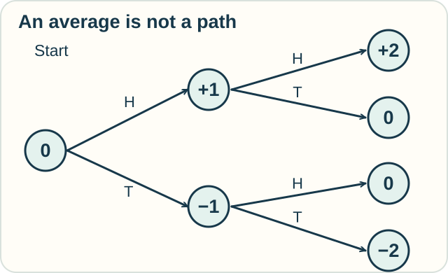

# Track — Stochastic Calculus: Change with Randomness

**Place in the field:** An established advanced area of probability and analysis. The main chance lesson supplies the entry ideas.

**Start with:** [chance and random paths](../../lessons/08-chance-and-cause.md), plus [rates and accumulation](../../lessons/01-classical-calculus.md).\
**By the end:** distinguish a possible path from an average over possible paths.

## The idea

Some models include random change. A **stochastic process** describes random quantities through time.

Try this small model: begin at 0. Toss a fair coin twice. Move up 1 for heads and down 1 for tails. Assume the tosses are independent.

| Tosses | Position after the first toss | Final position |
|---|---|---|
| Heads, heads | 1 | 2 |
| Heads, tails | 1 | 0 |
| Tails, heads | −1 | 0 |
| Tails, tails | −1 | −2 |

<!-- visual:diagram-random-paths -->

*H means heads; T means tails. Follow one branch at each toss.*
<!-- /visual:diagram-random-paths -->

The four equally likely outcomes average to 0. Yet half the paths finish elsewhere.

Their **squared** final positions are 4, 0, 0, and 4, which average to 2. Squaring the average position instead gives zero. The order of these operations matters.

## Try it somewhere else

A toy model gives a day's change in a reservoir as either +1 or −1 unit, equally likely. Can “the average change is zero” mean that the water level stays fixed every day?

Check your reasoning

No. Each day changes by one unit in this model. Zero describes the average across possibilities.

A particular path and its average answer different questions. Real reservoirs would also need rules for limits and other flows.

## From steps to continuous time

Coin tosses give a **discrete** model: change happens in steps. Stochastic calculus also works with continuous-time processes such as Brownian motion. Its paths are so rough that ordinary pointwise derivatives are unavailable, and integration needs a different construction.

Optional notation — why an extra term appears

A stochastic integral can have the form

$$
\int_0^t H_s\,dX_s.
$$

Its definition depends on the process and information conditions. A **filtration** records the information available through time.

For an Itô process $dX_t=a_t\,dt+b_t\,dW_t$ and a twice continuously differentiable function $f$, Itô's formula gives

$$
df(X_t)=\left(a_t f'(X_t)+\tfrac12 b_t^2f''(X_t)\right)dt
+b_t f'(X_t)\,dW_t.
$$

Here $W_t$ is Brownian motion. The second-derivative term comes from quadratic variation, a property of these paths. The coin-toss activity motivates random paths; it is not a derivation of this formula.

## Different integration rules

Two common definitions are the **Itô** and **Stratonovich** integrals. They use different sampling conventions when limits of sums are formed, so their values can differ. Their change-of-variable rules differ too. Stratonovich uses an ordinary-looking chain rule under the appropriate assumptions; Itô includes a correction term.

One is not merely a more accurate spelling of the other. The model and its assumptions determine which formulation is appropriate.

## Connection and sources

Stochastic calculus adapts integration to random processes with stated path and information assumptions. The toy examples are original.

See Ioannis Karatzas and Steven E. Shreve, *Brownian Motion and Stochastic Calculus* (1988), Varadhan's [stochastic-integration notes](https://math.nyu.edu/~varadhan/fall06/fall06.3.pdf), and [References](../../REFERENCES.md#stochastic-calculus).

[← Chance and cause](../../lessons/08-chance-and-cause.md) · [Home](../../README.md) · [Field map](../../PANTHEON.md#8-chance-random-paths-and-causes)
