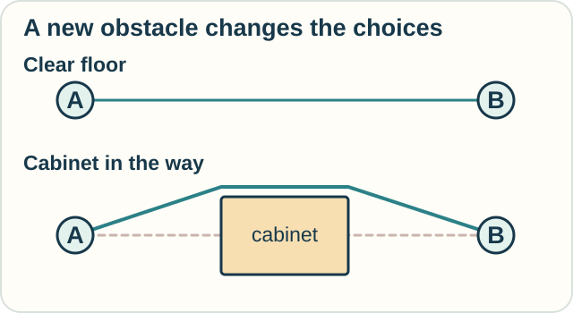

# Track — Calculus of Variations: Choose a Whole Path

**Place in the field:** An established area for varying whole functions and paths.

**Start with:** [rates and functions](../../lessons/01-classical-calculus.md).\
**By the end:** explain how choosing a path differs from choosing one number.

## The idea

Lay a loose string between two fixed points on a flat table. You can bend it into many routes.

If the only goal is the shortest length, and nothing blocks the way, a straight route wins. We are comparing **whole paths**.

A **functional** assigns a number to a function or path. Path length is one example. Calculus of variations studies how that score changes when we vary the whole candidate.

<!-- visual:diagram-path-and-obstacle -->

*Keeping the endpoints and goal does not keep the set of allowed paths unchanged.*
<!-- /visual:diagram-path-and-obstacle -->

## Try it somewhere else

You are laying a cable across a flat floor. The endpoints stay fixed, but a cabinet blocks the straight route.

Can you keep the old answer? What changed: the goal, the allowed paths, or both?

Check your reasoning

The straight route is no longer allowed. If the goal remains shortest length, the goal is unchanged but the set of allowed paths has changed.

The “shortest path is straight” answer depended on an unobstructed setting. A new constraint changes the problem.

Optional notation — variation and the Euler–Lagrange equation

A common functional is

$$
J[y]=\int_a^b L(x,y(x),y'(x))\,dx.
$$

Its input is a function $y$; its output is a number. Vary the input by

$$
y(x)\mapsto y(x)+\varepsilon\eta(x),
$$

where $\eta$ is an allowed change of shape. With fixed endpoints, require $\eta(a)=\eta(b)=0$.

Under the usual smoothness assumptions, a stationary path satisfies

$$
\frac{\partial L}{\partial y}
-\frac{d}{dx}\frac{\partial L}{\partial y'}=0.
$$

“Stationary” means the first variation vanishes. Further work is needed to establish a minimum, maximum, or neither, and to handle constraints.

## Connection and sources

This extends classical calculus by varying a function-valued input. The string and cable examples are original teaching illustrations.

See I. M. Gel'fand and S. V. Fomin, *Calculus of Variations* (1963), and Gilbert Strang's [“Calculus of Variations,” MIT OpenCourseWare](https://ocw.mit.edu/courses/18-086-mathematical-methods-for-engineers-ii-spring-2006/e94c05947ed036cd6ad0150102087062_am72.pdf).

[← Space and shape](../../lessons/02-space-and-shape.md) · [Home](../../README.md) · [Field map](../../PANTHEON.md#1-rates-totals-and-best-choices)
