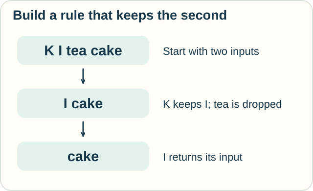
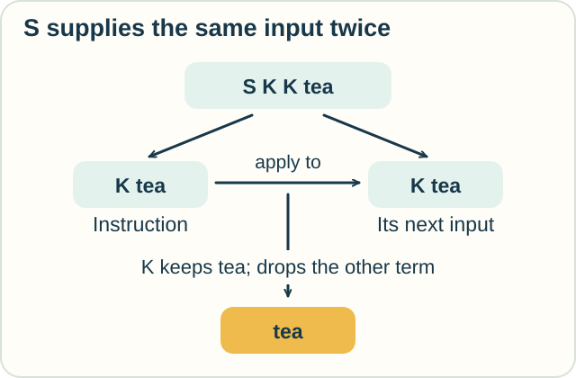

# Track — Combinatory Logic: Build with Three Rule Cards

**Place in the field:** A foundational way to express computation using application and a small collection of combinators.

**Start with:** [instructions with inputs](lambda-calculus.md).\
**By the end:** combine a few fixed rules into a new instruction, then explain what the rewriting does.

<!-- visual:art-workshop -->

*Can a few reusable instruction cards replace a fresh recipe for every task?*
<!-- /visual:art-workshop -->

## An instruction can be an input

Jo is making a tiny language for the workshop. Its expressions can stand for data or instructions. An instruction can receive another instruction as an input.

The first card, **I**, returns its input unchanged. The second, **K**, takes two inputs and returns the first.

| Card and inputs | Result | Read it aloud |
|---|---|---|
| `I tea` | `tea` | Return what you were given |
| `K tea cake` | `tea` | Keep the first of two inputs |
| `K I tea` | `I` | The first input was an instruction, so return that instruction |

The words `tea` and `cake` are stand-ins for expressions. We are moving symbols on a page, not serving real food.

Putting expressions beside each other means **application**: give the expression on the right to the one on the left. Group from the left unless parentheses say otherwise. Thus `K tea cake` means `(K tea) cake`.

`K tea` is waiting for one more input. It will then return `tea`, whatever that next input is.

## Build “keep the second”

Sam puts K and I together: `K I`. What does this new instruction do with two inputs?

| Step | Reason |
|---|---|
| `K I tea cake` | Start with the two cards and two inputs |
| `I cake` | K keeps I and drops tea; cake is still waiting to be supplied |
| `cake` | I returns its input |

<!-- visual:diagram-combinator-second -->

*A card that keeps its first input helped us build a rule that keeps the second.*
<!-- /visual:diagram-combinator-second -->

**Predict:** what does `K I cake tea` return? Does K itself change its rule?

Check

It returns **tea**: `K I cake tea` becomes `I tea`, then `tea`.

K still keeps its first input, which is I. The surrounding arrangement determines the whole program's behavior.

## One more card: share the input

The third card is **S**. It takes three inputs: two instructions, followed by a shared input.

Its rewrite rule is `S f g x` → `(f x) (g x)`.

S puts the same input into two places. It builds `f x` and `g x`, then applies the left expression to the right. We need not simplify both parts before using another rewrite rule. Application here means giving an input to an instruction.

Here is a small surprise: **S K K behaves like I**.

| Step | Rule used |
|---|---|
| `S K K tea` | Start |
| `(K tea) (K tea)` | S supplies tea in both places |
| `tea` | The left K keeps tea and drops its second input, the whole expression `K tea` |

<!-- visual:diagram-combinator-share -->

*We can build the return-unchanged rule from S and K.*
<!-- /visual:diagram-combinator-share -->

The rewrite repeats an **expression**. It does not create a second physical cup or permission to use a ticket twice. For rules about consumable resources, visit [linear logic](../proof/linear-logic.md).

## Why call this combinatory logic?

A **combinator** is an expression with no free input variables. I, K, and S are standard examples. Combinatory logic builds expressions by applying such building blocks; its language can also include free variables.

In lambda calculus, a declaration such as “take an input named x” binds a name. Combinatory logic can express the same computations without those binding declarations. The letters in our rewrite rules describe where arbitrary expressions go; they are placeholders in the explanation.

This is a reason the subject matters: a computation can survive a large change in how we write it. A translation can remove bound variable names while keeping the intended computation.

## Try it somewhere else

A message has a heading and a body. We use `K I` to keep the body.

1. If only the heading changes, does the result change?
2. If the program becomes `K`, with the same two inputs, what happens?
3. If the heading itself is an instruction, does that change K's selection rule?

Check and connect

1. No. `K I` returns the second input, the body.
2. K returns the first input, the heading.
3. No. K can return an instruction just as it can return any other expression. It still selects by position.

The subject matter changed from tea to messages. The arrangement of applications did the same work.

Optional notation — the rules and a translation

The basic reductions are

$$
I\,x\to x,\qquad K\,x\,y\to x,\qquad S\,f\,g\,x\to(f\,x)(g\,x).
$$

Their lambda definitions are $I=\lambda x.x$, $K=\lambda x.\lambda y.x$, and $S=\lambda f.\lambda g.\lambda x.(f\,x)(g\,x)$. I can be defined as $S\,K\,K$, leaving S and K as the basic stock.

**Bracket abstraction** removes a selected variable x from a combinatory expression M. One algorithm, applying these cases in order, is

$$
[x]x=I,\qquad
[x]M=K\,M\quad\text{if }x\notin\mathrm{FV}(M),\qquad
[x](M\,N)=S([x]M)([x]N).
$$

Here $\mathrm{FV}(M)$ means the free variables of M. The result satisfies $([x]M)\,N\to^* M[x:=N]$, where the star permits several rewrite steps. Translate inner lambda expressions first, then abstract their variables to obtain combinatory expressions.

This preserves a computational relationship; it need not preserve expression size or the number of execution steps. Untyped combinatory logic can also express computations that do not finish.

## Sources

The workshop and message activities are original teaching presentations of standard combinator identities. See Ben Lynn's [*Combinatory Logic*](https://theory.stanford.edu/~blynn/lambda/cl.html), especially the bracket-abstraction and reduction sections, and Antoni Diller's [*Bracket abstraction algorithms*](https://www.cantab.net/users/antoni.diller/brackets/intro.html) for the rules and translation variants. See [References](../../REFERENCES.md#combinatory-logic).

[← Lambda calculus](lambda-calculus.md) · [Next: System F →](../types/system-f.md) · [Home](../../README.md) · [Field map](../../PANTHEON.md#5-computation-types-and-program-guarantees)
