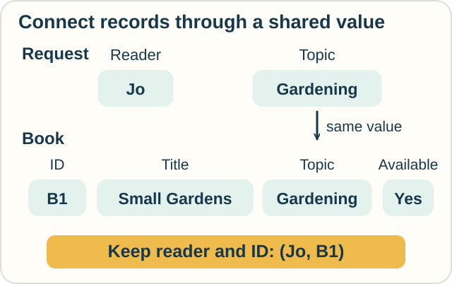
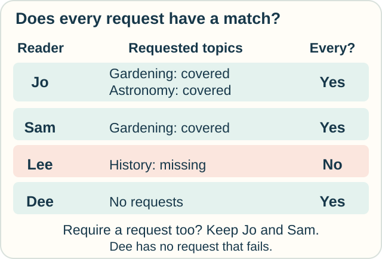

# Track — Domain Relational Calculus: Fill the Slots, Check Every Request

**Place in the field:** A database-query language whose variables stand for individual field values.

**Start with:** [matching requests and books](tuple-relational-calculus.md).\
**By the end:** connect records through shared values, test an “every” condition, and explain what happens when there are no requests.

<!-- visual:art-library -->

*Keep the catalog. Change how we name its parts—and which question we ask.*
<!-- /visual:art-library -->

## Name the values inside a record

Imagine a blank book card with four slots: **ID, Title, Topic, Available**. Filling them with **B1, Small Gardens, Gardening, Yes** reproduces one catalog record.

In **domain relational calculus**, variables stand for values in those slots. Here “domain” means a set of allowed values, such as book IDs or topic names. It does not mean a website address.

One variable might hold B1; another might hold Gardening. To use these values as evidence, we require that the filled card actually appears in the table.

<!-- visual:diagram-domain-slots -->

*A shared topic value connects the request to the book. Other values fill different roles.*
<!-- /visual:diagram-domain-slots -->

This expresses the same match as the tuple track. The difference is what the variables stand for: **one whole record** there, **individual field values** here. Both languages can ask “at least one” and “every” questions.

## Change from some to every

Use the same catalog:

| ID | Title | Topic | Available? |
|---|---|---|---|
| B1 | Small Gardens | Gardening | Yes |
| B2 | Night Skies | Astronomy | Yes |
| B3 | Seeds at Home | Gardening | No |
| B4 | Balcony Plants | Gardening | Yes |

Our registered readers are **Jo, Sam, Lee, and Dee**. Their recorded requests are:

| Reader | Requested topics |
|---|---|
| Jo | Gardening; Astronomy |
| Sam | Gardening |
| Lee | History |
| Dee | None |

For storage, each reader–topic request is a separate row, as in the previous track. The grouped table above is just easier to read.

Ask: **Which registered readers have at least one available book for every topic they requested?**

For Jo, we must check Gardening **and** Astronomy. B1 or B4 covers Gardening; B2 covers Astronomy. Jo qualifies. One book need not cover both topics: each requested topic may have its own witness.

Sam qualifies through Gardening. Lee fails because no available History book appears in the catalog.

<!-- visual:diagram-domain-coverage -->

*Look for a requested topic with no matching book. One missing topic defeats “every.”*
<!-- /visual:diagram-domain-coverage -->

## What about no requests?

Dee has no requested topic that fails the condition. So **Dee qualifies too** under the question exactly as written.

This is often called **vacuous truth**: “every item in this empty group passes” has no counterexample. It does not establish that Dee requested, received, or read a book.

If we want a reader to have made a request, we must say both:

- The reader has **at least one recorded request**.
- **Every recorded request** has an available match.

That revised answer is **Jo and Sam**.

**Predict:** B2 is now marked unavailable. Who satisfies the original every-request condition? Who satisfies the revised condition requiring a request too?

Check

**Sam and Dee** satisfy the original condition. Jo now has an uncovered Astronomy request; Lee still has an uncovered History request.

Only **Sam** satisfies the revised condition. Dee still has no request.

Jo still has some matches, but no longer has every requested topic covered. Changing one field value can separate those two questions.

## Turn “every” into a search for a failure

There are two equivalent ways to state our condition:

> Every requested topic has an available book.

> There is no requested topic for which no available book exists.

The second sentence suggests a way to check the answer: search for a missing match. If a reader has one, exclude that reader.

An actual database can use this connection to transform a query. The logic tells us why the answers agree; speed depends on the data and execution plan.

We have been querying a finite set of **registered readers**. Without that starting condition, “everyone with no unmet request” could include names that have never appeared in the library at all.

We also treat these tables as the complete record for the exercise. A missing request row means “no recorded request.” If a paper request was never entered, the query cannot discover it.

## Try it somewhere else

An equipment checklist records:

| Activity | Required equipment |
|---|---|
| Painting | Brush; Paint |
| Drawing | Pencil |
| Chatting | None |

Brush and Pencil are available; Paint is missing. Which activities have all their recorded equipment requirements met? Which have both at least one requirement and all requirements met?

Check and connect

**Drawing and Chatting** meet all recorded requirements. Painting has a missing item. Chatting has no requirement that can fail.

Only **Drawing** also has at least one recorded requirement.

The extra existence condition changes the result. Neither answer by itself proves that an activity is safe or ready in every real-world respect; it answers the specified equipment question.

Optional notation — values, quantifiers, and bounded answers

Write $\mathrm{Books}(i,n,t,a)$ for a stored book with ID i, title n, topic t, and availability a. Write $\mathrm{Requests}(r,t)$ for a recorded reader–topic pair.

The matching-pairs query is

$$
\{\langle r,i\rangle\mid
\exists t\,\exists n\,
(\mathrm{Requests}(r,t)\land\mathrm{Books}(i,n,t,\text{Yes}))\}.
$$

The repeated t enforces the topic match. The free variables r and i appear in the output; the quantified variables t and n supply evidence without appearing there.

Let $\mathrm{Readers}(r)$ mean that r is registered. The every-request query is

$$
\{\langle r\rangle\mid \mathrm{Readers}(r)\land
\forall t\,(\mathrm{Requests}(r,t)\Rightarrow
\exists i\,\exists n\,\mathrm{Books}(i,n,t,\text{Yes}))\}.
$$

The symbol $\forall$ means “for every,” and $\Rightarrow$ means “implies.” The implication tests book coverage only for topics that this reader requested.

Equivalently, its condition after Readers(r) is

$$
\neg\exists t\,
(\mathrm{Requests}(r,t)\land
\neg\exists i\,\exists n\,\mathrm{Books}(i,n,t,\text{Yes})).
$$

To require a request, also conjoin $\exists u\,\mathrm{Requests}(r,u)$.

These queries bind output values to stored readers or matching records. They are **domain independent**: adding unused possible values to the surrounding value universe does not change their answers. Safety restrictions give usable ways to keep relational-calculus queries bounded; finiteness of one particular answer alone is not a complete safety criterion.

Under the classical relational setting, safe tuple calculus, safe domain calculus, and relational algebra can express the same queries. Switching the kind of variable does not by itself add new expressive power.

## Sources

The library and equipment examples are original. See Silberschatz, Korth, and Sudarshan, [*Database System Concepts*, Chapter 27](https://www.db-book.com/online-chapters-dir/27.pdf), especially §§27.1.1 and 27.2 for universal conditions, empty groups, domain variables, and safety, and §27.3 for expressive power. See [References](../../REFERENCES.md#data-and-relations).

[← Whole-record queries](tuple-relational-calculus.md) · [Practice](../../PRACTICE.md#records-and-interactions) · [Home](../../README.md) · [Field map](../../PANTHEON.md#6-data-and-questions)
