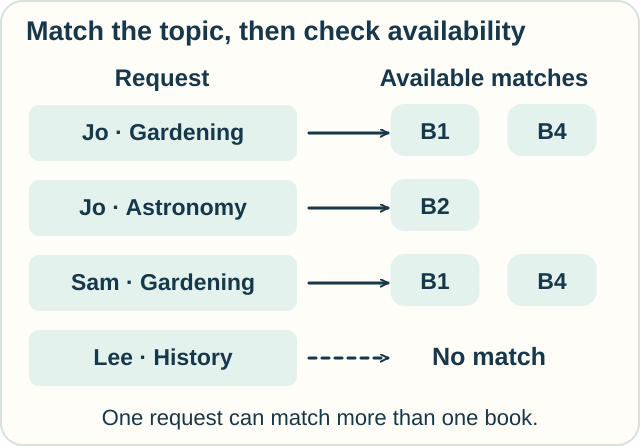
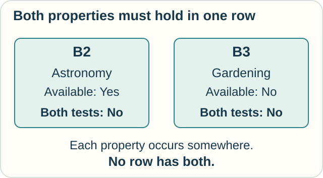

# Track — Tuple Relational Calculus: Which Records Belong Together?

**Place in the field:** A database-query language that states conditions on whole records.

**Start with:** [AND, OR, and matching records](../../lessons/06-data-and-relations.md).\
**By the end:** connect two tables, explain why a particular answer qualifies, and distinguish one matching record from all the records someone needs.

<!-- visual:art-library -->

*A book can match a reader's request. What exactly makes the match?*
<!-- /visual:art-library -->

## Give a whole row a name

The library from the core lesson has four books:

| ID | Title | Topic | Available? |
|---|---|---|---|
| B1 | Small Gardens | Gardening | Yes |
| B2 | Night Skies | Astronomy | Yes |
| B3 | Seeds at Home | Gardening | No |
| B4 | Balcony Plants | Gardening | Yes |

A **tuple** is a record with specified fields. Here one tuple contains a book's ID, title, topic, and availability. A **relation** is a set of records with the same fields; we display it as a table.

In **tuple relational calculus**, a variable can stand for a whole record. We can call a book record b and ask about **b's topic** or **b's availability**. The letter is a temporary name while we reason, not an extra column in the database.

For an available gardening book, the **same b** must meet both conditions. B1 and B4 qualify. B3 fails the availability condition.

## Match requests to books

We now have these requests. Names identify distinct readers in this small example.

| Reader | Wanted topic |
|---|---|
| Jo | Gardening |
| Jo | Astronomy |
| Sam | Gardening |
| Lee | History |

Ask: **Which reader–book pairs match a recorded request and an available book?**

For a pair to qualify, there must be a request record and a book record such that:

1. The request names that reader.
2. The book has that ID.
3. The requested topic equals the book's topic.
4. The book is marked available.

The matching-topic condition is a **join**: it connects records through a stated relationship.

<!-- visual:diagram-tuple-join -->

*Follow a request across the topic match to an available book.*
<!-- /visual:diagram-tuple-join -->

| Reader | Matching book ID |
|---|---|
| Jo | B1 |
| Jo | B2 |
| Jo | B4 |
| Sam | B1 |
| Sam | B4 |

For example, **Jo's gardening request and the B4 record** provide evidence for the answer (Jo, B4). Logicians call a record that establishes an “at least one exists” claim a **witness**.

Lee has no match in these tables. That tells us about this catalog; it does not say history books do not exist.

## Keep the conditions on the right record

Suppose someone reasons: “There is a gardening book, and there is an available book, so this book is an available gardening book.”

That can mix evidence from different rows. In the two-row catalog below, neither book meets both conditions:

<!-- visual:diagram-tuple-witness -->

*Two separate witnesses do not necessarily give one record with both properties.*
<!-- /visual:diagram-tuple-witness -->

Our correct query keeps the topic test and availability test attached to the same book record. It also connects that book's topic to the chosen request.

## Decide what the answer should contain

We could ask only: **Which readers have at least one match?** Then the result is **Jo and Sam**, each once.

Dropping the book-ID field from our five pairs leaves repeated reader names. Mathematical relations use sets, so identical output records collapse to one. This operation is called **projection**: choose which fields the answer keeps.

**Predict:** the library adds B5, another available gardening book. How many reader–book pairs now qualify? Does the reader-only result gain anyone?

Check

Two pairs are added: **(Jo, B5)** and **(Sam, B5)**, giving **seven pairs**.

The reader-only result stays **Jo and Sam**. More evidence for an existing answer does not create a new distinct reader.

Practical SQL often keeps duplicate rows unless asked to remove them. Our example uses mathematical set semantics.

## A condition is not a search schedule

The query says what makes a pair correct. It does not require a particular order of searching the tables. A database might compare rows, use an index, or choose another execution plan.

**Relational algebra** describes combinations of operations such as selection, join, and projection. For this query: keep available books, join them to requests on topic, then keep the reader and book ID. An engine can still choose how to execute those operations.

This is one connection between a condition-based query and an operation-based expression. [Domain relational calculus](domain-relational-calculus.md) expresses conditions using individual field values instead of whole-record variables.

## Try it somewhere else

A kitchen lists the ingredients needed for two dishes:

| Dish | Needed ingredient |
|---|---|
| Sandwich | Bread |
| Sandwich | Cheese |
| Soup | Water |

Stock records say bread and water are available, but cheese is not. Which dishes have **at least one** available needed ingredient? Does that answer show which dishes have **every** needed ingredient?

Check and connect

Both **Sandwich and Soup** have at least one match: bread for Sandwich, water for Soup.

Only Soup has all its listed ingredients available. The missing cheese matters for the second question, although it does not prevent Sandwich from having one match.

The join is useful in both questions. The words “at least one” and “every” determine what we must prove. The next track explores that change.

Optional notation — whole-record variables

Let Books have fields ID, Title, Topic, Available, and Requests have fields Reader, Topic. Use b and r for input tuples and t for an output tuple with fields Reader and Book:

$$
\{t\mid \exists r\in\mathrm{Requests}\;\exists b\in\mathrm{Books}\;
(t.\mathrm{Reader}=r.\mathrm{Reader}\land t.\mathrm{Book}=b.\mathrm{ID}
\land r.\mathrm{Topic}=b.\mathrm{Topic}\land b.\mathrm{Available}=\text{Yes})\}.
$$

The symbol $\exists$ means “there exists,” and $\land$ means AND. Both input variables range over named finite relations. Each output field is tied to a field in a matching input record.

For the reader-only query, give t just the Reader field and omit the Book equality. The witnesses still include a matching book; its ID simply does not appear in the answer.

An unrestricted query such as “all book-shaped records absent from Books” can include infinitely many invented values. **Safe** relational-calculus queries avoid such unbounded answers. The positive, relation-bounded query above is safe; a general safety account also has to handle negation and quantifiers carefully.

On finite relations, the standard safe relational calculi and relational algebra have the same expressive power for these relational queries. This statement uses the classical set-based languages, without SQL's extra rules for duplicates and missing values.

## Sources

The library, requests, and kitchen examples are original. Silberschatz, Korth, and Sudarshan's [*Database System Concepts*, Chapter 27](https://www.db-book.com/online-chapters-dir/27.pdf), §§27.1–27.3, gives tuple and domain variables, quantification, safety, and the relationship to relational algebra. See [References](../../REFERENCES.md#data-and-relations).

[← Questions of data](../../lessons/06-data-and-relations.md) · [Next: Field values and every request →](domain-relational-calculus.md) · [Home](../../README.md) · [Field map](../../PANTHEON.md#6-data-and-questions)
