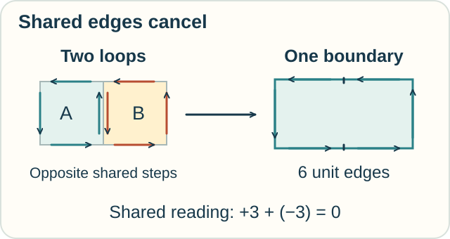
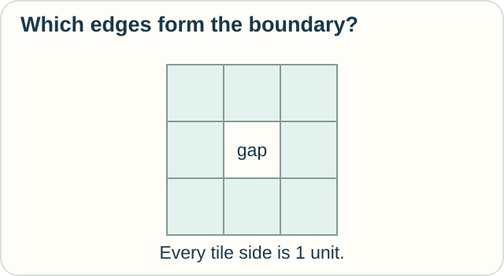

# Exterior Calculus — What Happens at the Boundary?

**Place in the field:** An established language for derivatives and integrals on spaces, using differential forms.

**Start with:** [rates and totals](../../lessons/01-classical-calculus.md) and [space and shape](../../lessons/02-space-and-shape.md).\
**By the end:** explain why shared interior edges can cancel when regions are joined.

*Return to the garden. This time, trace its edges.*

## Walk around two little plots

Place two square garden plots side by side. Each side is one meter long.

Walk around each plot counterclockwise, keeping that plot on your left. At their shared edge, one walk goes up and the other goes down.

*Opposite traversals of the same edge cancel in a signed sum.*

Suppose a measurement along that shared edge is +3 in one direction and −3 in the reverse direction. Together they contribute **zero**.

The outside edges remain. Two separate square loops have eight unit-edge traversals. After canceling the two opposite traversals of the shared edge, the combined outline has six.

We are combining **directed boundaries**. We are not saying that two physical fences vanish.

## From this picture to exterior calculus

A **differential form** is a kind of measurement rule suited to integration along oriented paths, surfaces, or higher-dimensional regions. Orientation tells us which direction or side counts as positive.

Exterior calculus provides operations on these forms. Its **exterior derivative** connects local change to measurements around boundaries.

The general **Stokes theorem**, under its mathematical conditions, says that integrating an exterior derivative over a region equals integrating the original form over its boundary. It brings several familiar integration theorems into one statement.

Our plots show a useful cancellation pattern. They are not a proof of the full theorem.

## Make a prediction

Four unit squares now form one larger square, with two rows and two columns. After the shared edges cancel, how many unit edges remain around the outside?

Check

**Eight.** Each of the four outside sides is two units long.

There are initially 16 directed edge traversals. Four shared edges each appear twice in opposite directions, removing eight traversals from the sum.

## Try a region with a hole

Arrange nine unit tiles in a three-by-three square. Remove the center tile.

Does the boundary consist only of the large outside square?

*Trace every edge with a tile on just one side.*

Check your reasoning

No. The hole has a boundary too. There are 12 outside unit edges and 4 around the hole.

For the usual orientation in the plane, the outer loop runs counterclockwise and the inner loop clockwise. In both cases, the tiled region stays on your left.

A missing piece can change which boundary must be included.

Optional mathematics — the compact statement

For a compact oriented smooth $n$-dimensional manifold $M$ with boundary, and a smooth $(n-1)$-form $\omega$,

$$
\int_M d\omega=\int_{\partial M}\omega.
$$

The boundary uses the induced orientation. Here $d$ is the exterior derivative and $\partial M$ is the boundary.

Differential forms are alternating covariant tensors. This links exterior calculus to [tensor calculus](tensor-calculus.md), while giving forms operations and integration rules suited to their particular structure. Piecewise smooth versions cover familiar polygonal regions.

## Sources

The garden and tile activities are original. See Reyer Sjamaar, [*Manifolds and Differential Forms*](https://pi.math.cornell.edu/~sjamaar/manifolds/manifold.pdf), Chapters 2, 5, and 9, and David Tong, [§2.4, Differential Forms](https://www.davidtong.org/teaching/general-relativity/grhtml/S2). These sources give the definitions and conditions behind the cancellation picture.

[Space and shape](../../lessons/02-space-and-shape.md) · [Tensor calculus](tensor-calculus.md) · [Field map](../../PANTHEON.md)
