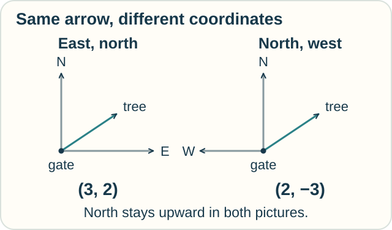
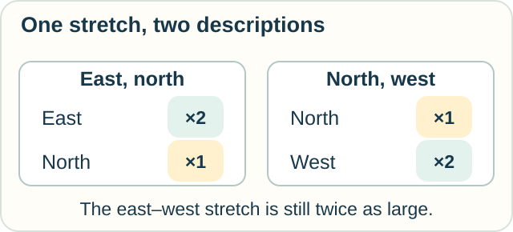

# Tensor Calculus — Same Thing, New Coordinates

**Place in the field:** A major language of geometry and physics. It helps describe quantities whose components must change together when coordinates change.

**Start with:** [directions and fields](../../lessons/02-space-and-shape.md).\
**By the end:** separate a change in a physical quantity from a change in its description.

*Turning the map need not move anything in the garden.*

## One arrow, two descriptions

An arrow points from the garden gate to a tree: **3 meters east and 2 meters north**.

Jo records east first, then north: **(3, 2)**.

Sam uses north first, then west: **(2, −3)**. The minus sign means three meters opposite west.

Both start at the gate and use the same unit, meters.

*The arrow stays put. Its numbers depend on the chosen directions.*

**Predict:** do the different pairs mean Jo and Sam disagree about where the tree is?

Check

No. Both descriptions lead to the same tree. To compare their numbers, we must first compare their coordinate choices.

A pair of numbers without its coordinate convention leaves out information.

A vector is one simple kind of **tensor**. Tensors include other quantities with more elaborate transformation rules. The important part is how the descriptions fit together.

## A rule that stretches arrows

Imagine a drawing tool that doubles east–west lengths and leaves north–south lengths alone.

An arrow with components (3, 2) becomes (6, 2), using east and north.

| Coordinate order | First component | Second component |
|---|---|---|
| East, north | Multiply by 2 | Leave unchanged |
| North, west | Leave unchanged | Multiply by 2 |

*The stretching rule stays the same even when its table changes.*

This linear map is an example of a tensor of type (1,1). Here, **linear** means that the rule respects adding arrows and multiplying them by numbers.

A **matrix** is an array of numbers. It can record this map in chosen coordinates. The array alone does not tell us what the numbers represent.

## Where the calculus enters

So far we have used tensor algebra. Tensor calculus studies tensor fields and their change across a space. It appears in descriptions of stress in materials, curved geometry, and gravity.

On a curved surface, even the local coordinate directions can vary from place to place. Comparing change must account for that too.

## Try a new setting

A floor plan uses east–north coordinates. A movement arrow is (5, 1). Rewrite it in north–west coordinates.

Then ask: if someone instead turns the movement arrow a quarter-turn counterclockwise while keeping the original axes, is that the same operation?

Check your reasoning

The coordinate rewrite is **(1, −5)**. The movement itself stays the same.

Turning the arrow changes the movement. In the original east–north axes, its new components are **(−1, 5)**. The [complex-calculus track](../change/complex-calculus.md) explores that kind of turn.

Changing coordinates and changing the object can produce different answers.

Optional mathematics — a change-of-basis rule

If old and new vector components satisfy $v=P v'$, the same linear map has matrices related by

$$
T'=P^{-1}TP.
$$

For our stretch, $T=\operatorname{diag}(2,1)$. Choosing north and west as the new basis gives $T'=\operatorname{diag}(1,2)$.

Other tensor types have corresponding transformation laws. A general tensor is a multilinear object; vectors, covectors, and linear maps are entry examples. When differentiating on a manifold, a covariant derivative uses a connection to compare the local descriptions.

## Sources

The garden and stretching examples are original. See Kasper Peeters, [*Introduction to Tensor Calculus*](https://www.maths.dur.ac.uk/users/kasper.peeters/pdf/tensor_en.pdf), and David Tong, [*General Relativity*, §2.3](https://www.davidtong.org/teaching/general-relativity/grhtml/S2), for tensors, components, and transformation laws. [References](../../REFERENCES.md#geometry-and-field-calculi) gives the wider setting.

[Space and shape](../../lessons/02-space-and-shape.md) · [Exterior calculus](exterior-calculus.md) · [Field map](../../PANTHEON.md)
