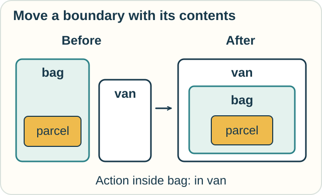
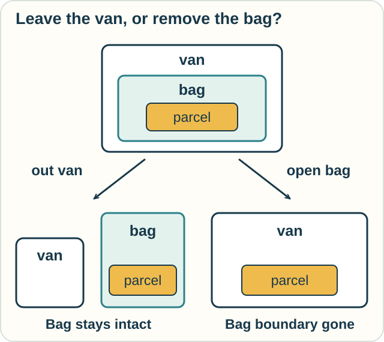
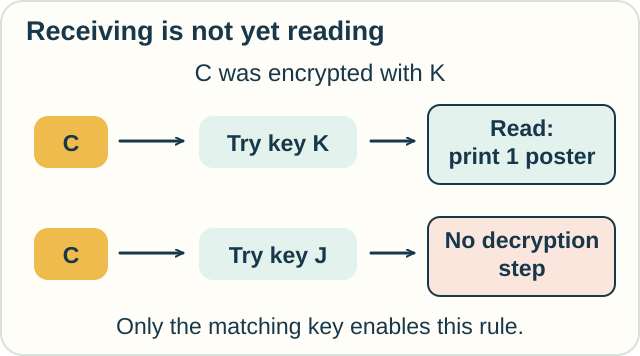
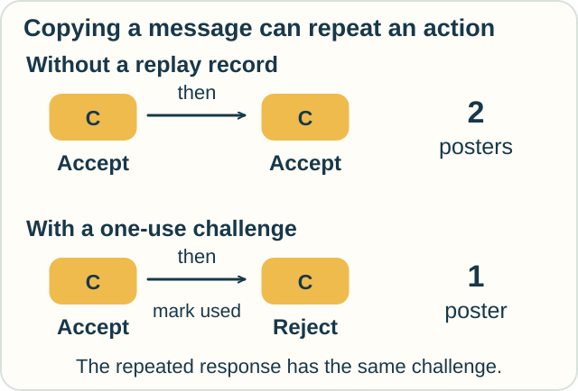

# Track — Ambient and Spi Calculi: Places, Boundaries, and Locked Messages

**Place in the field:** Two different process-calculus families: mobile ambients describe nested places and movement; spi calculus describes communication with cryptographic operations.

**Start with:** [processes and communication](../../lessons/07-interaction-and-action.md); [pi calculus](pi-calculus.md) helps explain the spi connection.\
**By the end:** distinguish moving a container from removing its boundary, and distinguish reading a message from copying it.

<!-- visual:art-delivery -->

*Where is a parcel? Who can read its message? These call for different rules.*
<!-- /visual:art-delivery -->

## A place can contain another place

Imagine a parcel inside a bag, with the bag beside a van. If the bag goes into the van, the parcel goes with it.

An **ambient** is a named boundary containing processes and possibly other ambients. Its arrangement describes **nesting**: what is inside what. A moving ambient carries its contents.

In the original mobile-ambient calculus, an instruction inside the bag can tell the bag to enter a neighboring ambient named van.

<!-- visual:diagram-ambient-enter -->

*The parcel stays in the bag while the bag changes its surrounding place.*
<!-- /visual:diagram-ambient-enter -->

This is a model of structure and movement. An ambient might represent a device, a running program's location, or an administrative boundary. The bag is our teaching analogy.

## Three operations change the nesting

| Operation | What it does in this presentation |
|---|---|
| **in van** | Moves the surrounding ambient into a sibling ambient named van |
| **out van** | Moves the surrounding ambient out of its immediate parent named van |
| **open bag** | Removes a bag boundary at the same level as the instruction, leaving its contents there |

“Sibling” means sharing an immediate parent. The required names and positions matter. An `in van` instruction cannot simply reach a van hidden at an arbitrary depth somewhere else.

The calculus uses **capabilities** for these actions. Our examples assume the relevant capability is available. The basic entry rule does not include a separate acceptance handshake from the target; more elaborate access rules need to be modeled explicitly.

## Leaving and opening are different changes

Start with **parcel inside bag inside van**. Compare two possible next steps:

- An **out van** instruction inside the bag moves the bag beside the van. The parcel is still inside the bag.
- An **open bag** instruction in the van removes the bag boundary. The parcel is now directly inside the van.

<!-- visual:diagram-ambient-exit-open -->

*In this calculus, “open” dissolves a boundary. It is more than opening a physical zipper.*
<!-- /visual:diagram-ambient-exit-open -->

**Predict:** the bag contains both a parcel and a pouch. After the bag exits the van, where are they? After opening the bag inside the van instead, does the pouch's own boundary disappear too?

Check

Exiting moves **both contents with the bag**. They remain inside it, now outside the van.

Opening bag removes **only the bag boundary**. The parcel and the still-intact pouch are directly inside the van. A separate operation would be needed to dissolve the pouch boundary.

## A different kind of boundary: encrypted content

**Spi calculus** extends pi-style communication with operations such as encryption and decryption. It lets us write protocol steps and ask what other processes can learn or cause.

For a small example, Jo and a printer share a secret key K. Jo encrypts the instruction **print one poster** and sends the resulting ciphertext. The printer receives it and tries to decrypt with K.

Think of a locked message box, while remembering that the calculus manipulates symbolic messages, not physical locks.

<!-- visual:diagram-spi-decrypt -->

*Receiving the ciphertext and successfully reading its contents are separate steps.*
<!-- /visual:diagram-spi-decrypt -->

In this symbolic model, the matching key enables decryption. A different key does not. We assume the key remains secret and the encryption operations obey the model's rules.

These rules let us reason about a protocol. They do not measure the strength of a particular encryption program, device, or password.

## A locked message can still be copied

Suppose the printer accepts a new message repeatedly. Each time it decrypts **print one poster**, it prints one poster. It keeps no record of earlier requests.

Someone who sees the ciphertext can copy and resend it without knowing its contents. If the printer receives the same valid ciphertext twice, it can print **two posters**.

This is a **replay**. No decryption by the copier was required.

One model for avoiding this replay gives the printer a fresh **challenge**, often called a **nonce**. The authorized sender includes it with the command inside the encrypted reply.

The printer accepts a reply only if its challenge matches the current unused challenge. It then marks that challenge used before acting. A response from an old challenge fails the match; a second copy for the same challenge fails the unused check.

“Fresh” is an assumption about generating a new value. Here we assume the challenge has not been used before and cannot be guessed in advance. The one-use state also matters. This small example explains the replay check; a complete protocol needs its participants, keys, messages, and allowed interactions specified.

<!-- visual:diagram-spi-replay -->

*C labels the ciphertext being repeated in each example. Protecting its contents and preventing a repeated action are different requirements.*
<!-- /visual:diagram-spi-replay -->

## Try it somewhere else

Consider two new settings:

1. A running app contains a task. The app moves from a local workspace into a remote workspace. Which ambient idea captures why the task moves with it?
2. A ticket scanner checks that a ticket is genuine but never records whether it was used. Can copying a genuine ticket matter even if nobody can forge a new one?

Check and connect

1. Model the app as an ambient containing the task. Moving that ambient carries the nested task. A plain text edit to a location record would not itself perform this modeled move.
2. Yes. Reusing an existing genuine ticket can pass a genuineness-only check. A separate used-ticket rule is needed for a one-entry promise. This is a replay analogy; the scanner need not literally implement spi calculus.

The useful questions are **which boundary changes** and **which condition an action checks**.

Optional notation — the ambient moves

Write $n[P]$ for an ambient named n containing process P. A vertical bar puts contents or processes alongside each other; a dot sequences an instruction and its continuation. The basic reductions are

$$
n[\mathrm{in}\ m.P\mid Q]\mid m[R]
\longrightarrow m[n[P\mid Q]\mid R],
$$

$$
m[n[\mathrm{out}\ m.P\mid Q]\mid R]
\longrightarrow n[P\mid Q]\mid m[R],
$$

$$
\mathrm{open}\ n.P\mid n[Q]\longrightarrow P\mid Q.
$$

For entry, take n = bag and m = van. Q includes the parcel. For exit, the same Q stays inside n. For opening, Q loses its enclosing n boundary but keeps its own internal structure.

The movement instruction runs **inside the moving ambient**. An open instruction runs **beside the boundary it dissolves**. These locations are part of each rule's left side.

Two ambients may have the same name without being the same ambient. Our examples use one bag and one van so that the intended target is unambiguous.

Optional notation — symbolic decryption and protocol properties

Write $\{M\}_K$ for message M encrypted under symmetric key K. One spi decryption rule is

$$
\mathrm{case}\ \{M\}_K\ \mathrm{of}\ \{x\}_K\ \mathrm{in}\ P
\longrightarrow P[M/x].
$$

It continues as P with M substituted for x, avoiding variable capture. If the ciphertext is encrypted under a different key, this rule does not apply. Other parallel processes may still act.

Our replay example adds an explicit receiver that accepts repeatedly and initially keeps no replay state. In the revised model, acceptance requires successful decryption of a pair $(n,M)$, equality of n with the current challenge, and an unused flag. Acceptance consumes that flag as part of the same receiver step. These are additional protocol rules, not automatic consequences of encryption.

Spi calculus can state security properties by comparing a protocol's observable behavior with an ideal specification in the presence of other processes. Such an equivalence requires a proof and a stated attacker model. A single successful decryption does not establish it.

## Sources

The bags, printer, and ticket examples are original teaching presentations. See Cardelli and Gordon's [*Mobile Ambients* (1998)](https://www.microsoft.com/en-us/research/wp-content/uploads/2016/11/fossacs98.pdf), §2, for the nesting and movement rules; and Abadi and Gordon's [*A Calculus for Cryptographic Protocols: The Spi Calculus* (1999)](https://andrewdgordon.github.io/papers/ic99spi.pdf), §§3–4, for symbolic encryption, replay, fresh challenges, and protocol reasoning. The sources develop much larger languages and examples. See [References](../../REFERENCES.md#locations-and-cryptographic-processes).

[← Coordinated processes](ccs-csp-acp.md) · [Action effects and persistence](../action/situation-event-fluent.md) · [Practice](../../PRACTICE.md#records-and-interactions) · [Home](../../README.md) · [Field map](../../PANTHEON.md#7-interaction-actions-and-events)
