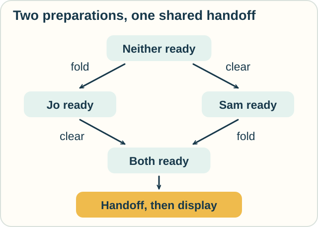
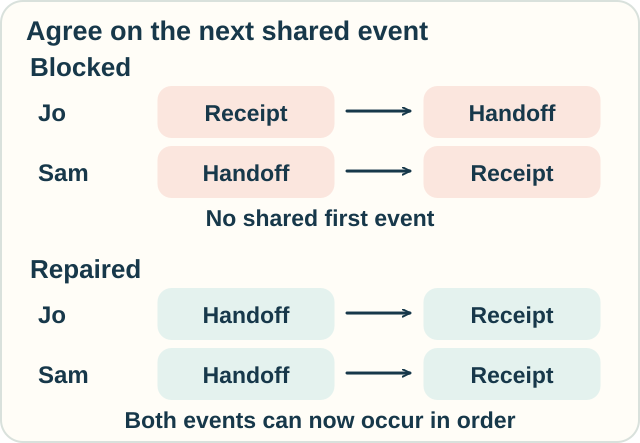

# Track — CCS, CSP, and ACP: When Can We Take the Next Step?

**Place in the field:** Three major traditions for describing interacting processes and reasoning about their behavior.

**Start with:** [messages, waiting, and deadlock](../../lessons/07-interaction-and-action.md).\
**By the end:** list allowed event orders, spot a blocked handshake, and explain one difference among these process languages.

<!-- visual:art-workshop -->

*Two helpers can prepare separately. A handoff needs them both.*
<!-- /visual:art-workshop -->

## Give each helper a small script

Jo folds a poster and hands it to Sam. Sam clears a table, receives the poster, and displays it.

| Helper | Steps, in order |
|---|---|
| Jo | Fold; handoff; no more steps |
| Sam | Clear table; handoff; display; no more steps |

In this model, **handoff is one shared event**. It can happen only when Jo is ready to give and Sam is ready to receive. There is no place to leave the poster while Sam is busy.

Folding and clearing can happen independently. Their order is flexible, but each helper must respect their own script.

<!-- visual:diagram-process-orders -->

*Two preparation orders reach the same point where the handoff is possible.*
<!-- /visual:diagram-process-orders -->

There are two complete event lists:

1. **Fold, clear, handoff, display.**
2. **Clear, fold, handoff, display.**

“Fold, handoff, clear, display” is impossible under these rules: Sam is not ready for the early handoff.

A **trace** records an allowed sequence of events. It can record only the beginning of a run; it need not be a finished story. Our two lists above record all planned actions.

This step-by-step model records an order. It does not measure how many seconds folding takes or whether the physical preparations overlap.

## What do the three names mean?

A **process algebra** combines descriptions using operations: do one step then another, offer alternatives, or run activities alongside each other. Its laws help us compare and simplify those descriptions.

| Tradition | Name | How a joint event is described in a common presentation |
|---|---|---|
| CCS | Calculus of Communicating Systems, developed by Robin Milner | Complementary actions synchronize and produce an internal step |
| CSP | Communicating Sequential Processes, developed by C. A. R. Hoare | Processes must agree on events chosen for synchronization |
| ACP | Algebra of Communicating Processes, developed by Jan Bergstra and Jan Willem Klop | A communication rule says which actions combine and what event they produce |

These are separate mathematical traditions, with variants and different choices about observation, alternatives, and successful completion. They share useful questions without having identical rules.

For the poster, CSP can use the same event name **handoff** on both sides. A CCS model instead pairs a sending action with its complementary receiving action. ACP can specify that **give** combined with **take** produces **handoff**.

In CCS and ACP, merely placing the two scripts alongside each other also permits separate actions. To enforce our joint handoff, the model must block the unpaired handoff actions. CSP can enforce the agreement through its chosen synchronization set.

## A handshake can get stuck

Now change the procedure. Jo wants a receipt before handing over the poster. Sam issues the receipt only after receiving it.

| Helper | Required shared events, in order |
|---|---|
| Jo | Receipt; handoff |
| Sam | Handoff; receipt |

Both events need both helpers. Jo is ready for receipt; Sam is ready for handoff. Neither event is enabled.

<!-- visual:diagram-process-deadlock -->

*Compare the first event each script offers. Agreement must happen at the same stage.*
<!-- /visual:diagram-process-deadlock -->

**Predict:** Jo changes the script to “handoff, then receipt.” Does this resolve the blockage? What if Jo only performs the old script faster?

Check

The changed script permits **handoff**, then **receipt**, since both helpers now offer the same next event each time.

Speeding up the old script cannot create a shared first event. The obstacle is the order of requirements.

This repair works for the two-event model. Extra rules or participants would need to be checked too.

After all planned actions are complete, there may also be no next event. We therefore check **where** a process stops and **what goal has been reached**. A bare “no transitions” state does not by itself tell us whether the task succeeded.

## Visibility is part of the question

Someone watching the final display might not care about the handoff. A model can treat that event as **internal**, often labelled with the Greek letter tau, written $\tau$.

An internal event still changes the system. It is left out of a chosen external record. Hiding a step does not mean the step never occurred or could never block progress.

[Observational equivalence](../observation/observational-equivalence.md) goes further: when do two systems count as behaving the same under a chosen comparison?

## Try it somewhere else

A cook chops vegetables, then passes a bowl. A helper washes their hands, receives the bowl, and mixes. Treat the pass as a joint event and the two preparations as independent.

List the complete event orders. Then change the model: the cook may leave the bowl on a counter, and the helper can collect it later. Must setting it down now wait for handwashing?

Check and connect

With a joint pass, the complete orders are **chop, wash, pass, mix** and **wash, chop, pass, mix**.

With a counter, setting down and collecting become separate events. Setting down can happen before handwashing, provided chopping is done and the counter is available. Collecting still needs the bowl to be there and, under the helper's script, clean hands.

Adding a buffer changes the interaction rules. We cannot assume that every use of the word “send” means the same kind of waiting.

Optional notation — three ways to specify the handshake

Use f for fold, c for clear, h for handoff, and d for display. A CSP-style presentation is

$$
J=f\to h\to\mathrm{STOP},\qquad
S=c\to h\to d\to\mathrm{STOP}.
$$

Compose them as $J\parallel_{\{h\}}S$: synchronize on h and interleave the other actions. STOP has no further events; we use it after the helper's planned work, not as a separate success signal. Hoare's alphabet-based presentation gives this same example by making h the only shared alphabet event.

More precisely, when $a\ne h$, one component can take an a-step alone. An h-step needs an h-step from each component and advances both. Starting at the pair of initial states and applying those rules gives the two complete lists above and their prefixes.

A corresponding CCS description uses complementary h actions:

$$
\bigl(f.\overline h.0\mid c.h.d.0\bigr)\setminus\{h\}.
$$

Here the dot means “then,” the bar over h distinguishes the complementary action, and 0 has no actions. Restriction blocks separate h and $\overline h$ actions from the combined system; their joint transition remains possible and is labelled $\tau$. Its complete visible traces are therefore f,c,d and c,f,d. The earlier CSP lists show the handoff explicitly; comparing them requires this stated choice about visibility.

In an ACP model, choose a communication function with

$$
\gamma(\mathrm{give},\mathrm{take})=\mathrm{handoff}.
$$

Choose the symmetric entry the same way and make unspecified pairs fail to communicate. Encapsulate the unpaired give and take actions, so a successful handoff requires their combination. ACP supplies algebraic laws for such sequential, alternative, and parallel compositions; it does not prescribe this particular communication table for every application.

## Sources

The poster, receipt, and kitchen examples are original. See Hoare's [*Communicating Sequential Processes*](https://www.cs.ox.ac.uk/ucs/hoarebook.pdf), Chapter 2; Rob van Glabbeek's [*Comparative Concurrency Semantics* course notes](https://cgi.cse.unsw.edu.au/~rvg/3152/notes.html), especially the CCS, CSP, and synchronization discussions; and Bergstra and Klop's [*Algebra of Communicating Processes*](https://ir.cwi.nl/pub/1778/1778D.pdf), §§1–2. These support the different composition rules, not an assertion that the three languages are interchangeable. See [References](../../REFERENCES.md#process-algebra-and-concurrency).

[← Messages and events](../../lessons/07-interaction-and-action.md) · [Next: Locations and locked messages →](ambient-and-spi-calculi.md) · [Home](../../README.md) · [Field map](../../PANTHEON.md#7-interaction-actions-and-events)
