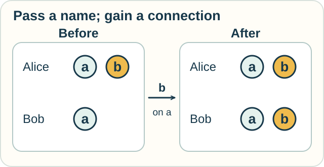

# Track — Pi Calculus: Passing a New Connection

**Place in the field:** A specific process calculus for changing communication connections.

**Start with:** the idea of sending and receiving a message.\
**By the end:** explain how a message can change who can communicate.

<!-- visual:art-workshop -->

*The workshop returns as a place where passing a contact can change who can communicate.*
<!-- /visual:art-workshop -->

## The idea

A **process** is something that can act and interact. A **channel** is a route for communication. In **π-calculus**, pronounced “pi calculus,” a channel's name can itself be sent in a message.

Think of a cook giving a helper a supplier's contact address. The message changes what the helper can do next.

## A worked example

Alice and Bob share a channel named $a$. Alice also knows channel $b$. Bob does not.

1. Alice sends the name $b$ on $a$.
2. Bob receives it.
3. Bob can now use $b$ in later communication.

| Process | Names available before | Names available after |
|---|---|---|
| Alice | $a$, $b$ | $a$, $b$ |
| Bob | $a$ | $a$, $b$ |

*The message carries a usable name. It does not need to move either process.*

The model assumes that knowing a channel name is enough to use it. Real contact systems may add passwords, permissions, and delivery failures.

The distinctive move is **passing a communication name**. A process can gain a connection without physically moving anywhere.

## Try it

Bob now shares a different channel $c$ with Carol. Carol does not know $b$.

How could Bob make $b$ available to Carol? What if Bob sends only the words “I know another channel”?

Check your reasoning

Bob can send the name $b$ on $c$. Carol can then use the received name.

The statement “I know another channel” does not supply that name, so it does not provide the same connection.

## Try it somewhere else

A help desk passes your request to a specialist.

Compare two designs:

- the desk forwards each message for you;
- the desk gives you a contact address you can use directly.

Which design resembles the move in our example? What changed?

Check and connect

Giving you the contact address resembles name passing. You gain a route for later communication.

Forwarding messages keeps the desk as an intermediary. Both designs involve messages, but their patterns of access differ.

This is an analogy for communication structure, not a full model of a help desk.

Optional notation — one communication rule

In a common synchronous presentation,

$$
\overline a\langle b\rangle.P
$$

means “send $b$ on $a$, then continue as $P$,” while $a(x).Q$ means “receive on $a$, call the received name $x$, then continue as $Q$.”

The vertical bar puts processes in parallel:

$$
\overline a\langle b\rangle.P\mid a(x).Q
\longrightarrow P\mid Q[b/x].
$$

The receiver substitutes $b$ for its input variable $x$, avoiding capture. A matching send and receive can now advance together.

The wider language includes restricted names and repeated behavior. Comparing processes often requires comparing possible interactions, not just one final output. **Bisimulation** is one family of methods for doing that.

## Connections

Milner, Parrow, and Walker developed π-calculus within the process-algebra tradition. It extends ideas from CCS with name passing and changing connections.

The [CCS/CSP/ACP track](ccs-csp-acp.md) compares ways to synchronize actions. [Spi calculus](ambient-and-spi-calculi.md#a-different-kind-of-boundary-encrypted-content) extends pi-style communication with cryptographic operations; receiving a channel name, receiving ciphertext, and successfully decrypting it are different capabilities.

[λ-calculus](../computation/lambda-calculus.md) foregrounds application. This lesson foregrounds interaction. [ρ-calculus](rho-calculus.md) next asks how process descriptions can themselves serve as names.

## Sources

The contact stories are original analogies. For the calculus, see Milner, Parrow, and Walker, *A Calculus of Mobile Processes*, I–II (1992), and Robin Milner's [*The Polyadic π-Calculus: A Tutorial*](https://www.lfcs.inf.ed.ac.uk/reports/91/ECS-LFCS-91-180/). Full citations are in [References](../../REFERENCES.md#π-calculus).

[← Messages and events](../../lessons/07-interaction-and-action.md) · [Home](../../README.md) · [Field map](../../PANTHEON.md#7-interaction-actions-and-events)
