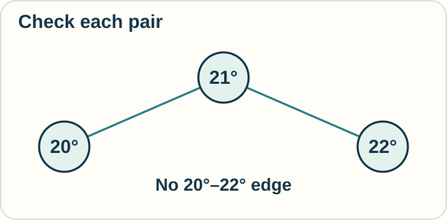

# Track — Distinction Graphs: What Can Be Told Apart?

**Place in the field:** Ben Goertzel's research formalism for observer-dependent distinctions. The graph is a representation; additional rules are needed to describe change.

**Start with:** comparing pairs of things.\
**By the end:** draw a graph from an observation rule and explain what each line means.

## The idea

Two items can differ even when a particular person or device cannot tell them apart.

Ben Goertzel's **distinction graph** records this. Each item becomes a **node**, drawn as a point or box. Join two nodes with a line, called an **edge**, when the chosen observer **cannot distinguish that pair**.

## A worked example

For an invented device, suppose temperatures less than 2 degrees apart cannot be distinguished in a pairwise comparison.

| Pair | Difference | Draw an edge? |
|---|---|---|
| A: 20° and B: 21° | 1 degree | Yes |
| B: 21° and C: 22° | 1 degree | Yes |
| A: 20° and C: 22° | 2 degrees | No |

The graph has A–B and B–C edges, but no A–C edge. Following a path through B does not add a direct edge between A and C. Each pair must be checked.

This rule describes a toy device, not a claim about human temperature perception.

## Try it

A second device can distinguish any pair at least 1 degree apart. Use the same three temperatures.

Which edges remain? Did the temperatures have to change?

Check your reasoning

No edges remain between these three nodes. Every pair differs by at least 1 degree.

The temperatures stayed fixed. The observation rule changed, so the graph changed.

## Try it somewhere else

A reader confuses labels A and B. Another test shows that the reader confuses B and C.

Must the reader also confuse A and C? What would you check?

Check and connect

It does not follow from those two results alone. Test A against C.

The temperature example showed why: pairwise confusion need not carry along a chain. A graph lets us record that pattern without forcing all three items into one group.

Optional notation and extensions

For items $x,y$ and observer $O$, an edge records

$$
x\sim_O y
\quad\Longleftrightarrow\quad
O\text{ cannot distinguish }x\text{ and }y.
$$

Here $\sim_O$ records pairwise indistinguishability; it need not be a transitive equivalence relation. The toy graph above is an example.

The basic construction starts with items and a specified observer. Goertzel's 2019 paper also introduces **graphtropy**, a measure based on the graph's pair structure, and **Dynamic Distinction Graphs**, which add causal implications. It explores probabilistic and quantum versions too.

A static graph records distinctions under the chosen conditions. Predictions about how they change need further rules and observations.

## A question to carry forward

Which differences survive an observation? If you use its record to rebuild something, which details could remain unavailable?

Compare another observation rule in [rough sets](rough-sets.md): matching recorded labels groups objects into equivalence classes. Or ask what possibilities a person retains in [epistemic logic](epistemic-logic.md). Each example makes its distinction rule explicit.

## Sources

The device and label examples are original. The graph definition and its extensions come from Ben Goertzel, [*Distinction Graphs and Graphtropy*](https://arxiv.org/abs/1902.00741) (2019); §3.1 discusses nontransitive indistinguishability. See [References](../../REFERENCES.md#distinction-graphs).

[← Choosing a model](../../lessons/09-choose-and-combine.md) · [Home](../../README.md) · [Observation route](../../PANTHEON.md#10-observation-knowledge-and-measurement)
