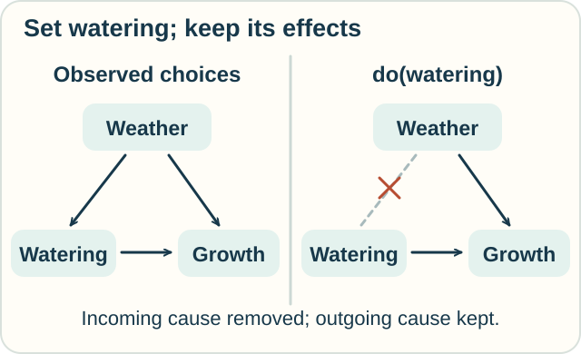
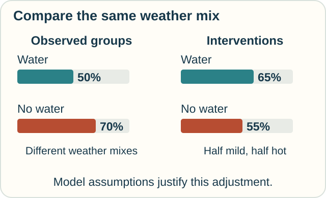

# Do-Calculus — What If We Change the Setting?

**Place in the field:** Judea Pearl's three rules for transforming causal probability expressions when their graph conditions hold. They help determine when data and causal assumptions identify an intervention's effect.

**Start with:** [chance and cause](../../lessons/08-chance-and-cause.md), fractions, and percentages.\
**By the end:** distinguish seeing a choice from setting it, and work through one adjustment for a shared cause.

*Does watering help? Comparing the watered and unwatered plants may mix together different conditions.*

## Two questions that look alike

Jo asks: “Among the plants people watered, how many grew well?”

Sam asks: “What would happen if we made sure every plant was watered?”

The first question selects an observed group. The second changes a decision. People may choose to water precisely when growing conditions are difficult.

The notation **do(water)** means an intervention that sets watering. It replaces the usual rule that decides whether to water.

## State the model first

In our invented garden model:

- weather affects whether people water;
- weather also affects growth;
- watering can affect growth;
- weather is the only shared cause of watering and growth. There are no additional hidden common causes in this model.

The weather comes before the watering decision. Watering does not change the weather.

*Setting watering cuts its incoming arrow. Its possible effect on growth remains.*

## A misleading overall comparison

Use the following invented frequencies as exact probabilities for our toy model. Real observations would only estimate such probabilities.

| Weather | Watered: grew well | Not watered: grew well |
|---|---|---|
| Mild | 18 of 20 = **90%** | 64 of 80 = **80%** |
| Hot | 32 of 80 = **40%** | 6 of 20 = **30%** |

Across both weather groups, **50 of 100 watered plants** grew well. Among unwatered plants, **70 of 100** did.

The overall comparison is 50% versus 70%. Yet within each weather group, watering has a ten-percentage-point advantage.

The watered group contains many more hot-weather plants. The two totals mix weather in different proportions. This kind of reversal is often called **Simpson's paradox**.

## Compare the same mix of weather

Our full model population is half mild-weather and half hot-weather trials. Under either watering intervention, that weather mix stays the same.

For **water every plant**, average the two watered success rates with equal weights:

**Half of 90% + half of 40% = 65%.**

For **water none**, use the same weather weights:

**Half of 80% + half of 30% = 55%.**

*A fair comparison here uses the same weather mix for both actions.*

Under the stated causal model, watering increases the success probability by **ten percentage points**. The causal conclusion uses the model as well as the numbers.

## Where do-calculus enters

Pearl's rules allow three kinds of move, each with its own graphical conditions:

1. Add or remove an observed condition.
2. Exchange an intervention for an observed condition, or the reverse.
3. Add or remove an intervention.

These are conditional rules, not permission to replace every “seeing” with “doing.”

In our example, controlling for weather blocks the route from watering backward through its shared cause to growth. This is **back-door adjustment**, a useful result supported by do-calculus. Do-calculus can also handle some questions that this simple adjustment cannot.

Adding every available variable is not a general solution. Whether adjustment helps depends on its position in the causal graph.

## Make a prediction

Keep the within-weather rates the same, but suppose a new population is **three-quarters hot** and **one-quarter mild**. What success rates do the two interventions predict there?

Check

Water every plant: **1/4 × 90% + 3/4 × 40% = 52.5%**.

Water none: **1/4 × 80% + 3/4 × 30% = 42.5%**.

The ten-point advantage stays the same in this example. The overall success rates fall because hot-weather trials are now more common. We explicitly assumed the within-weather rates still apply.

## Try it outside the garden

Players who struggle are more likely to receive extra coaching. At the end of the season, their average scores remain below those of players who did not receive it.

Does that comparison alone show that coaching hurts performance?

Check your reasoning

No. Starting skill could affect both who receives coaching and later scores. A useful causal study must address how coaching was assigned and what else affects performance.

The garden calculation illustrates one possible adjustment. It does not establish that starting skill is the only relevant shared cause in a real team.

Optional mathematics — removing the do from this query

Let $Z$ be weather, $W$ watering, and $Y$ good growth. For the stated graph, with both watering choices represented within each weather group,

$$
\begin{aligned}
P(Y=1\mid do(W=w))
&=\sum_z P(Y=1\mid do(W=w),Z=z)P(Z=z\mid do(W=w))\\
&=\sum_z P(Y=1\mid W=w,Z=z)P(Z=z).
\end{aligned}
$$

The first line is a probability decomposition. Weather's distribution is unaffected by the watering intervention; the graph permits the action/observation exchange for the conditional growth term.

The second line contains quantities from the observational distribution. With unmeasured common causes or a different graph, this identification can fail. **Identification** means that the available distribution and assumptions fix the causal answer; estimation from finite data is a further problem.

## Sources

The garden numbers and coaching question are original teaching examples. See Judea Pearl, [“Causal Diagrams for Empirical Research”](https://ftp.cs.ucla.edu/pub/stat_ser/R218-B.pdf), 1995, for causal graphs and adjustment, and [*The Do-Calculus Revisited*](https://ftp.cs.ucla.edu/pub/stat_ser/r402.pdf), 2012, §1, for interventions, identification, and the three rules.

[Chance and cause](../../lessons/08-chance-and-cause.md) · [Knowledge updates](epistemic-logic.md) · [Field map](../../PANTHEON.md#8-chance-random-paths-and-causes)
