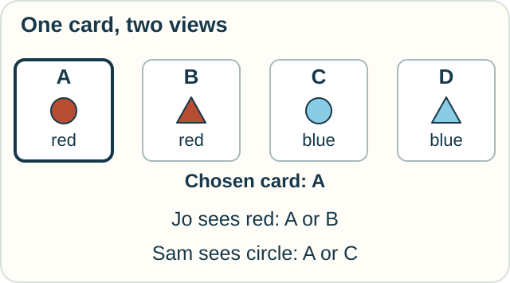
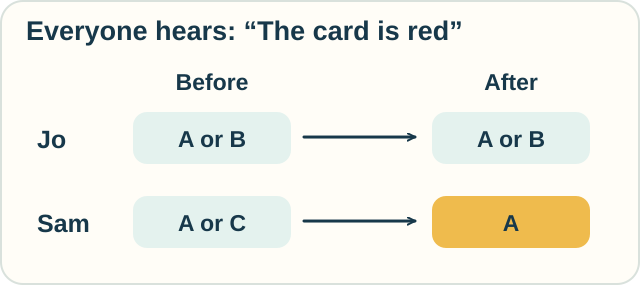

# Epistemic Logic — Who Knows What?

**Place in the field:** Logics of knowledge and information change. Epistemic logic studies what agents know; dynamic epistemic logic also studies events that change their information.

**Start with:** [claims and proof](../../lessons/04-logic-and-proof.md).\
**By the end:** keep two people's possibilities separate and update them after a public announcement.

*Two people can share a table while having different information.*

## One card, two views

The fair has exactly four cards:

| Card | Color | Shape |
|---|---|---|
| A | Red | Circle |
| B | Red | Triangle |
| C | Blue | Circle |
| D | Blue | Triangle |

One card is placed in a viewer. Jo can see only its color. Sam can see only its shape. Both know the table and how the viewer works. Nobody receives any other clue.

The chosen card is **A**. We can see that in the story; Jo and Sam must work from their own views.

- Jo sees red, so **A or B** remains possible for Jo.
- Sam sees a circle, so **A or C** remains possible for Sam.

*The card stays the same. The available clues differ.*

In this model, someone **knows** a claim when it holds in every possibility their information leaves open.

Jo knows the card is red. Sam knows it is a circle. Neither can yet name the card.

## Say something everyone hears

A trusted announcer says, “The card is red.” The announcement is true, and both people hear it and know that everyone heard it.

**Predict:** can Sam now name the card? Can Jo?

Check

Sam combines “circle” with “red.” Only **A** fits.

Jo still has **A or B**. The announcement repeats information Jo already had. It does not reveal the shape.

*The same announcement can change one person's possibilities more than another's.*

The card has not been repainted. The update changes the information available about it. This is a simple **public-announcement** model within dynamic epistemic logic.

## Knowledge about someone else's knowledge

Jo still cannot name the card, but Jo can work out that Sam can. Jo knows that Sam sees the shape, and that each red shape occurs on just one card.

That gives us a new kind of statement: “Jo knows that Sam knows which card it is.” Such statements are useful when people or programs must coordinate.

These elementary models idealize reasoning: agents draw all the conclusions allowed by their listed possibilities. Belief, mistakes, and limited reasoning need additional choices in the model.

## Change who hears

Suppose the same true message is whispered only to Jo. Sam neither hears it nor learns that it was sent.

Can Sam now identify A?

Check your reasoning

No. Sam still has **A or C**. A private message to somebody else does not give Sam its contents.

Who receives a message is part of the event we must describe.

## Try it at the library

A missing book is either on the upper shelf or in a closed cupboard. You see that the upper shelf is empty. What can you conclude if those are the only two possible places?

What changes if the book might also have been borrowed?

Check

With exactly two possibilities, the book must be in the cupboard. Adding a third possibility leaves “cupboard or borrowed.”

Eliminating one option gives certainty only when the remaining possibilities support it.

Optional notation — possibilities and updates

A Kripke model has worlds, an accessibility relation for each agent, and truth assignments. Write $K_i p$ for “agent $i$ knows $p$.” At world $w$,

$$
M,w\models K_i p
\quad\text{iff}\quad
M,v\models p\text{ for every }v\text{ with }wR_i v.
$$

For a truthful public announcement of $p$, restrict the model to worlds where $p$ holds and restrict each accessibility relation to those worlds. At a world satisfying $p$, subsequent claims are evaluated in this updated model $M|p$.

More general event models represent private messages and uncertainty about which event occurred. Those require more structure than deleting the same worlds for everyone.

## Sources

The card and library activities are original. For public-announcement logic, see the [Open Logic Project's introduction](https://builds.openlogicproject.org/content/applied-modal-logic/epistemic-logic/public-announcement-logic-lang.pdf). Baltag, Moss, and Solecki's [*The Logic of Public Announcements, Common Knowledge, and Private Suspicions*](https://ir.cwi.nl/pub/4497/04497D.pdf) develops event-based logics; this is the 1999 report following their 1998 conference paper. Charrier and colleagues' [2016 paper](https://cdn.aaai.org/ocs/12899/12899-57552-1-PB.pdf) builds epistemic logic from observations and announcements.

[Logic and proof](../../lessons/04-logic-and-proof.md) · [Rough sets](rough-sets.md) · [Observation route](../../PANTHEON.md#10-observation-knowledge-and-measurement)
