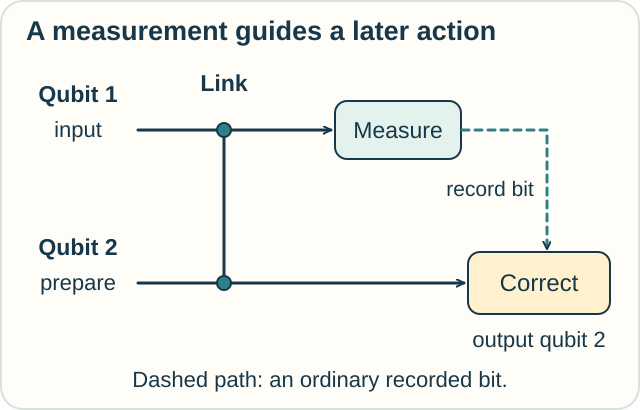
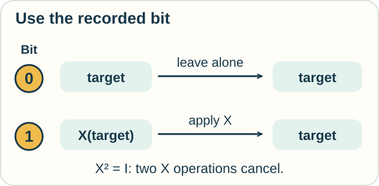

# Measurement Calculus — A Result Can Guide the Next Step

**Place in the field:** Danos, Kashefi, and Panangaden's formal language for measurement-based quantum computation. It gives commands and rewrite rules for programs built around quantum measurements.

**Start with:** [instructions](../../lessons/05-computation-and-correctness.md) and the [operator track's two-swap example](../operators/functional-calculus.md).\
**By the end:** follow a recorded measurement result into a later correction and explain why the order matters.

*Some instructions must wait for the result of an earlier step.*

## A measurement can be part of a program

A **qubit** is a unit of quantum information. Its state generally needs more description than an ordinary hidden zero or one.

Quantum measurements can produce ordinary recorded outcomes. Those records can control later operations on the remaining qubits.

The **measurement calculus** describes programs of this kind. Its basic jobs are:

| Command | Job |
|---|---|
| Prepare | Set up an extra qubit in a specified state |
| Entangle | Apply an operation linking qubits, which can create quantum correlations |
| Measure | Measure a qubit and record an outcome |
| Correct | Apply a specified operation, possibly selected by earlier outcomes |

A complete program is called a **pattern**. It identifies inputs, outputs, commands, and which results later commands need.

## Two outcomes, one corrected result

Consider a small pattern with two qubits. The first carries the input. We prepare the second, link the two, then measure the first. The second carries the output.

*The outcome record and the output qubit have different jobs.*

Call the intended output the **target state**. In this pattern, the measured bit tells us which of two states we received:

| Recorded bit | Output before correction | What to do |
|---|---|---|
| 0 | Target state | Leave it alone |
| 1 | Target with an operation called X applied | Apply X once more |

X has the useful property that **two X operations cancel**. This resembles the two swaps in the operator track, although the object here is a quantum state.

*Different recorded outcomes can lead to the same corrected quantum state.*

The target is a specified transformation of the input. We do not need to know the input state to follow these correction instructions. The optional mathematics identifies the transformation used here.

## Make a prediction

Suppose the record says 1, but we skip the correction. Is the output guaranteed to be the target for every input?

Check

No. X is still applied to the target. Some particular states are unchanged by X, but that does not give a guarantee for all inputs.

The correction rule matters even though we cannot choose the measurement result.

## Which order is allowed?

Could we use the outcome bit to choose the correction before obtaining that bit?

Check your reasoning

No. That instruction depends on an unavailable result.

The calculus has rules for rewriting patterns while preserving their meaning. Its standardization result puts suitable patterns into an order with entangling operations first, measurements next, and corrections last. Rewriting must preserve the dependencies.

In this calculus, measuring a qubit consumes it: later quantum commands cannot act on that same qubit. Its classical outcome remains available to guide other commands.

## Try the dependency idea elsewhere

A scanner reads whether a parcel needs a clockwise quarter-turn or no turn. A robot turns the parcel according to that record. Could it reliably discard the record and always choose the same instruction?

Check

No, if both cases occur and need different instructions. It must retain the distinction long enough to act on it.

This parcel example transfers the idea of a result controlling a later step. It uses ordinary classical objects; it does not reproduce quantum entanglement.

Optional mathematics — the actual two-qubit pattern

With input qubit 1 and output qubit 2, the pattern is

$$
X_2^{s_1}M_1^0E_{12}N_2,
$$

executed from right to left. $N_2$ prepares $|+\rangle=(|0\rangle+|1\rangle)/\sqrt2$; $E_{12}$ is controlled-Z; $M_1^0$ measures in the X basis and records $s_1\in\{0,1\}$.

For input $|\psi\rangle$, the normalized output before correction is $X^{s_1}H|\psi\rangle$. Here

$$
H=\frac1{\sqrt2}\begin{pmatrix}1&1\\1&-1\end{pmatrix},
\qquad
X=\begin{pmatrix}0&1\\1&0\end{pmatrix}.
$$

Applying $X^{s_1}$ leaves $H|\psi\rangle$ in either branch, since $X^2=I$. $H$ is the Hadamard operation.

## Sources

The two-qubit pattern is the Hadamard example in Danos, Kashefi, and Panangaden, [*The Measurement Calculus*](https://arxiv.org/html/0704.1263v1), §§2–3; §5 develops rewriting and standardization. The diagrams and parcel activity are original presentations. For the physical computing model, see Michael A. Nielsen, [*Cluster-state Quantum Computation*](https://arxiv.org/abs/quant-ph/0504097).

[Operators](../operators/functional-calculus.md) · [Linear logic and resource use](../proof/linear-logic.md) · [Observation route](../../PANTHEON.md#10-observation-knowledge-and-measurement)
