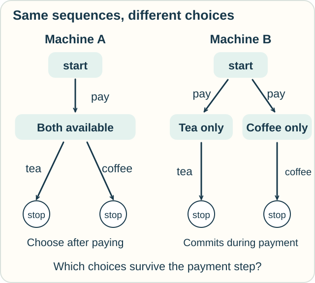

# Observational Equivalence — Can You Tell These Systems Apart?

**Place in the field:** Behavioral comparisons used in programming-language theory and process calculi. Bisimulation is one important way to compare systems step by step.

**Start with:** [messages and events](../../lessons/07-interaction-and-action.md).\
**By the end:** explain why matching possible finished sequences may leave a difference in the choices available along the way.

*A useful comparison says which interactions we can try.*

## Two drink machines

Jo and Sam test two machines. Each takes one token and can supply tea or coffee.

We record three kinds of successful action: **pay**, **tea**, and **coffee**. We do not record speed, sounds, or cabinet color.

Both machines allow these complete sequences:

- pay, then tea;
- pay, then coffee.

Would that list settle whether they behave alike?

## When the choice happens

**Machine A** accepts payment and then keeps both drinks available. The customer can choose either.

**Machine B** commits to one drink as it accepts payment. Its internal choice may be tea or coffee, and the customer does not control that choice. Afterward, only the committed drink is available.

*The same completed sequences can come from different branching behavior.*

**Predict:** after paying, a customer requests coffee. Which machine guarantees that coffee remains an available next action?

Check

**A.** B may already have committed to tea. B sometimes supplies coffee, but that does not mean coffee is available after every payment.

We found a difference by examining what remains possible after a step.

## Match the next step, then keep matching

A **trace** is a sequence of visible actions. Our machines have the same possible traces, including unfinished prefixes such as “pay.”

A **bisimulation** asks for more. Whenever one system makes a step, the other must be able to match it and reach a state that can still be compared in the same way. This requirement works in both directions.

Try matching B's payment that commits it to tea. A can match the payment, but A then offers coffee as well. B's tea-only state cannot match that next action.

So these machines fail this step-by-step comparison.

## Specify what a test can see

Suppose two machines have exactly the same action structure but different internal state names. Renaming a state from “ready” to “state 17” does not change any of our recorded actions.

Now suppose one machine is slower. Our current model says nothing about timing. A time-sensitive comparison would need to record that difference.

“Observationally equivalent” always belongs to a specified language, observation rule, and kind of comparison. Process theory supplies several choices, including trace, testing, and bisimulation-based equivalences.

## Try it with a delivery service

Two services advertise both “book, then collect” and “book, then deliver.” One lets you choose the method after booking. The other silently fixes the method during booking.

What should you ask before treating them as interchangeable?

Check your reasoning

Ask whether both methods remain available after each booking. Also ask who controls the earlier choice.

Lists of possible completed orders leave that information out, just as the drink-machine lists did.

Optional mathematics — strong bisimulation

A labelled transition system has states and transitions $p\xrightarrow{a}p'$. A relation $R$ is a strong bisimulation when, for every $pRq$:

- each $p\xrightarrow{a}p'$ has a matching $q\xrightarrow{a}q'$ with $p'Rq'$;
- each step from $q$ has a corresponding match from $p$.

Using $0$ for a stopped process, a dot for action prefix, and $+$ for alternatives, our structures are

$$
A=\mathrm{pay}.(\mathrm{tea}.0+\mathrm{coffee}.0),
\qquad
B=\mathrm{pay}.\mathrm{tea}.0+\mathrm{pay}.\mathrm{coffee}.0.
$$

They are trace-equivalent but not strongly bisimilar. Weak variants can hide selected internal steps. Barbed bisimulation uses reductions and observable capabilities; it is a related, different presentation.

## Sources

The machine and delivery stories are original presentations of a standard branching distinction. See Davide Sangiorgi, [*An Introduction to Bisimulation and Coinduction*](https://www.cs.unibo.it/~sangio/DOC_public/corsoFL.pdf), and Milner and Sangiorgi, [“Barbed Bisimulation”](https://www.research.ed.ac.uk/en/publications/barbed-bisimulation/), 1992. Sangiorgi's [book page](https://www.cs.unibo.it/~sangio/IntroBook.html) gives a longer reading route.

[Pi calculus](../interaction/pi-calculus.md) · [Rho calculus](../interaction/rho-calculus.md) · [Observation route](../../PANTHEON.md#10-observation-knowledge-and-measurement)
