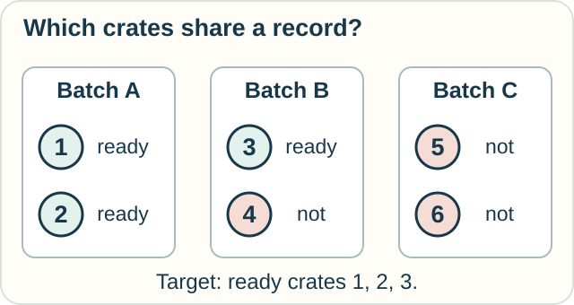
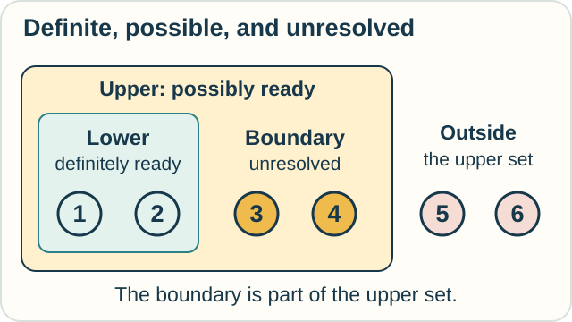

# Rough Sets — What Can This Record Tell Apart?

**Place in the field:** Pawlak's rough-set theory studies approximations based on available distinctions. It is an established area of data analysis and mathematical reasoning, with several later extensions.

**Start with:** [asking questions of records](../../lessons/06-data-and-relations.md).\
**By the end:** separate definite membership, possible membership, and an unresolved boundary.

*A label can group together things that differ in a way we care about.*

## A scanner that sees only the batch

There are six fruit crates. An inspection team supplies this complete table:

| Crate | Batch label | Fruit ready to eat? |
|---|---|---|
| 1 | A | Yes |
| 2 | A | Yes |
| 3 | B | Yes |
| 4 | B | No |
| 5 | C | No |
| 6 | C | No |

One of these six crates is selected. The scanner reports only its batch label. It cannot read the crate number or inspect the fruit.

If the scanner reports **A**, either crate 1 or crate 2 was selected. Both are ready.

If it reports **B**, the crate might be 3 or 4. One is ready and one is not.

If it reports **C**, either possibility is not ready.

*Use the whole group left possible by the record.*

## Three useful regions

Our target set is the ready crates: **1, 2, and 3**. A **set** is a collection of objects.

Using only batch labels, rough-set theory gives us:

| Region | Which crates? | Why? |
|---|---|---|
| **Lower approximation**: definitely ready | 1, 2 | Every crate with their label is ready |
| **Upper approximation**: possibly ready | 1, 2, 3, 4 | Their label occurs on at least one ready crate |
| **Boundary**: unresolved by this record | 3, 4 | Their shared label also fits the opposite answer |

*Crate 4 is not ready, but its label alone does not rule readiness out.*

The uncertainty here comes from what the scanner can distinguish. We have not assigned probabilities to the crates. “Possible” does not automatically mean “50 percent likely.”

## Make a prediction

Suppose crate 4's fruit ripens. The inspection table is updated, but the batch labels stay the same.

What happens to the lower approximation and the boundary?

Check

Both B crates are now ready. The lower approximation grows to **1, 2, 3, 4**, matching the upper approximation. The boundary is empty.

The scanner still cannot identify every individual crate. It can now settle this particular ready-or-not question for all six crates.

## Improve the record instead

Return to the original table. Now give the scanner a way to read each crate's unique number.

What changes?

Each possible group contains one crate. The lower and upper approximations both become **1, 2, 3**. The boundary is empty because the record now settles readiness for every listed crate.

We resolved the question by improving the observation, rather than by changing the fruit.

## Try another setting

A parcel database records only “small” or “large.” Among its large parcels, some are fragile and some are not. Can a large-only record settle whether the selected parcel is fragile?

What extra field would settle that question for these records?

Check your reasoning

No. “Large” leaves both answers open. A reliable fragile-or-not field would settle it.

These conclusions concern the listed objects and trusted table. Applying a pattern to future parcels is a further learning problem.

Optional notation — approximating a set

Let $U$ be the six crates. Two crates are equivalent under $R$ when their batch labels match. Write $[x]_R$ for the whole group containing $x$. For a target set $X$,

$$
\underline{R}(X)=\{x\in U:[x]_R\subseteq X\},
\qquad
\overline{R}(X)=\{x\in U:[x]_R\cap X\ne\varnothing\}.
$$

The boundary is $\overline{R}(X)\setminus\underline{R}(X)$.

Here matching recorded labels is transitive: if two labels match a third, they match each other. The [distinction-graph example](distinction-graphs.md) instead uses a pairwise comparison rule that can fail transitivity. Choose the relation that fits the actual observation rule.

## Sources

The crate and parcel activities are original. See Zdzisław Pawlak, [“Rough Sets”](https://link.springer.com/article/10.1007/BF01001956), 1982, and [“Rough Set Theory and Its Applications to Data Analysis”](https://www.tandfonline.com/doi/abs/10.1080/019697298125470), 1998. The latter introduces lower and upper approximations. Our example uses the classical equivalence-relation setting.

[Data and questions](../../lessons/06-data-and-relations.md) · [Epistemic logic](epistemic-logic.md) · [Observation route](../../PANTHEON.md#10-observation-knowledge-and-measurement)
