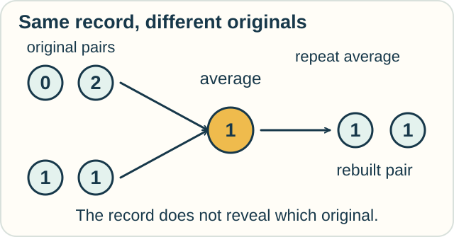

# Track — Tiffany's Fuzzy Calculus: Change Through Bounded Observation

**Place in the field:** The particular research framework in Paul Tiffany's Principia Symbolica and related materials. This page uses those sources' definitions; it is not a survey of fuzzy logic.

**Start with:** [rates and reconstruction](../../lessons/01-classical-calculus.md).\
**By the end:** explain why rebuilding an observed record may leave details of its source unresolved.

## The idea

In Paul Tiffany's **Fuzzy Calculus**, the act and limits of observation enter the rules for change and reconstruction.

A record may retain some distinctions and lose others. The question is: what change can be observed, what can be recovered, and what mismatch remains?

A **residue** records a specified mismatch. It can have structure even when nothing random happens.

## A worked example of limited access

A recorder stores only the average of each pair of readings.

| Original pair | Recorded average |
|---|---|
| 0, 2 | 1 |
| 1, 1 | 1 |

The record is the same for two different pairs.

Suppose our rebuilding rule repeats the average twice. From the record 1, it produces **1, 1**.

- For the original **0, 2**, the mismatch “rebuilt minus original” is **+1, −1**.
- For the original **1, 1**, the mismatch is **0, 0**.

We can calculate those mismatches because this table shows the originals. Someone given only the average cannot know which mismatch occurred.

<!-- visual:diagram-average-and-rebuild -->

*The toy example shows why the record and the original must be named separately.*
<!-- /visual:diagram-average-and-rebuild -->

This is an original, discrete teaching example of lost distinctions. It illustrates a recovery question; it does not implement the full Fuzzy Calculus.

## Try it

Find another pair whose average is 1. Could any rule given only that average always recover the exact original pair?

Check your reasoning

**−1, 3** is another pair.

No single answer based only on the average can be correct for all these originals. Exact recovery would need more observations or assumptions that restrict which originals are possible.

A residue can name what is missing without making that missing information available.

## Try it somewhere else

A recorder keeps only the total rainfall for each day. Can you tell whether rain fell steadily or in one short shower?

What extra record would help? Would hourly totals answer every question about minute-by-minute rain?

Check and connect

A daily total leaves the timing unresolved. Hourly totals give finer detail, but different patterns within an hour may still share the same total.

Ask which distinctions each observation retains. A finer record can answer more questions without answering every possible question.

Optional depth — the native calculus and its sources

Book IV of *Principia Symbolica* includes a bounded-observer construction with kernel, derivation, and domain:

$$
(K_O,\delta_O,\mathcal B_O).
$$

Its observer-kernel convolution uses

$$
\mathcal K_O[X](x)=\int_M K_O(x-y)X(y)\,d\mu(y),
$$

with $x-y$ interpreted in a local chart or suitable ambient group structure. This describes how observation acts on a field.

The Book IV Fuzzy Fundamental Theorem states an integral-of-derivative relation of the form

$$
\int_O^\gamma D_O f
= f(\gamma(b))-f(\gamma(a))+H_O(\gamma,f).
$$

Here $\gamma$ is a path, $a,b$ its endpoint parameters, and $H_O$ the construction's path-dependent correction. Its definitions and assumptions belong to the source theorem.

The AGI-26 Figure 2 companion develops a reduced, curve-local FFTC and an Observer-Relative Stokes theorem with bulk and boundary residues. Its bundle, connection, and regularity assumptions specify that geometric setting.

**Recovering which object?** If $g$ is a sufficiently smooth observed field, ordinary calculus can still give

$$
g(x)=g(a)+\int_a^x g'(t)\,dt.
$$

This recovers $g$. Recovering the field from which $g$ was observed is another question. The averaging example illustrates why those targets must be named separately.

## Sources

Paul Carver Tiffany III, *Principia Symbolica*, Book IV: **Bounded Observer**, **Observer-Kernel Convolution**, and **Fuzzy Fundamental Theorem of Calculus**. Read the [source chapter](https://github.com/PaulTiffany/Principia-Symbolica/blob/main/src/book4.tex) or the [structured atlas](https://paultiffany.github.io/Principia-Symbolica/atlas/).

For the geometric development, see the [Figure 2 companion](https://github.com/PaulTiffany/hypothesis-surface-agi26/blob/master/supplementary/fig2_companion_fftc.tex). Full references are in [References](../../REFERENCES.md#fuzzy-calculus--bounded-observer-geometry).

[← Choosing a model](../../lessons/09-choose-and-combine.md) · [Home](../../README.md) · [Field map](../../PANTHEON.md#source-specific-research-explorations)
