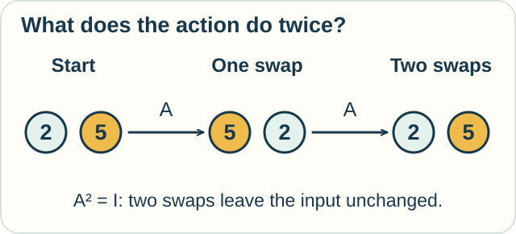
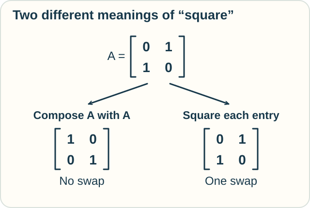

# Functional Calculus — Apply a Function to an Action

**Place in the field:** Methods for applying functions to matrices and suitable operators. These are important in analysis, differential equations, and mathematical physics.

**Start with:** [instructions](../../lessons/05-computation-and-correctness.md). No matrix calculations are needed for the main example.\
**By the end:** distinguish repeating an operator from changing the individual numbers in its table.

*What happens when the same action is performed twice?*

## A box that swaps two values

A toy sound box holds two numbers, one for its left channel and one for its right channel.

Call its action **A**. A swaps the values.

| Starting pair | After one A | After another A |
|---|---|---|
| (2, 5) | (5, 2) | (2, 5) |

*Two swaps return the original pair.*

An **operator** acts on objects such as vectors or functions. Our swap is a small linear operator on pairs of numbers.

The identity operator, written **I**, leaves every input unchanged. We have just checked why **A² = I**: doing A twice restores any pair.

## A function can take an operator as input

For ordinary numbers, the function $f(s)=s^2$ squares its input.

In functional calculus, we can apply that function to A. The result is **f(A) = A²**.

Here squaring means composing the action with itself. It does not mean squaring the two channel values.

**Predict:** starting from (7, 1), what does f(A) produce?

Check

**(7, 1).** The two swaps cancel.

The result is not (49, 1). That would square the input values, a different instruction.

## A surprising table trap

We can record the swap using a matrix:

$$
A=\begin{pmatrix}0&1\\1&0\end{pmatrix}.
$$

The first row says “take the second input.” The second row says “take the first.”

Squaring each entry leaves this particular array unchanged: zeros stay zero and ones stay one. That still describes **one swap**.

Matrix squaring instead describes **two swaps** and gives the identity matrix.

*The same word, “square,” can name different operations. State which one you mean.*

Functional calculus extends this idea to functions beyond polynomials, under appropriate conditions. Matrix exponentials, for example, help solve systems of differential equations.

## Try another operator

A new box doubles both input values. Call it B.

What does B² do to (3, 4)? Would it still be the identity?

Check your reasoning

One application gives (6, 8). Two give **(12, 16)**.

So B² multiplies each input by four. The two-step result depends on which operator we use.

## Three names worth keeping separate

| Name | What it means here |
|---|---|
| Functional calculus | Apply a function to a matrix or suitable operator |
| A functional in the calculus of variations | A rule that takes a function as input and returns a number |
| Functional programming | A programming approach organized around functions |

The words are related linguistically. They do not name the same subject.

Optional mathematics — a polynomial first

If $p(s)=c_0+c_1s+\cdots+c_ns^n$, define

$$
p(A)=c_0I+c_1A+\cdots+c_nA^n.
$$

For a diagonalizable matrix $A=V\Lambda V^{-1}$, suitable matrix functions satisfy $f(A)=Vf(\Lambda)V^{-1}$, with $f$ applied to the diagonal entries of $\Lambda$.

Further operator calculi require stated classes of operators, functions, and domains. This small example does not supply every such extension.

## Sources

The sound-box examples are original. See Nicholas J. Higham, [“What Is a Matrix Function?”](https://nhigham.com/2020/06/09/what-is-a-matrix-function/) and [“Functions of Matrices”](https://eprints.maths.manchester.ac.uk/2109/). These explain matrix functions and why applying a function entry by entry is a different operation.

[Instructions](../../lessons/05-computation-and-correctness.md) · [Variations](../change/variational-calculus.md) · [Field map](../../PANTHEON.md)
