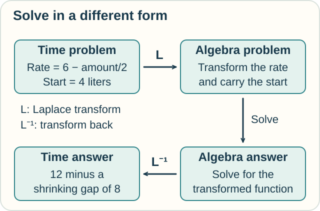
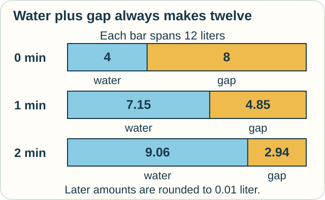

# Track — Operational Calculus: Change the Form of the Problem

**Place in the field:** Methods that use operators and transforms to turn suitable differential problems into algebra. This track takes the Laplace-transform route.

**Start with:** [the tank's rate rule](../change/differential-equations.md).\
**By the end:** explain the transform–solve–return method, use its answer, and see why a starting value must travel through the calculation.

<!-- visual:art-garden -->

*Return to the same tank. Can changing its mathematical description make the answer easier to find?*
<!-- /visual:art-garden -->

## Keep the problem; change its description

Our tank starts with **4 liters**. The tap adds **6 liters per minute**. The controlled drain removes water at a rate equal to half the current amount per minute.

In the previous track, we estimated the future one short step at a time. Operational calculus offers another route for this kind of equation:

1. **Transform** the unknown time function into a new mathematical description.
2. Use the transform's rules to turn the rate equation into an algebra problem.
3. Solve that problem and **transform back** to a function of time.

A **transform** maps a function to another function. It can make certain operations easier to handle, just as a different arrangement of an arithmetic calculation can make it easier to solve.

<!-- visual:diagram-operational-route -->

*Bring both the rule and the starting amount across, then return to the original question.*
<!-- /visual:diagram-operational-route -->

## What the Laplace transform buys us

The **Laplace transform** describes a time function through a family of weighted integrals. Its new input is usually called s. It is not another clock reading.

The useful rule here is that **taking a time derivative becomes multiplication by s, with a correction for the starting value**. Addition stays addition. For our equation, this leaves ordinary algebra to solve.

The transformed answer is a whole function of s, not a single score. Under appropriate conditions, an inverse transform recovers the original function. Our example uses smooth functions for times starting at zero; other settings need their own assumptions.

You can follow what the answer means below. The optional section shows every algebra step that produces it.

## Read the answer as a steady part and a fading part

For this tank, the result is:

> **Water amount = 12 liters minus a shrinking gap that starts at 8 liters.**

The 12-liter part is the equilibrium. The 8-liter gap makes the initial amount **12 − 8 = 4**.

The gap shrinks exponentially. That means it keeps the same fraction of its current size over each equal time interval. This model keeps about **0.6065 of the gap each minute**, as derived by the formula below.

| Time | Remaining gap below 12 liters | Water amount |
|---|---|---|
| Start | 8 liters | **4 liters** |
| 1 minute | About 4.85 liters | **About 7.15 liters** |
| 2 minutes | About 2.94 liters | **About 9.06 liters** |
| 4 minutes | About 1.08 liters | **About 10.92 liters** |

<!-- visual:diagram-operational-gap -->

*The water grows as the gap shrinks. Each bar compares the amount with the same equilibrium.*
<!-- /visual:diagram-operational-gap -->

The exact formula describes every time, not only the times listed here. The decimal table is rounded.

**Predict:** change only the starting amount to **8 liters**. What is the starting gap below 12? After one minute, will that gap be half the original tank's gap, or twice as large?

Check

The new starting gap is **4 liters**, half of 8. The drain rule is unchanged, so this gap keeps the same fraction each minute. After one minute it is about **2.43 liters**, giving about **9.57 liters** of water.

The gap is half as large as before. The water amount itself is not simply doubled; the fixed equilibrium must still be included.

## Do not drop the starting value

Suppose someone uses the derivative rule but forgets its starting-value correction. For this example, the result would describe a tank starting **empty**.

That answer might look like a sensible rising curve. It would still answer the wrong initial-value problem. Checking the amount at time zero catches the mistake immediately.

This is the same need for a starting value that appeared in sums of differences and in the first tank lesson. Changing the form of the calculation does not remove that need.

## Try it somewhere else

A room-warming model approaches **22°C**. It starts at **18°C**. At a particular later time, one quarter of the original temperature gap remains. What is the room's temperature then?

What if it instead started at **26°C** and approached 22°C from above, with the same fraction of its initial gap remaining?

Check and connect

Starting at 18°C gives a gap of 4 degrees below the target. A quarter remains: 1 degree. The temperature is **21°C**.

Starting at 26°C gives a gap of 4 degrees above the target. With 1 degree remaining, the temperature is **23°C**.

The useful decomposition is **steady value plus a fading initial difference**. Which side we start on determines the sign. It applies here because we stated the corresponding settling model.

## Where this method fits

Laplace methods are useful for many linear equations with constant coefficients, including models of circuits, springs, and controlled systems. They also handle suitable inputs that switch on or off.

Operational calculus is a wider family of methods. This one example introduces a particular route. A transform does not make every equation easy, and its algebraic rules require the stated function classes and initial data.

[Functional calculus](functional-calculus.md) asks another operator question: how do we apply a function to a matrix or operator? The two subjects have connections, but their names are not interchangeable.

Optional mathematics — transform, solve, and return

For a suitable function f on $t\geq0$, the one-sided Laplace transform is

$$
F(s)=\mathcal L\{f\}(s)=\int_0^\infty e^{-st}f(t)\,dt.
$$

We use smooth functions and positive real s in this example. More generally, convergence holds on an appropriate region of complex s. Standard sufficient conditions include piecewise continuity and an exponential growth bound; the derivative rule also needs suitable regularity of f and its derivative.

For our smooth initial-value problem, integration by parts gives

$$
\mathcal L\{f'\}(s)=sF(s)-f(0).
$$

Let Y be the transform of the tank's amount V. With time measured in minutes and amount in liters, transform $V'+V/2=6$, $V(0)=4$:

$$
(sY(s)-4)+\tfrac12Y(s)=\frac6s.
$$

Solve and separate the fractions:

$$
Y(s)=\frac{6/s+4}{s+1/2}
=\frac{12}{s}-\frac8{s+1/2}.
$$

Use the transform pairs $\mathcal L\{1\}=1/s$ and $\mathcal L\{e^{-t/2}\}=1/(s+1/2)$ to return to time:

$$
V(t)=12-8e^{-t/2}.
$$

Thus the gap's one-minute multiplier is $e^{-1/2}\approx0.60653$. Multiplying this factor across minutes reproduces the exact exponential, with rounding only when we use decimal approximations.

Dropping the −4 from the transformed equation gives $Y(s)=12/s-12/(s+1/2)$, hence $V(t)=12-12e^{-t/2}$ and $V(0)=0$. That verifies precisely which initial condition was lost.

The linked MIT notes also discuss generalized signals and use a $0^-$ convention. Our tank is smooth at the initial time, so the ordinary starting value suffices; no impulse or jump is part of this example.

## Sources

The tank, gap table, and temperature activity are original teaching examples using standard transform rules. See MIT OpenCourseWare's [*Laplace Transform: Solving Initial Value Problems*](https://ocw.mit.edu/courses/18-03sc-differential-equations-fall-2011/pages/unit-iii-fourier-series-and-laplace-transform/laplace-transform-solving-initial-value-problems/), especially its transform table, derivative rules, inverse-transform discussion, and worked initial-value notes. Gilbert Strang's [*Differential Equations and Linear Algebra* materials](https://math.mit.edu/~gs/dela/) give a broader operator-and-transform route. See [References](../../REFERENCES.md#operational-calculus-and-laplace-transforms).

[← Differential equations](../change/differential-equations.md) · [Practice](../../PRACTICE.md#steps-samples-and-continuous-change) · [Home](../../README.md) · [Field map](../../PANTHEON.md#9-operators-and-transforms)
