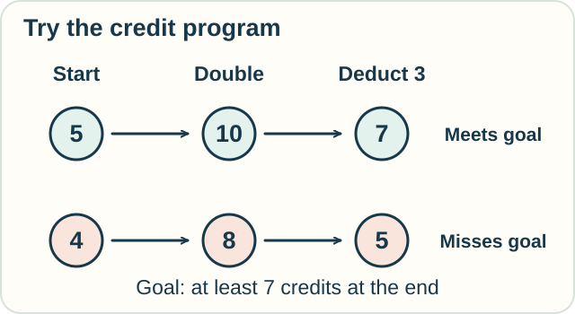
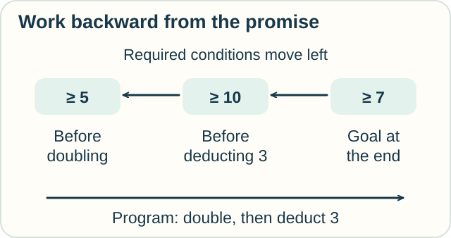
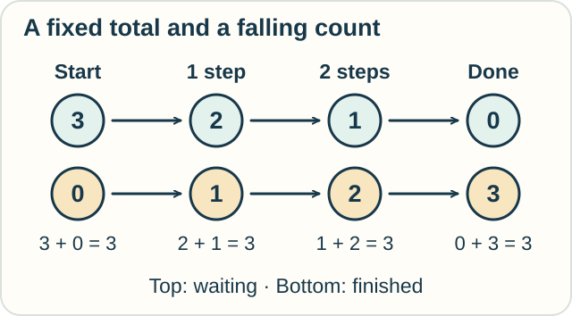

# Track — Hoare Logic: Prove the Program's Promise

**Place in the field:** Program logic using preconditions and postconditions, with predicate transformers for reasoning backward.

**Start with:** [the ticket-counter contract](../../lessons/05-computation-and-correctness.md).\
**By the end:** find the least restrictive starting condition for a small program, and explain what a loop needs to establish.

<!-- visual:art-workshop -->


*The printer needs more than an instruction. What can we promise about the result?*
<!-- /visual:art-workshop -->

## Start with a promise

The workshop uses whole-number credits for printing. On bonus day its program does two things, in order:

1. Double the recorded credit balance.
2. Deduct 3 credits for a print job.

Jo wants **at least 7 credits left afterward**. What balance is enough before the program starts?

Starting with 5 works: double it to 10, then deduct 3, leaving 7. Starting with 4 leaves only 5.

<!-- visual:diagram-hoare-contract -->


*One successful run helps us guess a condition. A proof must cover every allowed start.*
<!-- /visual:diagram-hoare-contract -->

A **precondition** states what we require at the start. A **postcondition** states our promise at the end. Hoare logic connects them to a program through proof rules.

For this example, assume exact integer arithmetic, one person running the program, and no outside changes to the balance. These are rules for the recorded count.

## Work backward from the goal

Instead of trying starting balances one by one, ask what each step requires.

| Where are we? | What must be true? | Why? |
|---|---|---|
| At the end | At least 7 credits | This is the goal |
| Before deducting 3 | At least 10 credits | Deducting 3 must still leave 7 |
| Before doubling | At least 5 credits | Doubling must reach at least 10 |

<!-- visual:diagram-hoare-backward -->


*Execution moves toward the result. Required conditions travel back toward the start.*
<!-- /visual:diagram-hoare-backward -->

“At least 5” includes every successful starting balance in our model. Any smaller whole-number balance fails. It is the **weakest precondition**: the least restrictive starting condition that guarantees successful completion with the promised result.

“At least 20” also works, but needlessly rejects safe starts such as 5 or 6. Here “weakest” means allowing the most starts, not giving the least confidence.

A **predicate** is a condition that can be true or false. A **predicate transformer** takes a desired end condition and produces a start condition. Dijkstra developed this way of specifying and deriving programs.

**Predict:** if we want at least **8** credits left, what is the weakest condition on the starting whole-number balance?

<details>
<summary>Check</summary>

Start with **at least 6**. Before deducting 3 we need at least 11. Doubling 5 gives only 10; doubling 6 gives 12, leaving 9.

The algebraic cutoff is 5½, but the balance is a whole number. An ending value of exactly 8 is impossible for this program: doubling gives an even number, and subtracting 3 gives an odd one. The promise says **at least** 8.

</details>

## A loop needs a fact that survives

Sam now counts finished print jobs. Start with 3 jobs waiting and none finished. Repeat this whole step while some job is waiting:

> Reduce waiting by 1, then increase finished by 1.

At each return to the loop's starting check, **waiting plus finished is still 3**, and neither count is negative. This is a **loop invariant**: a condition true before the first repetition and preserved by each complete repetition.

<!-- visual:diagram-hoare-invariant -->


*The sum stays fixed. The waiting count moves toward zero.*
<!-- /visual:diagram-hoare-invariant -->

When the loop stops, waiting is zero. The invariant then tells us that all 3 jobs are finished.

But why must it stop? Waiting is a nonnegative whole number that falls by 1 each time. It cannot keep falling forever while staying nonnegative.

These are two different proof jobs:

- **Partial correctness:** if the program finishes, it meets the promised condition.
- **Total correctness:** it finishes and meets that condition.

A broken loop that does nothing while jobs are waiting preserves the sum, yet runs forever when the waiting count is positive. The invariant alone does not settle termination.

## Try it somewhere else

A kitchen moves plates from “empty” to “filled,” one at a time. Start with 6 empty plates and none filled. No plates enter or leave.

What quantity stays fixed? What decreases? If a plate breaks and is removed halfway through, which part of your argument needs to change?

<details>
<summary>Check and connect</summary>

Empty plus filled stays **6**. Empty decreases by 1 on each repetition. At the end, no empty plates remain, so all 6 are filled.

A removed broken plate violates the stated model. You could add a broken-plate count and preserve “empty plus filled plus broken is 6,” but that would establish a different final result.

A proof follows its conditions. Changing the process may require changing both the invariant and the promise.

</details>

<details>
<summary>Optional notation — contracts and weakest preconditions</summary>

A Hoare triple $\{P\}\ C\ \{Q\}$ states partial correctness here: from a state satisfying P, if C finishes, its result satisfies Q. A program state records current variable values.

For the credit program,

$$
\{n\geq5\}\quad n:=2n;\ n:=n-3\quad\{n\geq7\}.
$$

Assignment $n:=E$ replaces the stored value of n by the current value of E. The semicolon means run the left command first.

For our total, exact arithmetic expressions, the weakest-precondition rules are

$$
\operatorname{wp}(n:=E,Q)=Q[n:=E],\qquad
\operatorname{wp}(C;D,Q)=\operatorname{wp}(C,\operatorname{wp}(D,Q)).
$$

Substitute the assigned expression into the requested condition. Thus

$$
\operatorname{wp}(n:=n-3,n\geq7)=(n-3\geq7)=(n\geq10),
$$

$$
\operatorname{wp}(n:=2n,n\geq10)=(2n\geq10)=(n\geq5).
$$

We use Dijkstra's convention that wp includes successful termination. A **weakest liberal precondition**, often written wlp, asks only for correctness if termination occurs. These agree for the two assignments here; loops can separate them.

</details>

<details>
<summary>Optional notation — the loop proof for any starting count</summary>

Let N be a fixed nonnegative integer. Initialize $r:=N$ and $f:=0$, then run

```text
while r > 0:
    r := r - 1
    f := f + 1
```

Use the invariant $I:(r+f=N)\land(r\geq0)\land(f\geq0)$ at the loop's check. It holds initially. One whole iteration preserves it, since $(r-1)+(f+1)=r+f$. The guard $r>0$ makes the decrement safe.

At exit, $r\leq0$ together with $r\geq0$ gives $r=0$, hence $f=N$. The nonnegative integer r is a decreasing **variant**, which establishes termination. The invariant is not claimed between the two assignments inside the loop body.

The proof counts recorded jobs; whether a printer actually produced each page requires the model to connect its records to that event.

</details>

## Sources

The credit, print-job, and plate activities are original examples. See Jonathan Aldrich's [*Axiomatic Semantics and Hoare-style Verification*](https://www.cs.cmu.edu/~aldrich/courses/17-355-19sp/notes/notes11-hoare-logic.pdf), especially §§2.1–2.2, for contracts, backward rules, and loop proofs. Dijkstra's [EWD472, *Guarded commands, non-determinacy and formal derivation of programs*](https://www.cs.utexas.edu/~EWD/transcriptions/EWD04xx/EWD472.html), §3, defines wp including termination. See [References](../../REFERENCES.md#program-logic-and-correctness).

[← System F](../types/system-f.md) · [Next: Separate memory →](separation-logic.md) · [Home](../../README.md) · [Field map](../../PANTHEON.md#5-computation-types-and-program-guarantees)
