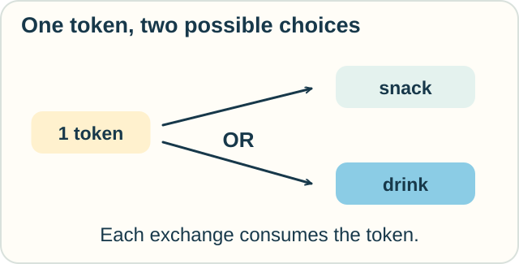
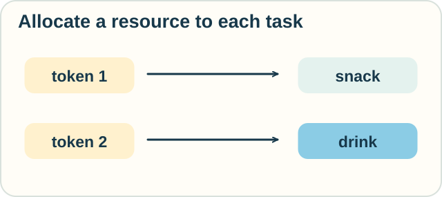

# Linear Logic — Can You Use That Twice?

**Place in the field:** An established logic with proof calculi that track the use of assumptions. It has applications in programming and resource-sensitive reasoning.

**Start with:** [claims and proof](../../lessons/04-logic-and-proof.md).\
**By the end:** distinguish a reusable fact or rule from a resource that a step consumes.

*At the fair, knowing a rule and having something to spend are different matters.*

## One token, two possible purchases

At a toy fair stall, a token buys either one snack or one drink. Each purchase consumes its token. The stall has enough stock.

Jo has **one token**.

The menu remains available to read after a purchase. The token does not remain available to spend.

*There are two possible choices. Count the resources needed to make both purchases.*

**Predict:** can Jo get both a snack and a drink under these rules?

Check

No. Each purchase requires a token. Jo needs **two tokens** to make both purchases.

Using the menu rule twice does not create a second token.

## Change the reasoning rules

In ordinary logic, learning a fact does not normally use it up. “The stall opens at noon” can support several arguments.

**Linear logic** changes the rules for using assumptions. In its basic linear part, an assumption cannot be copied or thrown away freely. Proofs must account for its use.

Some assumptions can be explicitly marked as reusable. This lets one system describe both consumable resources and persistent information.

The word “linear” here concerns the logic's use of assumptions. It does not mean “draw a straight line” or “use a linear equation.”

## Two tokens make a different state

Sam arrives with a second token. Allocate one token to the snack purchase and the other to the drink purchase.

*Two resource occurrences support two purchases.*

Counting assumptions changes what can be derived. The calculation is not just about whether the word “token” appears somewhere.

## Try it in the kitchen

A recipe card says: “One egg makes one small pancake.” Assume the other ingredients and equipment are available. Making a pancake consumes that egg.

You have one egg and may read the recipe as often as you like. Can you make two pancakes?

What changes if a different rule explicitly allows one egg to make two smaller pancakes?

Check your reasoning

The first rule permits one pancake. Reusing the recipe does not replenish the ingredient.

The second rule permits two smaller pancakes because the conversion rule changed. Resource-aware reasoning follows the stated operations; it does not decree that one input can never produce several outputs.

## Where this helps

Programs can work with resources that must have a clear owner or a controlled lifetime. Resource-sensitive logics and type systems help express such obligations.

There are related but different systems. **Affine** rules allow an assumption to be unused while still restricting duplication. Full linear logic also has connectives for alternatives and for reusable information.

Our stall illustrates one part of this landscape. A full proof calculus specifies the connectives and inference rules.

Optional notation — a linear implication

Write $T$ for one token and $S$ for one snack. The rule

$$
T\multimap S
$$

reads “a token can be used to obtain a snack.” The arrow is called linear implication.

$S\otimes D$ means having a snack and a drink together, with resources allocated to both. The symbol $!$ marks a form of reusable information. With the two purchase rules available as reusable assumptions,

$$
T,T,!(T\multimap S),!(T\multimap D)\vdash S\otimes D.
$$

The repeated $T$ records two tokens. Replacing the two occurrences with one does not prove the same goal under these rules.

## A neighboring way to track resources

[Separation logic](separation-logic.md) asks which memory cells a program uses, and when separate cells remain unchanged. Its star connects descriptions of separate memory. The voucher rules here and the memory rules there both account for resources, but belong to different formal systems.

## Sources

The stall and kitchen examples are original. See Frank Pfenning, [*Linear Logic* notes](https://www.cs.cmu.edu/~fp/courses/15816-f01/handouts/linear.pdf), especially linear hypotheses, simultaneous conjunction, and unrestricted resources. Jean-Yves Girard introduced linear logic in “Linear Logic,” *Theoretical Computer Science* 50(1):1–101, 1987, DOI: 10.1016/0304-3975(87)90045-4.

[Logic and proof](../../lessons/04-logic-and-proof.md) · [Sequents](sequent-calculus.md) · [Field map](../../PANTHEON.md)
