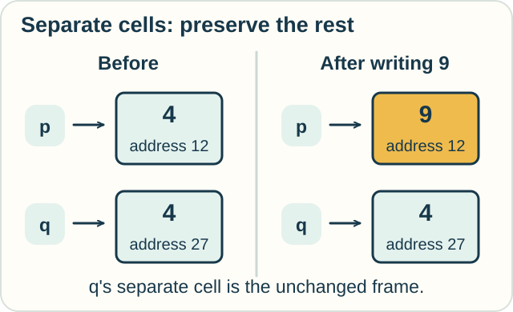
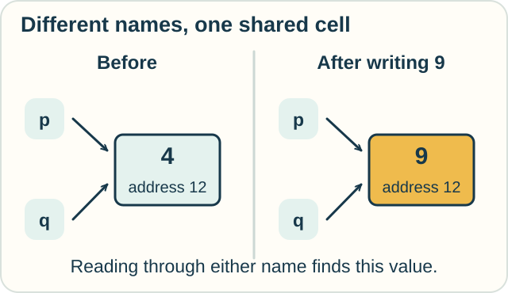

# Track — Separation Logic: Change One Part, Keep the Rest

**Place in the field:** A program logic for reasoning about memory that programs can share and change.

**Start with:** [program promises](hoare-logic.md).\
**By the end:** distinguish two names from two separate memory cells, and explain when a local change preserves the rest.

<!-- visual:art-workshop -->

*Which part of the workshop controller does this instruction actually touch?*
<!-- /visual:art-workshop -->

## Two names can lead to one place

Picture the controller's memory as small boxes. Each box has an **address**, like a locker number, and a stored value. A **pointer** holds an address so a program can find that box.

Jo uses the pointer name p; Sam uses q. Those are names in the program. Different names do not guarantee different addresses.

First suppose p holds address **12**, while q holds address **27**. Each box contains **4**. The instruction says:

> Put 9 in the box that p points to.

Afterward, box 12 holds 9. Box 27 still holds 4.

<!-- visual:diagram-separation-frame -->

*Equal contents do not make these the same box. Their addresses differ.*
<!-- /visual:diagram-separation-frame -->

Now change one fact: p and q both hold address **12**. Both names lead to the same box. This is called **aliasing**.

Writing 9 through p means a later read through q also finds 9. The program did not need to mention q to affect what q sees.

<!-- visual:diagram-separation-alias -->

*Two arrows can reach one box. Count the boxes, not the names.*
<!-- /visual:diagram-separation-alias -->

## Say that the parts really are separate

**Separation logic** lets a proof state that two descriptions concern separate parts of memory. Its central connective is **separating conjunction**, written with a star: `P * Q`.

Read this as: “Split the memory under discussion into two parts with no shared cells; P describes one part and Q describes the other.”

The star adds a claim about the parts: they have no cells in common. Ordinary “and” checks both descriptions on the same memory, without requiring such a split.

For our first picture, one description says “p's cell contains 4.” The other says “q's separate cell contains 4.” The star records that these are two cells, even though their values match.

## The frame rule saves repeated work

Suppose we have proved that an instruction can safely change p's cell from 4 to 9 using just that cell.

We can then add a description of separate, untouched memory to both ends of the proof. This is the **frame rule**. The extra description is called the **frame**.

For the first picture, q's cell is that frame. We reuse the small proof about p and carry q's unchanged value along with it. With a thousand other separate cells, we do not need a new account of each cell for this one update.

The rule needs real separation. We must also keep the variables used to describe the frame unchanged. If the program redirects q to a new address, “the cell q points to” may no longer name the preserved cell.

**Predict:** p and q hold different addresses, but both cells contain the number 4. Does changing p's cell force q's cell to change because their values match?

Check

No. Matching **values** do not connect the cells. Separate cells can hold the same value and then change independently under our stated command.

The first diagram already shows this case. The second changes the address relationship, not just the values.

## Copying an address is not copying a box

Consider two different instructions:

| Instruction | What changes? |
|---|---|
| Set p to q's address | The pointer p now leads to the same cell as q |
| Store 9 through p | The contents of the cell currently reached by p change |

Starting from the separate-cell picture, do the first instruction, then the second. What value does q now find?

Check

It finds **9**. After the address copy, both pointers reach box 27. The write through p changes that box.

Box 12 still contains 4 in this little model; copying a pointer did not move its contents. Our old claim that p and q describe separate cells no longer applies.

## Try it somewhere else

Jo and Sam have two bookmarks to the **same shared document**. Jo edits through one bookmark. Can Sam rely on the other showing the old document because its bookmark has a different name?

What would change if the bookmarks led to two independent document copies, with no automatic syncing?

Check and connect

Different bookmark names do not make independent documents. With both pointing to the same document, the edit changes what both open.

With independent copies and no syncing, editing one can leave the other unchanged. The transferable question is: **are there separate objects, or separate ways to reach one object?**

This is an analogy about sharing. A real document service has more behavior than the small memory model here.

## What the little picture leaves out

The full logic can describe linked structures, allocation of new cells, removal of cells, and carefully specified sharing. The point is to state which resources a command uses. It is not a blanket ban on shared data.

Here we use a sequential program and ordinary writable cells. Reasoning about simultaneous writers or shared read permissions requires appropriate additional rules. The [linear-logic track](linear-logic.md) also accounts for resources, but uses a different formal system and interpretation.

Optional notation — cells, disjoint heaps, and the frame rule

A **store** gives variables their values, including pointer addresses. A **heap** records the values in allocated memory cells.

In the classical exact-heap model used here, $p\mapsto4$ means the described heap consists of one cell at p's address holding 4. Thus

$$
p\mapsto4\;*\;q\mapsto4
$$

describes two separate cells. In particular, p and q must hold different addresses. The star means the heap can be divided into disjoint parts satisfying the left and right assertions.

By contrast, $(p\mapsto4)\land(q\mapsto4)$ checks both assertions on the same heap. Under these exact singleton meanings, that conjunction requires the same address. This explains why replacing the star with ordinary “and” changes the claim.

Write $[p]:=9$ for updating the cell at p's address. The local triple is

$$
\{p\mapsto4\}\quad[p]:=9\quad\{p\mapsto9\}.
$$

The frame rule has the form

$$
\frac{\{P\}\ C\ \{Q\}}{\{P*R\}\ C\ \{Q*R\}},
\qquad\mathrm{FV}(R)\cap\mathrm{Mod}(C)=\varnothing.
$$

The side condition says that C does not assign to any variable used freely in R. The local specification must also be valid in the memory-safe command semantics: C must run safely using the resources described by P. Merely hiding an accessed cell from the assertion would not prove this premise.

Framing $q\mapsto4$ around our update yields

$$
\{p\mapsto4*q\mapsto4\}\quad[p]:=9\quad\{p\mapsto9*q\mapsto4\}.
$$

The pointer-copy command is instead $p:=q$: it changes the store's value for p. This distinction between changing an address and changing its cell is essential.

## Sources

The cell values, workshop, and bookmark activity are original teaching examples. The formal rules follow John C. Reynolds's [*Separation Logic: A Logic for Shared Mutable Data Structures*](https://www.cs.cmu.edu/~jcr/seplogic.pdf), 2002, especially §§2–4. That paper credits the development with Peter O'Hearn and others, building on earlier work by Rod Burstall, and discusses work by Samin Ishtiaq and O'Hearn. See [References](../../REFERENCES.md#program-logic-and-correctness).

[← Program promises](hoare-logic.md) · [Practice](../../PRACTICE.md#program-rules-and-guarantees) · [Home](../../README.md) · [Field map](../../PANTHEON.md#5-computation-types-and-program-guarantees)
