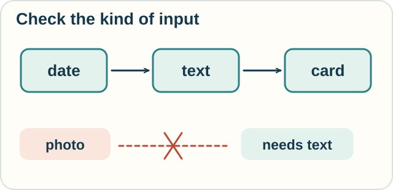

# Track — Calculus of Constructions: When Instructions Fit

**Place in the field:** A particular dependent type theory connecting computation and formal proof.

**Start with:** [instructions with inputs](../computation/lambda-calculus.md); [proofs](../proof/sequent-calculus.md) help too.\
**By the end:** explain how types check that pieces fit, then connect a requested proof to a construction.

## The idea

A **type** describes what kind of input or result an expression has.

Suppose one instruction takes a date and produces a written label. Another takes a written label and produces a printed card. Their input and output types fit, so we can compose them in that order.

A third instruction expects a photograph. We cannot feed it the written label without a suitable conversion.

This is a teaching analogy for typed computation.

<!-- visual:diagram-types-fit -->

*A date can become a written label, then a printed card. The next input must be the right kind.*
<!-- /visual:diagram-types-fit -->

## Try it somewhere else

A sensor produces a temperature. A calculator expects a length.

Both may be stored as numbers. Would checking only “is this a number?” catch the mismatch? What type information would help?

Check your reasoning

Checking only for a number would not catch it. Types that distinguish temperature from length could.

A type system checks the distinctions it has been designed to represent. Choosing those distinctions is part of modeling the task.

## Where proofs enter

The **Calculus of Constructions (CoC)**, introduced by Thierry Coquand and Gérard Huet, combines typed computation with a language for formal proof.

In a propositions-as-types interpretation, a proposition is represented by a type. To prove it, construct a term of that type. CoC supports dependencies that go beyond simple input/output labels.

Optional notation — a construction and its type

A judgment

$$
\Gamma\vdash t:A
$$

says that, under assumptions $\Gamma$, term $t$ has type $A$.

For example,

$$
\lambda x:A.x
$$

takes an input of type $A$ and returns it unchanged. It has type $A\to A$. Under propositions-as-types, it also expresses a proof that $A$ implies $A$.

CoC combines λ-style reduction with typing rules and dependent products. The later **Calculus of Inductive Constructions** adds inductive definitions; it underlies proof assistants such as [Rocq, formerly Coq](https://rocq-prover.org/doc/master/refman/language/core/index.html).

A checked construction proves the formal statement expressed by its type. Whether that statement captures the intended outside-world requirement remains a modeling question.

## Sources

The label and sensor examples are original analogies. See Thierry Coquand and Gérard Huet, *The Calculus of Constructions*, **Information and Computation** 76(2–3):95–120 (1988), [DOI: 10.1016/0890-5401(88)90005-3](https://doi.org/10.1016/0890-5401(88)90005-3).

[← Instructions and guarantees](../../lessons/05-computation-and-correctness.md) · [Home](../../README.md) · [Field map](../../PANTHEON.md#5-computation-types-and-program-guarantees)
