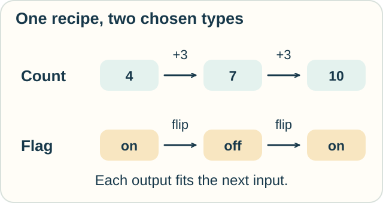
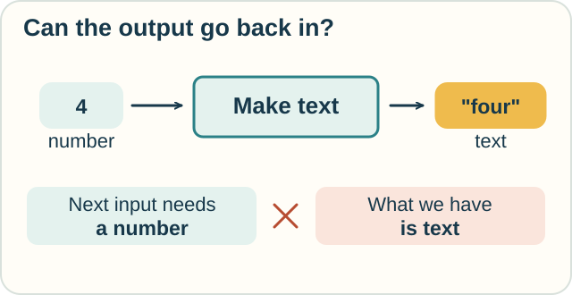

# Track — System F: One Recipe, Many Types

**Place in the field:** A typed lambda calculus that makes abstraction over types explicit.

**Start with:** [instructions and types](../../lessons/05-computation-and-correctness.md).\
**By the end:** reuse a recipe with different kinds of input and spot a type mismatch inside it.

<!-- visual:art-workshop -->

*Keep the recipe. Change the kind of thing it handles.*
<!-- /visual:art-workshop -->

## The recipe called “twice”

Jo writes a recipe:

> Take a step and a starting value. Apply the step once. Apply it again to the result.

The step must return the same kind of thing it accepts, so its output can feed back into it.

Sam tries two steps:

| Kind of value | Supplied step | Start | After one use | After two uses |
|---|---|---|---|---|
| Whole-number count | Add 3 | 4 | 7 | 10 |
| On/off flag | Flip on to off, or off to on | on | off | on |

<!-- visual:diagram-polymorphic-twice -->

*The outer recipe stays the same. The supplied step and the type change.*
<!-- /visual:diagram-polymorphic-twice -->

Twice does not need to know how addition or flipping works. It needs a step whose result fits its next input.

This kind of reuse is called **parametric polymorphism**. “Polymorphism” means having many forms; the parameter here is a type. In this example, choose a type, then supply a step and value that fit that choice.

## What System F adds

**System F** is a formal language for this idea, associated with the independent work of Jean-Yves Girard and John Reynolds. It extends typed lambda calculus with type inputs as well as ordinary value inputs.

Imagine two kinds of slot on Jo's recipe card:

1. A **type slot**: choose “whole-number count,” for example.
2. The **value slots**: supply a count-to-count step, then a starting count.

For another use, choose the on/off type and a flag-to-flag step. Within each use, all occurrences of the chosen type must agree.

There is no instruction here to inspect a value and decide whether to treat it as a number or a flag. We supply the appropriate type and step when we use the recipe.

## A mismatch in the middle

A label maker turns a number into text. Given 4, it returns the text “four.” Could we give that step to twice?

<!-- visual:diagram-polymorphic-mismatch -->

*A valid first step can still leave the wrong input for the next step.*
<!-- /visual:diagram-polymorphic-mismatch -->

No. Its first result is text, while its next input must be a number. It does not fit the required same-type step.

**Predict:** a different step takes text and adds an exclamation mark to the end. Does that fit twice? Starting with `hello`, what is the result?

Check

Yes. It takes text and returns text. The results are `hello!`, then **`hello!!`**.

It is fine that the text changes. The requirement is that the type still fits, not that the value stays unchanged.

## A type does not specify every behavior

Sam accidentally writes a recipe that uses the supplied step only **once**. Its inputs and output still have the same types as those of twice.

With the add-3 step and starting count 4, the mistaken recipe returns **7**, while twice returns **10**. Both return a whole-number count.

So this type catches the label-maker mismatch, but it does not establish “exactly two uses.” We inspect the definition or prove that further property. [Program logic](../proof/hoare-logic.md) explores how explicit promises can guide such reasoning.

## Try it somewhere else

A map app has two possible steps:

- Rotate a map image by a quarter-turn, returning another map image.
- Read a map image and return a written description.

Which step fits twice? What would two uses of the first step do?

Check and connect

The rotation fits: image in, image out. Two quarter-turns in the same direction give a **half-turn**.

The description step changes image to text, so it cannot feed its own result back into its image input. An app could combine it with a different text-handling step, but that would be a different recipe.

The useful pattern is matching output to input. The number and map examples share that structure.

Optional notation — type inputs and value inputs

Use capital lambda, $\Lambda$, to introduce a type input, and ordinary lambda, $\lambda$, for a value input:

$$
\mathrm{twice}=\Lambda A.\lambda f:A\to A.\lambda x:A.f(f\,x).
$$

Its type is

$$
\mathrm{twice}:\forall A.(A\to A)\to A\to A.
$$

Read $\forall A$ as “for every type A.” Arrows group to the right: supply a step, then a value, to obtain a value. Square brackets below mark type application:

$$
\mathrm{twice}[\mathrm{Nat}]\;\mathrm{add3}\;4
\to^*\mathrm{add3}(\mathrm{add3}(4))=10.
$$

For readability, the lesson treats natural numbers, flags, text, and their operations as familiar data with the stated types. Pure System F can encode data; the recipe's definition needs none of these types built in. Girard's Chapter 11 develops such encodings.

The two substitution moves are

$$
(\Lambda A.t)[B]\to t[A:=B],\qquad
(\lambda x:A.t)u\to t[x:=u].
$$

Both substitutions preserve binding by renaming bound variables when needed. A type abstraction requires its chosen type variable to be independent of the types of any free value inputs.

For comparison, $\mathrm{once}=\Lambda A.\lambda f:A\to A.\lambda x:A.f\,x$ has the very same type as twice.

Well-typed terms of **pure System F** are strongly normalizing: their reductions cannot continue forever. This theorem does not automatically extend to a programming language that adds unrestricted recursion or other features. See Girard's Chapter 14.

## Sources

The workshop, flag, punctuation, and map stories are original presentations. The higher-order twice recipe is a standard polymorphism example, also used in James Bornholt's [*Polymorphism and System F*](https://www.cs.utexas.edu/~bornholt/courses/cs345h-24sp/lectures/8-system-f/). For the formal calculus and termination theorem, see Jean-Yves Girard's [*Proofs and Types*](https://www.paultaylor.eu/stable/prot.pdf), Chapters 11 and 14, translated with appendices by Paul Taylor and Yves Lafont. Frank Pfenning's [*Parametric Polymorphism*](https://www.cs.cmu.edu/afs/cs/Web/People/fp/courses/15814-f18/lectures/11-polymorphism.pdf) gives another formal presentation. See [References](../../REFERENCES.md#system-f-and-parametric-polymorphism).

[← Combinatory logic](../computation/combinatory-logic.md) · [Next: Program promises →](../proof/hoare-logic.md) · [Dependent types](calculus-of-constructions.md) · [Home](../../README.md) · [Field map](../../PANTHEON.md#5-computation-types-and-program-guarantees)
